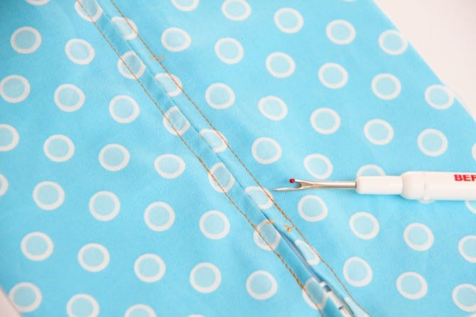
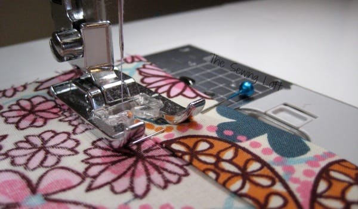

I’m always looking for tips and tricks to make sewing projects easier. These 10 sewing hacks are so cool! Some I’ve already used and some I am really excited to try out. Maybe you will have luck with them too!

photo from marthastewart.com

## Sewing Tip #1: Use Masking Tape for Quilting

Of course it was Martha Stewart’s website that I learned this one! She had a simple and wonderful idea for using masking tape in her

[**Baby Quilt pattern**](http://www.marthastewart.com/264118/simple-baby-quilt?backto=true\&backtourl=/photogallery/handmade-baby-gifts#slide_29)

to get straight lines. Just put the tape diagonally from corner to corner and use it as your guide!

photo from sewmccool.com

## Sewing Tip #2: Rubber Band 2 Pencils Together for a Seam Allowance

I somehow haven’t used this tip yet, even though I heard about it awhile ago! Such a great idea for a fast seam allowance on a pattern! Thanks for the trick,

**[SewMcCool](http://www.sewmccool.com/tracing-ottobre-patterns/)**

!

## Sewing Tip #3: Guide Elastic with a Safety Pin

This is a

[hack](/blog/quick-summer-skirt-tutorial/)

I’ve been using for ages! Still, if my mom hadn’t taught me about it years ago, I guess I wouldn’t have known. Folding the elastic over on itself and pinning it together with a safety pin before running it through your skirt/pants makes it so much easier to find and gather!

photo from andreasnotebook.com

## Sewing Tip #4: Rubber Band Seam Allowance Guides

Another trick for a rubber band! I’ve seen people talk about drawing a line on their sewing machine with a permanent marker to use as a seam allowance guide, but my machine is too pretty to mark up! That’s why I love this simple tip from

**[Andrea’s Notebook](http://andreasnotebook.com/seam-allowance-guide/)**

of slipping a rubber band around it. Perfect!

photo from makeit-loveit.com

## Sewing Tip #5: Installing a Basic Zipper

I won’t lie- I’ve had trouble with zippers in the past. This wonderful tip from

**[Make It & Love It](http://www.makeit-loveit.com/2011/10/sewing-tips-installing-a-basic-zipper.html)**

seems pretty foolproof though! I’ll be trying this way out the next time I have to sew a zipper.

photo from craftypod.com

## Sewing Tip #6: Make a Pin-Sharpening Pin Cushion

Making a new pin cushion is on my “to-do” list right now. I have rice to absorb any moisture and a ton of stuffing ready to go. I’m just picking out what fabric I want to use for the project. I’m glad I haven’t gotten around to making it yet though, since I just found this tip! I will definitely be adding steel wool to the cushion instead of regular stuffing, so that my pins stay nice and sharp! Great tip from

**[CraftyPod](http://www.craftypod.com/2008/07/07/a-sharp-little-idea-get-it/)**

!

photo from thesewingloftblog.com

## Sewing Tip #7: Double Fold Hem

When I started sewing (which honestly wasn’t very long ago) it somehow never occurred to me to DOUBLE FOLD the hem. It makes it so much neater looking and there is just no reason not to. I felt pretty dumb when I realized I hadn’t been doing it all along. I was really glad to have found it on

**[The Sewing Loft Blog](http://thesewingloftblog.com/double-fold-hem/)**

.

photo from thesewingloftblog.com

## Sewing Tip #8: Stay Tape

Another tip from

**[The Sewing Loft Blog](http://thesewingloftblog.com/power-of-stay-tape/)**

(I just love her!) is using Stay Tape when sewing knits! It keeps the knit fabric from stretching too much and makes your sewing go much smoother. I will need to try this out!

photo from makeit-loveit.com

## Sewing Tip #9: Add Pockets

Sometimes, you just need pockets. I have a few summer skirts that would be 100% better if pockets were involved. I can’t wait to dig them out of the basement and give them new meaning to their lives using this tutorial from

**[Make It & Love It](http://www.makeit-loveit.com/2013/03/adding-hidden-side-pockets-to-anything-skirt-pants-shorts-etc.html)**

! She shows just how simple it is to add pockets to an already existing skirt!

photo from scavengerhuntblog.com

## Sewing Tip #10: Magnetic Pin Plate

This last trick from

**[Scavenger Hunt](http://www.scavengerhuntblog.com/2013/10/diy-magnetic-pin-plate.html)**

is very handy. It’s too hard to quickly take pins out as I’m sewing and stick them back in my pin cushion, so I usually keep a small mason jar handy to throw in as I go. I’ve knocked this over with my elbow several times, though. I am totally going to make a magnetic pin plate so that doesn’t happen again! Magnets, glue and a plate = no more picking up pins? Done and done.

I hope at least one of these sewing tips is helpful to you! Better yet, if you aren’t a current sewer, perhaps something will even sound so cool that you’ll want to try it out and take it up! Let me know of any other tips, tricks and hacks you’ve used in the comments!
