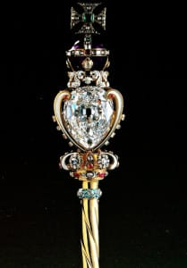
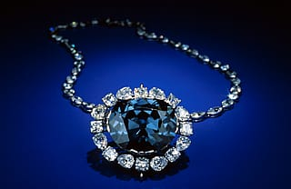

A few weeks ago, my friend

**[Natalia Khon](http://magicjewellerybox.blogspot.ca "Natalia Khon's Magic Jewellry Box")**

posted on her blog 25 facts about diamonds that you probably don’t know, and I thought they were so interesting! I asked her if I could share them with you guys today, and thankfully she agreed. Be sure to check out her

_[original post here](http://magicjewellerybox.blogspot.ca/2015/02/25-diamond-facts-that-you-possibly-did.html "25 Diamond Facts That You Possibly Didn't Know on Natalia Khon")!_

Read below for the re-post of Natalia’s diamond findings!

_“When I studied diamonds during my gemology course, I had an assignment to come up with as many diamond facts as I could. I have found 200+ diamond facts at that time! Here I would like to share only 25 the most interesting facts about diamonds.”_

- Diamond has got its name from the Greek “adamas” meaning “hard”.

- Diamond has three varieties: gem diamond, industrial diamond,

  [carbonado](http://en.wikipedia.org/wiki/Carbonado "Definition: Carbonado")

  .

- Many new styles of cut for diamonds are invented every year.

- The original source of diamond was India.

- Australia produces colored diamonds.

The Regent Diamond can be found at the Louvre in Paris. Photo Source: http\://famousdiamonds.tripod.com

- Diamond has supreme position among gemstones because of its hardness, luster, high RI (

  [Refractive Index](http://en.wikipedia.org/wiki/Refractive_index "Definition: Refractive Index")

  ) and high dispersion.

- If diamond colored by radiation, they are not as valuable as those with natural tints.

- Inclusions in diamonds are the crystals of other minerals and cleavages.

- Mankind’s first introduction to diamond is lost in the mist of antiquity.

- The initial discovery of diamonds in Canada in the Lac De Grass area occurred more than ten years ago. Since that discovery the NWT has become one of the top producers of diamonds after Russia and Botswana.

Koh-i-Noor means “Mountain of Light”

Photo Source: http\://science.nationalgeographic.com

- The diamond industry is formerly conservative, secretive and tightly controlled.

- De Beers is the largest diamond miner in the world.

- Russia is the world’s number two producer of diamonds.

- Australia is currently the largest producer in the world by volume.

- Congo and Angola have a large informal mining sector (smuggling).

The Idol’s Eye was first seen in 1865 in London.

Photo Source: http\://famousdiamonds.tripod.com

- The industry invests heavily to maintain consumer confidence in natural diamonds by developing technology to detect synthetic and treated stones.

- Over the last 20 years India has increased the volume and value of diamonds processed by fife times, making it world’s dominant polishing center.

- America has a right to buy 400,000 carats a year of rough diamonds from Russia.

- The USA makes up over 48% of the world diamond jewellery market.

- Many observers predict that China could surpass America as the largest retail diamond market of the future.

The Great Star of Africa is set in the Royal Scepter and kept with the other Crown Jewels in the Tower of London.

Photo Source: http\://astratelli.com

- Until the mid-1990s De Beers controlled 70-80% of rough diamond market.

- De Beers heavily invested in generic advertising boosted the sales of all diamonds, not only their own ones.

- Diamonds were used to fund civil wars in Africa.

- Diamonds are a unique commodity that offers opportunities across economic sectors: mining, exploration, manufacturing, arts and crafts, tourism and retail.

- The famous blue diamond is called “Hope” after name of a broker who bought it in 1830 in London.

The Hope Diamond is 45.52 carats. Photo Source: http\://mineralsciences.si.edu.htm

Do you know any interesting diamond facts? Share them in the comments!
