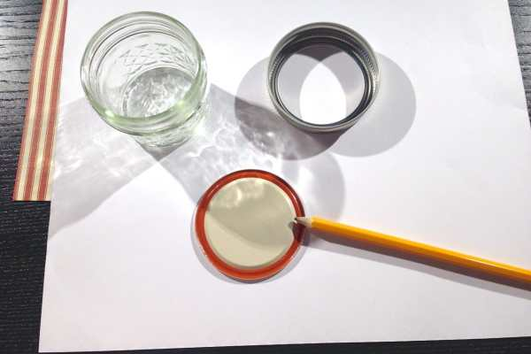
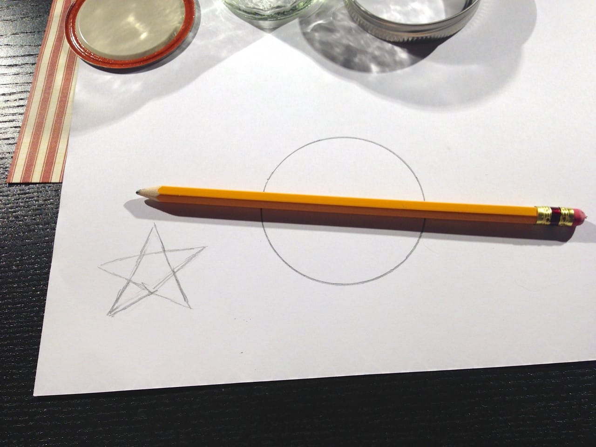
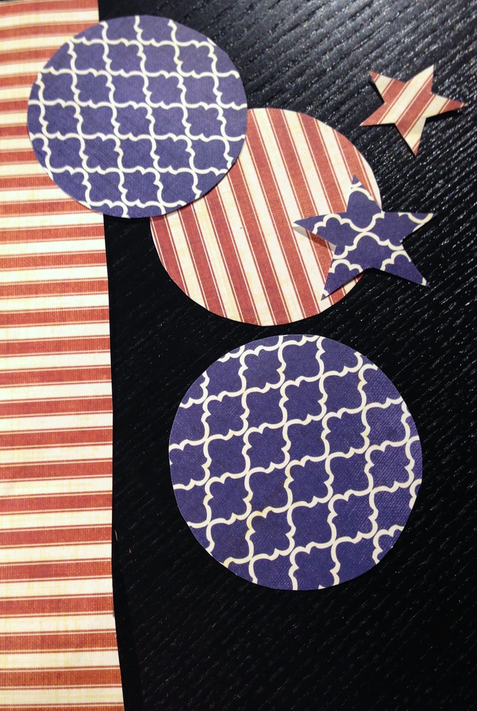
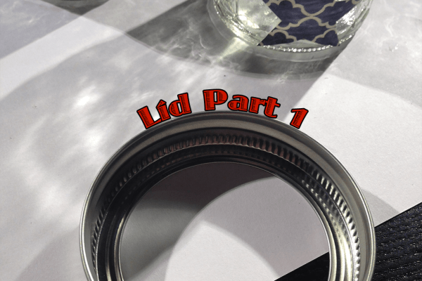
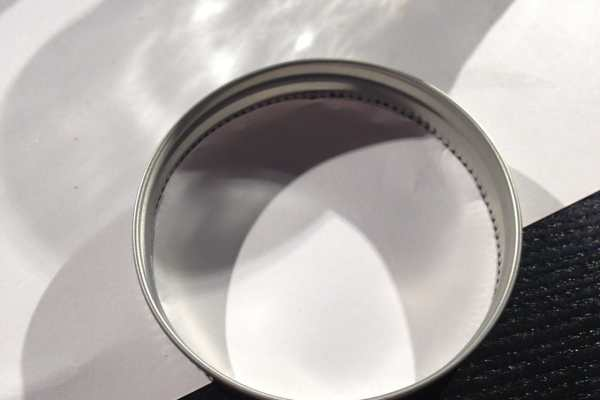
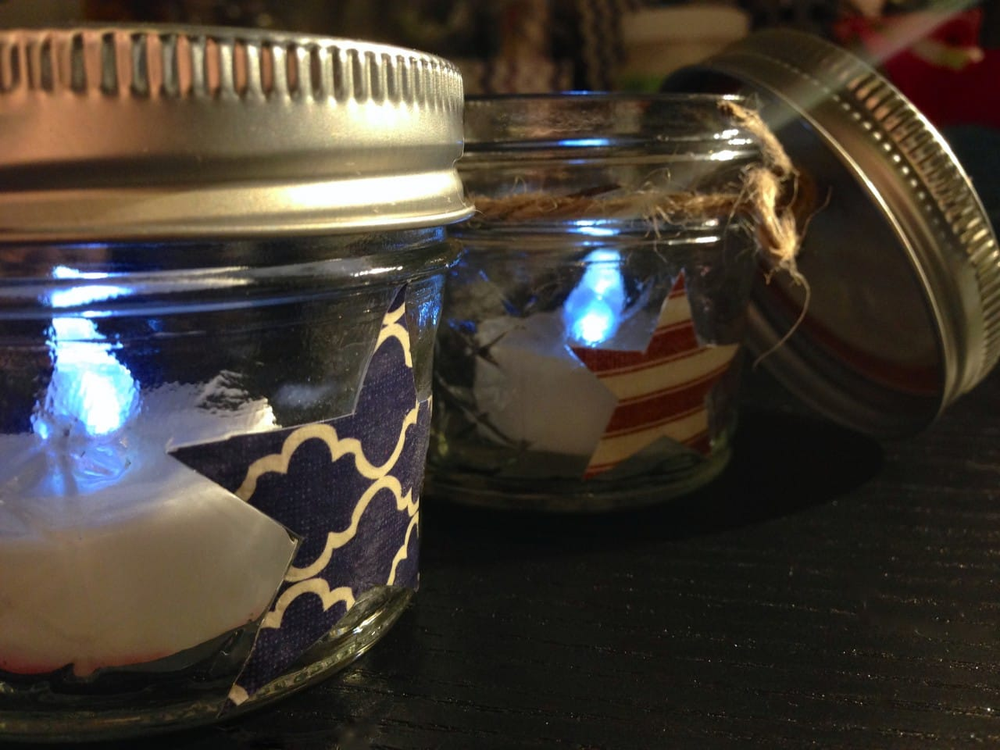

Project: 4th of July Mason Jar Candles

Fourth of July is coming up quickly! If you are looking for a cute little hostess gift to bring to the person who is throwing the annual July 4th BBQ, or if you want a pretty table scape for your own picnic table, this DIY is perfect! It’s fast, easy and you’ll have adorable little mason jar candle holders ready in no time!

## Materials:

- Mason jars (4 oz. jelly jars used in this tutorial)

- Red/white/blue scrapbook paper (or other pretty paper!)

- Mod Podge Paper Gloss

- Paint brush

- Scissors

- Pencil

- Tea lights (flameless or real)

- Twine (optional)

## Instructions:

- The lid of the mason jar should have two parts to it. Take out the center of it and flip it over, tracing the circle on the back of your paper. Repeat for however many jars you plan to make!

- Draw a few stars freehand. Keep in mind the size of the jar itself- don’t make the stars too big to fit! If you want to do something other than a star, go for it! Get creative. 🙂

- Cut your shapes out.

- Using

  [Mod Podge Paper Gloss](http://amzn.to/UZNrqj "Mod Podge Paper Gloss")

  (a waterbased sealer/glue/finish) and your paintbrush, spread a thin layer of glue to the back of the star, select where you want it to be on your jar, and place it down. Don’t worry about getting glue on the jar- you will intentionally do this in the next step anyway!

- Now that the stars are in their perfect spots, cover them again with Mod Podge! Get all edges, making sure to “seal” it to the glass. Mod Podge dries CLEAR so you don’t need to worry about any apparent white streaks- it won’t last long!

- Set jars aside to dry and work on the lids.

- With the two pieces of the lid still separated (parts shown below), place your cut out paper circle face down (with back of it facing you) into lid part 1. Use your fingertips to press it securely inside.

- Put a thin coat of Mod Podge on the shiny side of lid part 2. Flip it over and place glue-side-down on the paper circle. Press firmly and set aside to dry with glass portion of jar for 15-20 minutes.

- When everything is dry, simple pop a tea light inside and you’re all set! If you go flameless (as I have), you can screw the pretty top back on so you can see the whole mason jar at once. Add some twine for a little extra touch.

If you make these adorable little jars for your Independence Day table, don’t forget to snap some pics and share them in the comments!

