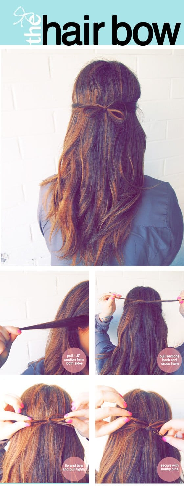
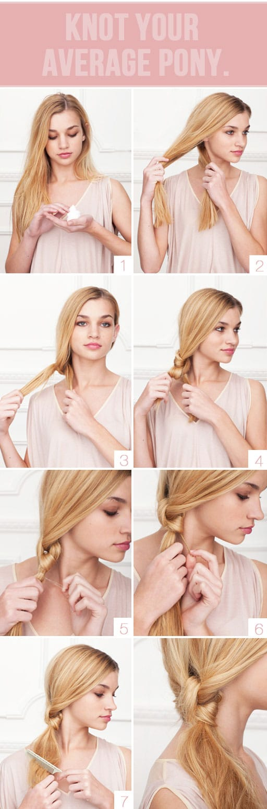
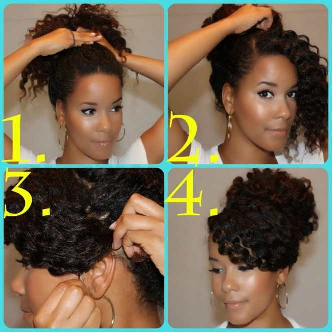

I may not be going back to school in a few weeks (nor have I in almost 10 years… which makes me feel old…) but maybe some of you students or teachers are! Perhaps a few easy-to-master mega cute hair styles are just what you need under your belt to make getting ready for that early morning class that much quicker. Lucky for you, I scoured Pinterest with you in mind (mostly) and found five really great really easy back to school styles for your locks!

## #1. The Fun Bun

##

I wear my hair in a top bun all the time, mostly because it’s currently in the in between stage where it’s too long to do most things with but too short to do my old styles. I never saw this way of doing a top bun though, and I’ll definitely be trying it this week!

## #2. Easy Braided Pony

##

I love braids. Incorporating a few in a simple ponytail sounds like just the right amount of fun in an otherwise plain pony!

## #3. The Hair Bow

## 

I’m not sure if my hair will work with this style, but I’d love to try it out! The little bow is SO cute, especially for someone who has naturally long and straight hair- it’s a little something extra that gives the person sitting at the desk behind you something adorable to look at!

## #4. Knot Your Average Pony

## 

This one also looks nice and simple! My hair isn’t long enough to try it yet, but when it is I’ll definitely give it a whirl!

## #5. Swoop Bang + High Bun

## 

Wearing my hair curly, puling it back with a side part and swooping the front half down and pinning it sounds like an easy and really great style when I’m in a rush! I can’t wait to see how it turns out!

Make sure to click each of the photos to see the full tutorial on each of their websites! There are also a ton of other great ideas on the websites, too! Hope you liked my easy back-to-school hair style picks!

What do you think of my choices? Which is your favorite?
