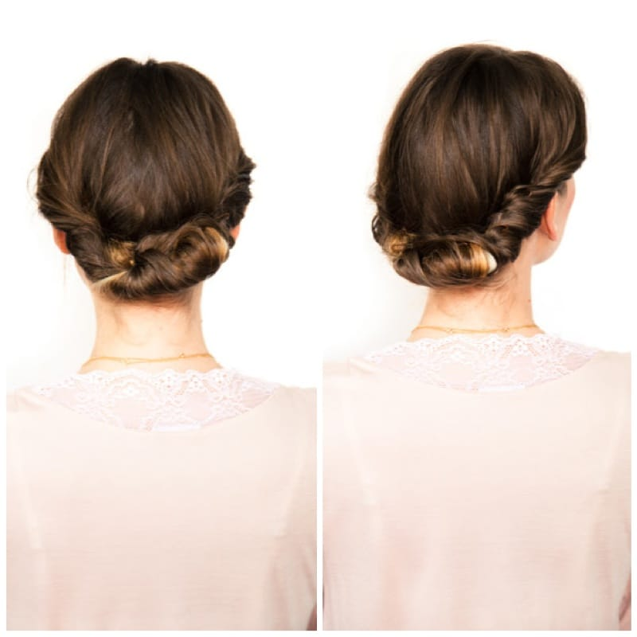
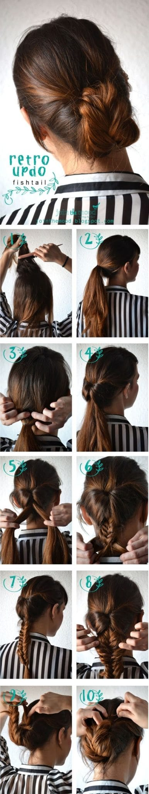

Project: 5 Easy Updo Styles with Tutorials

I love finding new hair style tutorials and

**[pin](http://www.pinterest.com/imkatiecrafts/hair-beauty/ "Katie Crafts Pinterest - Hair & Beauty Board")**

pretty much everything I come across, but some of them are things I’ll never get around to doing. These, however, are five great how-tos from various websites that are not only amazing, but fairly quick and easy! Since I’m stuck in

[**jury duty**](/blog/nail-art-jury-duty-nails/ "Nail Art: Jury Duty Nails")

this week, fast hair styles bright and early are the only way I’ll get there on time.

I’ve only had the chance to try a few of these tutorials so far (my hair isn’t quite long enough yet for the others) but I can’t wait til I can because they are mega cute! Here are my favorites:

## **#1. Upside Down French Braided Bun**

This is my favorite, probably because I’m especially fond of anything with braids involved. Even though I brought along a universal adapter on my honeymoon to Italy, it ended up not working for my hair dryer or straightener, and so I ended up having to wear it up pretty much the whole trip. I did this style numerous times to class up my otherwise boring top bun!

Here’s the video by the talented

[**Kayley Anne**](http://sidewalkready.com/2012/04/upside-down-french-braided-bun-tutorial/ "Sidewalk Ready")

if you need help learning!

## **#2. Faux Gibson Roll**

When my hair was slightly shorter than it is now, the layers were too short to do anything with. So, I found myself short on fast fancy styles. I’d often fake a Gibson Roll with twists and bobby pins, and complete the look with a flower. It always turned out cute! Plus, it always makes me think of

**Blair Waldorf**

, a character I sorely miss watching.

[**A Cup of Jo**](http://joannagoddard.blogspot.co.nz/2011/06/diy-wedding-hair-gibson-roll.html "A Cup of Jo: Gibson Roll Tutorial ")

has the perfect tutorial on how to achieve the look!

## **#3. Retro Updo Fishtail**

Another braided look! I haven’t mastered the

[**fishtail braid**](http://hairstyles-tutorial.blogspot.com/2013/03/how-to-make-retro-updo-fishtail.html "Retro Updo Fishtail Braid ")

on myself yet, but hopefully I do soon so I can give this really pretty style a go.

## **#4. The Sideways French Twist**

I’ve been a big fan of

**Kate**

over at

[**The Small Things Blog**](http://www.thesmallthingsblog.com/2012/07/sideways-french-twist.html "The Small Things Blog; Sidewass French Twist")

for a long time now (seriously, if you don’t already follow her, do it now!) She has really easy to follow steps on creating beautiful looks. The Sideways French Twist is one of my favorites! Watch how to create this look below.

## **#5. Not Your Average Bun**

Another super simple awesome design, this one comes from

[**A Little Slice Of…**](http://alittlesliceof.blogspot.com.au/2013/04/not-your-average-bun.html "A Little Slice Of... Not Your Average Bun tutorial")

It’s (surprise surprise!) another braid style, but this one is a little different! When you twist the braid around the bun it makes it look more like a knot, which I adore. Need further instructions to go along with the above pics? Here are the directions right from

**A Little Slice Of…**

‘s website!

> __
>
> _**Step 1**_
>
> _Tie your hair up into a ponytail._
>
> _**Step 2**Take a section of hair from the top of your pony tail._\
> _**Step 3**Plait this section and secure it away from the rest of the ponytail with a butterfly clip (you will use this later)._\
> _**Step 4 & 5**Divide the remaining part of your ponytail into four sections. Loop each section under, one at a time, and secure at the base of the pony tail with a bobby pin or two. You should now have a messy little bun._\
> _**Step 6**Unclip your braid from Step 3, loop the end under and pin into the base of your bun._\
> _**Step 7**Loosen the plait slightly with your fingers and push it to one side._\
> _**Step 8**Finished look from the side._

Well, those are my five go-to hairstyles for quick and easy updos! Do you have any that I should definitely try out, or are you an avid lover of any of the above styles? Be sure to check out each of the websites I got the ideas from- they rock! Have a loverly day!
