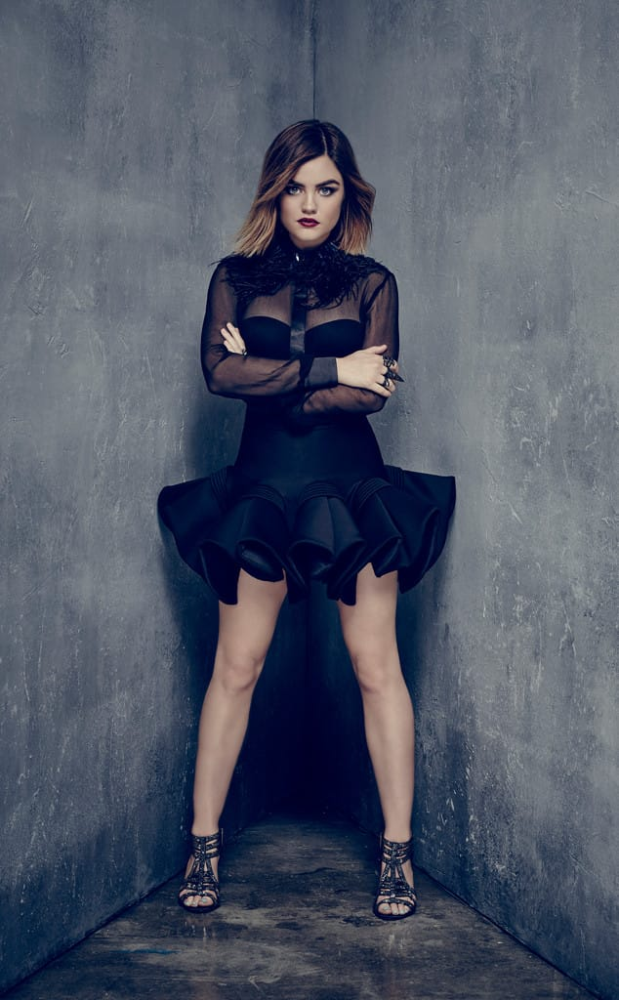
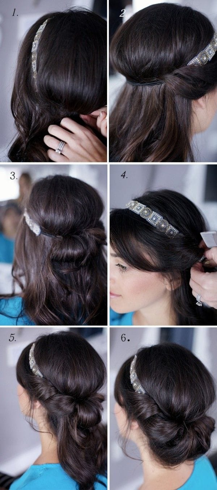

It’s March! That means we are a mere two and a half weeks away from it being SPRING! I have lots of Spring posts lined up for the next month in celebration of warmer weather and sunny days ahead. First up is a post about how to wear your hair this season! I found 5 hairstyles for Spring 2016 that look effortless and lovely that just about anyone can pull off.

Chances are, your poor hair has been hiding under a winter hat for quite awhile now! While I’m all for hiding my hair on days I don’t feel like doing it (who isn’t?), I’m also excited to have new styles to try.

I just adore this first look from

**[Yet Another Beauty Site](http://yetanotherbeautysite.com/)**

! Now that I

_finally_

have longer hair (I’ve been growing it out for four years now and it only just reaches my back!!!) it means I get to try some styles I have been yearning for. This is definitely one of them! How adorable is this little flower made out of a braid? It also looks mega simple, too! I can’t wait to give it a whirl for this Spring.

Warmer weather also means a chance to lighten things up a bit! I’ve had dark plum hair all winter which I totally adore, but I’ll be adding back in some lighter fun highlights for the upcoming season. Maybe you’d prefer to do an all over light color, like this gorgeous rose gold! If it didn’t have so much upkeep, I’d have already done it myself! Who knows… maybe I’ll do it anyway. 😉 This photo from

**[Behind The Chair](http://www.behindthechair.com/)**

has me really wanting to.

One 2016 Spring hair trend according to NYFW and

**[Elle](http://www.elle.com/)**

, is fringe! Whenever I do bite the bullet and get me some adorable choppy bangs, they immediately curl up and look terrible. If you don’t have that problem, this hairstyle may just be what you’re looking for! I found a great example of the look on

**[Mom Fabulous](http://momfabulous.com/)**

. How cute is this wavy/messy/classy bob?!

Are there any other

_Pretty Little Liars_

fans here? I admit, it’s my favorite guilty pleasure show! Lucy Hale’s character Aria is killing it with her new haircut this season. Sometimes once the warm weather hits, you get the urge to just chop it all off, and with a cute hairstyle like hers I couldn’t blame you. How fab does it look in this Season 6B promo shot on

**[Fashion Gone Rogue](http://www.fashiongonerogue.com/)**

?

A final look for the Spring seems like a fairly simple idea from

**[Top Hair](http://www.hairsilver.com/).**

With a pretty stretchy headband, just tuck your hair into it and you’ll have an instant, effortless updo. I even like the next to last step with only half the hair tucked in. It’s cute no matter how you do it.

Which of these five Spring hairstyles do you like the best? What is your go-to warm weather look?
