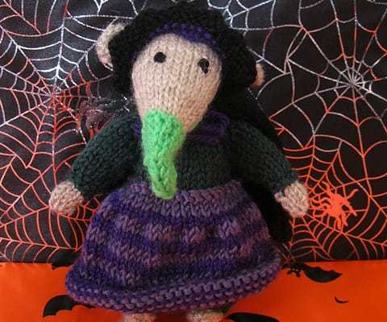
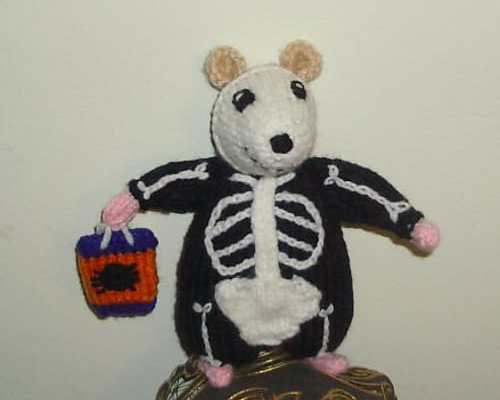
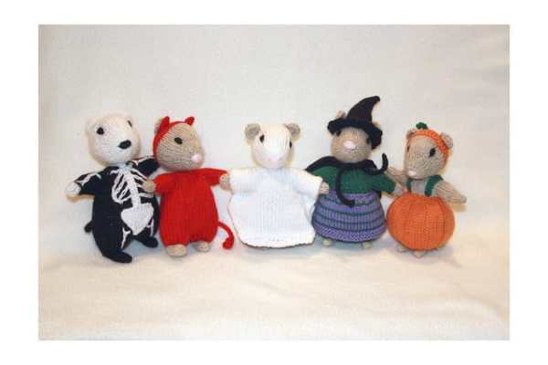

I was so excited to find all the

[Halloween Crochet Patterns](/blog/5-halloween-crochet-patterns/)

a few weeks ago, that I decided to do a follow up post only with knits! Check out these five wonderful knit patterns I found on Ravelry that are completely perfect for the upcoming holiday.

The first pattern is totally free! It’s called the

[VooDoo Doll Pincushion](http://www.ravelry.com/patterns/library/voodoo-doll-pincushion)

and it’s designed by Alison Hogg. Such a cute and creepy idea for a pincushion for all your sewing and crafting needs! I feel like the same pattern would be perfect for making a gingerbread man pincushion for later on in the year, too!

The next pattern is less scary and way cute! It comes from Alan Dart and is simply called

[Halloween Hamsters](http://www.ravelry.com/patterns/library/halloween-hamsters)

. When you buy the pattern, you get access to FIVE different Hamsters in costume! “

_A set of five toy hamsters dressed in Halloween costumes – a ghost, pumpkin, skeleton, witch and devil.”_

I think the pumpkin hamster is my fave. Which is yours?

Another great pattern is this

[Halloween Beanie by Sandra Jäger](http://www.ravelry.com/patterns/library/halloween-kitty-child-adult-beanie)

. This black cat hat (say that 10x fast!) can be made for a child or an adult, so it would be a great gift for just about anyone! I know I’d certainly wear it if someone gave it to me! Soooo cute.

A fourth pattern I loved is another freebie. This one is from the creative mind of Kristin M. Roach and is called

[Candy Corn Creature](http://www.ravelry.com/patterns/library/candy-corn-creature)

! I imagine if a real life candy corn suddenly grew eyes, fangs and feet it would probably be quite terrifying, but these guys make it sweet.

The last pattern I’ll share today is something to keep your toes warm on Halloween night! These

[Halloween Stockings by Michael Brian McNorrill](http://www.ravelry.com/patterns/library/halloween-stockings)

are just amazing! Knitting socks completely scares me so when anyone makes them I’m totally in awe, and these are so beautifully done that I’m in love. Such a great project!

Don’t forget, all of these projects (and their photos!) come from

[Ravelry](http://www.ravelry.com/)

! Be sure to check them out on there!

Which of these 5 Halloween knit patterns did you like the best? What other kind of Halloween projects should I blog about?
