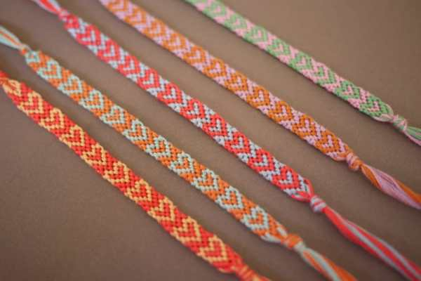
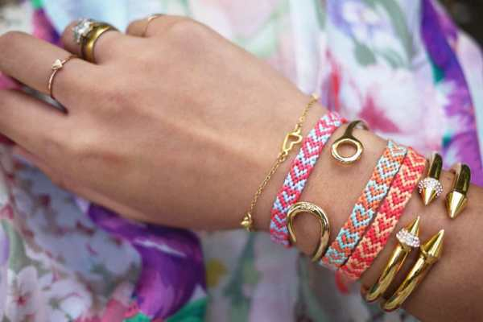
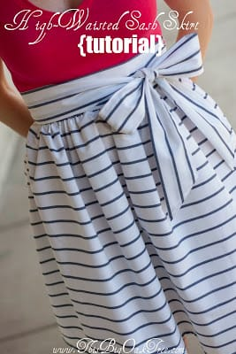
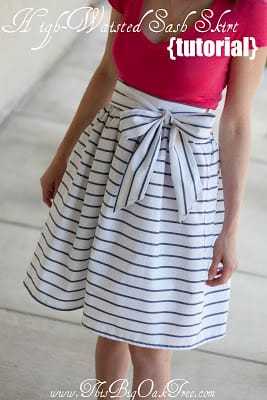
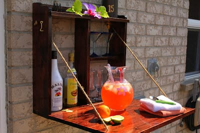
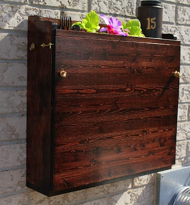
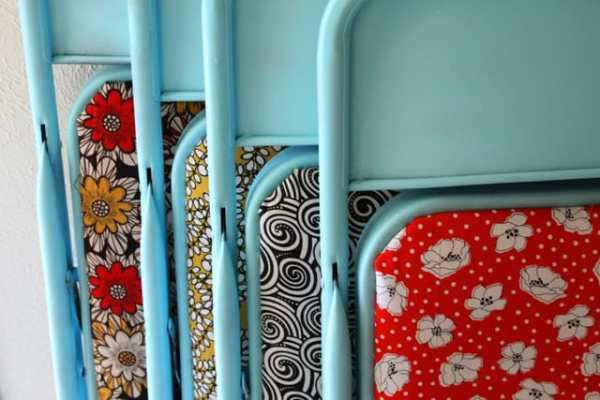
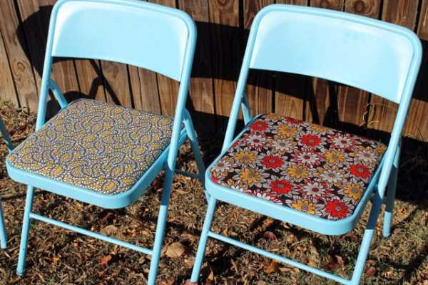
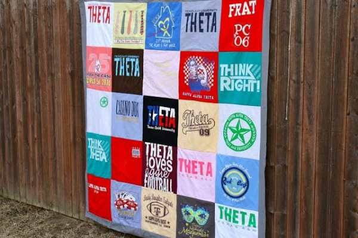
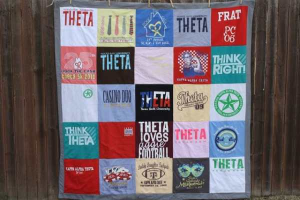

A new year means new beginnings… and new projects! There are a million ideas running through my head of things I want to try out, but these five projects are my favorite! I can’t wait to get them started in the upcoming months and share my results with you!

### Project #1: DIY Heart Friendship Bracelet from Honestly WTF

I’m bringing a ton of embroidery floss to my Knitting group in a couple weeks and we’re spending our two hour session making these instead! It reminds me of childhood so much. I had a red with black polka dots caboodle box that held all my string, and I’d use the cardboard back of my spiral notebook to make these kinds of

[friendship bracelets](http://honestlywtf.com/diy/diy-heart-friendship-bracelet/ "DIY Heart Friendship Bracelet by HonestlyWTF")

. I mastered many of them, though never this heart one. It’s been 20+ years since I’ve made any, so hopefully I won’t suck too much. So excited to give it a try!

### Project #2: High Waisted Sash Skirt Tutorial by This Big Oak Tree

I am already picking out fabrics for Spring and Summer skirts. I love bows and sashes and want to incorporate them more in my wardrobe, so I fell in love with this

[high waisted sash skirt](http://www.thisbigoaktree.com/2012/04/high-waisted-sash-skirt-tutorial.html "High Waisted Sash Skirt Tutorial by This Big Oak Tree")

pretty quickly! I can’t wait to give it a whirl. Hopefully I do a good enough job that I can make myself a few!

### Project #3: DIY Backyard Bar by Turtles & Tails

Living in a city, we were pretty thrilled to buy a house that had a backyard. Most don’t have them. Granted, it’s a teeny tiny itty bitty concrete rectangle that only just fits our grill, rug and a few chairs, but still- it’s ours. We are really looking forward to warmer days when we can finally utilize! With that being said, we really want to be able to use the space more efficiently, so a

[backyard bar](http://turtlesandtails.blogspot.ca/2012/06/its-five-oclock-somewhere.html "Backyard Bar by Turtles and Tails")

that closes up on itself when not in use is the perfect solution! I can’t wait to get to work on this in the future months!

### Project #4: Restyled Folding Chairs DIY by Punk Projects

While still on the topic of the backyard… We currently have two regular green plastic chairs out there (stolen from my Dad’s house) without much room to fit more. There are only two of us, so it’s fine. But what happens when we have company? When we emptied out our storage unit recently, we found two different colored

[folding chairs](http://www.punkprojects.com/2012/12/restyled-folding-chairs-diy.html "Restyled Folding Chairs DIY on Punk Projects")

in it. I bet painting them and giving them pretty fabric cushions will jazz them up and make them totally backyard worthy.

### Project #5: DIY T-Shirt Quilt by Sew Caroline

This one will take me awhile. I know it’s a big project and I really want to make it, but big projects exhaust me before I even begin them! Just the idea that I will have to put aside all the other projects I want to do and blog about in order to power through just one item makes me not want to start. But I will! I’ve wanted to take my old shirts from shows (Warped Tour ’01 anyone?) and adorable Woot tees that shrank immediately in the wash (I miss you, tiny dino holding a cupcake!) and make them in to one fantastical

[quilt](http://sewcaroline.com/2011/02/diy-t-shirt-quilt-part-one-of-two.html "DIY Tshirt Quilt by Sew Caroline")

forever. No better time than 2015, right? Maybe it will get done before next year!

_::fingers crossed::_

Make sure to click on through and check out each of these original projects! They’re all wonderful!

What projects do you have lined up for this year?
