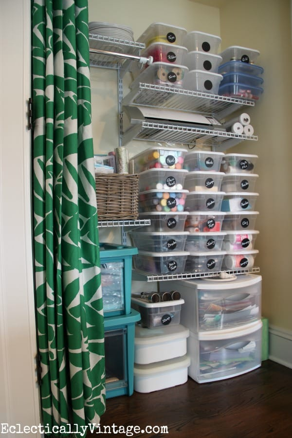
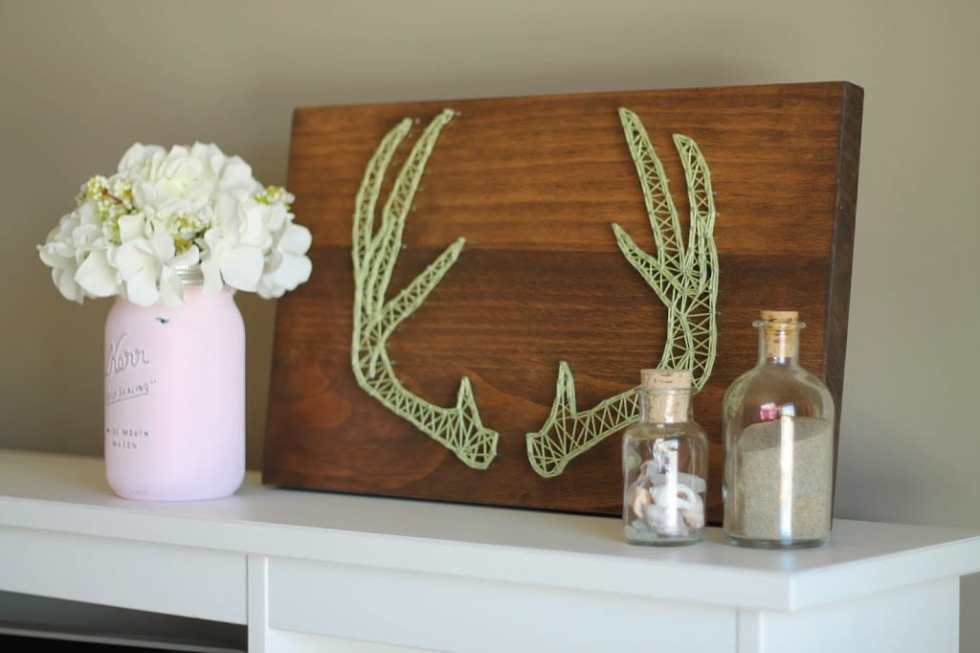

At the start of 2015, I posted about

**[five projects](/blog/5-projects-for-2015/)**

I really wanted to try out during the year. I managed to craft some, but never got around to all of them. They will remain on my to-do list until I get a chance to complete them. In the meantime, I found 5 projects for 2016 that I’m just as excited about!

This first one isn’t exactly a project… but a delicious recipe! Since I live in Philadelphia, I have no other choice but to try out this mouth watering

**[Philly Cheesesteak Dip recipe from Spend With Pennies](http://www.spendwithpennies.com/philly-cheesesteak-dip/)**

! It may not be wit wiz, but it’s certainly worth making.

The next project I’m excited for has to do with my newest obsession: VINYL! The Husband bought me a

**[Silhouette Cameo](http://www.amazon.com/gp/product/B00NAX7H78/ref=as_li_qf_sp_asin_il_tl?ie=UTF8\&camp=1789\&creative=9325\&creativeASIN=B00NAX7H78\&linkCode=as2\&tag=katicraf-20\&linkId=22BNZVMJJYK7UWNU)**

for my birthday, and then a heat press for Christmas- so I’ve been busy sticking vinyl on everything under the sun. Add that to my already established love of nail art and this craft idea from

**[Miss Audrey Sue](http://missaudreysue.blogspot.com/2014/03/diy-nail-art-decals-silhouette-file.html)**

is totally up my alley! I can’t wait to make nail decals for every occasion!

Yet another Silhouette related project- appliqués! Santa brought me a fabric blade and some heavy interfacing, so my very large fabric stash is in danger of being stuck to everything soon too! I love this craft idea from

**[Where The Smiles Have Been](http://www.wherethesmileshavebeen.com/how-to-cut-fabric-and-make-a-no-sew-applique/)**

because it’s no sew, but uses a few of my favorite craft supplies at once.

I really want to get organized this year, so one of the projects I want to tackle is craft storage! My craft closet is screaming for a makeover (a.k.a. everything is falling off the shelves and I can’t find anything at all!) so when I saw a great (and organized!) craft closet on

**[Eclectically Vintage](http://web.archive.org/web/20160925233238/http://eclecticallyvintage.com/2014/01/craft-supply-organization-tips-chalkboard-labels/)**

, I was inspired! Half my battle with my closet is the horribly old bi-fold door. It’s constantly falling out of the tracks and making it impossible to open all the way and get to anything. If I replace it with a curtain rod and some pretty DIY curtains, it may make things a bit easier! Then I can use a ton of labeled storage containers like in the photo and have something much more manageable!

A last project for 2016 that I’m excited to try is string art! It’s something I’ve always really admired but never tried. 2016 shall be the year that changes! Coming up with a design idea for this one will be hard, since there are about a million things I want to try. I really love the antlers that

[**Messes to Memories**](http://www.messestomemories.com/2014/08/diy-antler-string-art.html)

made. Simple and adorable!

I’ll be sure to share my attempts at these 5 projects for 2016 as I try them out! Which of these are you most excited about?
