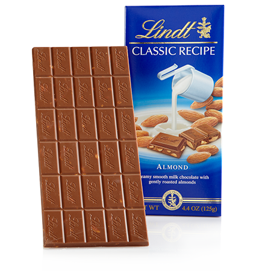
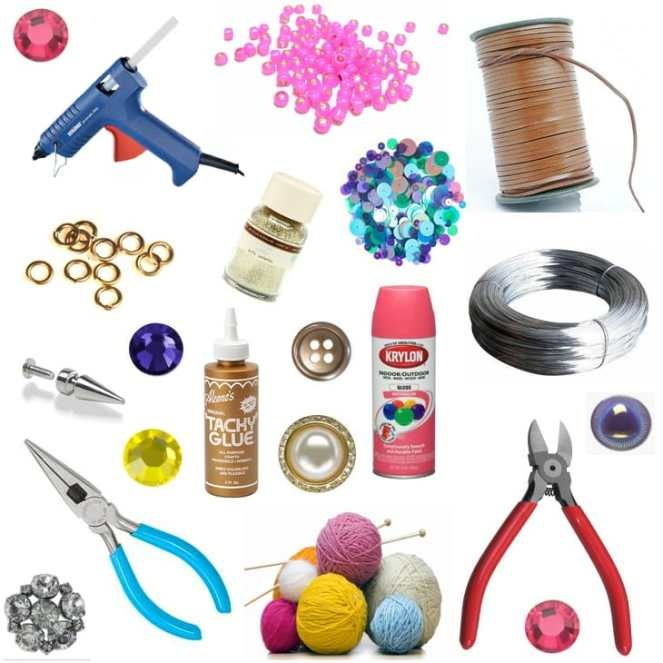
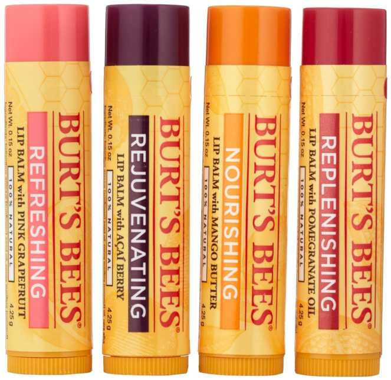

Today’s post is all about 5 things that are total essentials for me, things I just can’t live without! It was inspired by a conversation about

[Man Crates](http://www.mancrates.com/ "Man Crates")

, a company that makes fun gift boxes for guys. The Husband is pretty excited about this concept, since most subscription sampler boxes we hear about are for us ladies, or include things he has no interest in! If I could make my own survival kit box, these things would be in it.

First off, we’re eliminating things like “oxygen” or “water” or “food”! This isn’t a fending-for-your-life kit so much as it is a life-would-really-suck-without-these-things kit. Here we go!

\#1: Eyeliner.

It sounds silly, yeah. But I can’t leave the house with at least some eyeliner on. Even if I don’t have time for any other makeup- I have to have on eyeliner.. otherwise I look twelve!

\#2: Chocolate.

Not even any particular kind- my favorites tend to change- but my chocolate cravings never do fade! I’d definitely need chocolate in my essentials box!

\#3: Craft Supplies.

I’m picturing being stranded on a desert island, with my eyeliner on, my chocolate all eaten, and nothing else to do! Sure, relaxing on the island would be nice for a little while, but I’d surely get bored. Crafting time is my happy time, no matter what the project is. If I had some craft supplies in my essentials box, I’d be all set!

\#4: Lip Gloss/Chapstick.

This isn’t just because I want color on my lips- that part doesn’t mean too much to me- I just always feel like my lips are dry and it drives me crazy. Having some kind of lip gloss or chapstick or lip balm in my box would save me from that!

\#5: Photos.

Presumably I can’t fit my Husband, family, friends or kitties in the box (well, the kitties would probably try to squeeze in anyway), so photos of all of them would be a must have! That way I could relive moments and smile thinking of them.

What 5 things can you absolutely not live without that you’d want in your essentials box?
