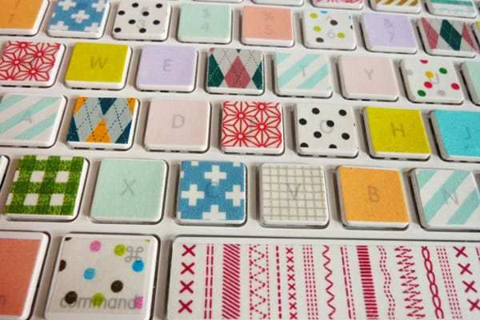
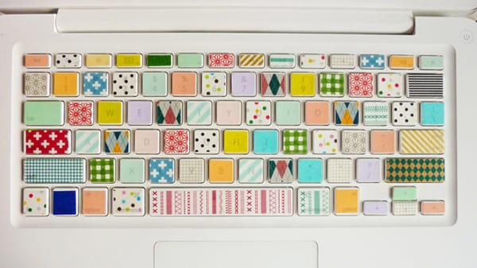
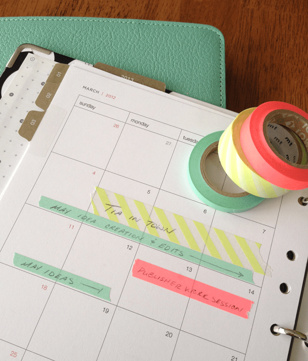
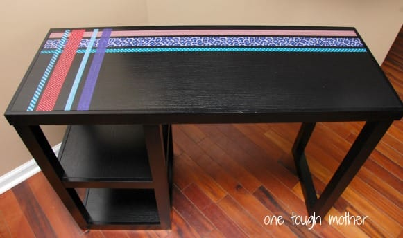
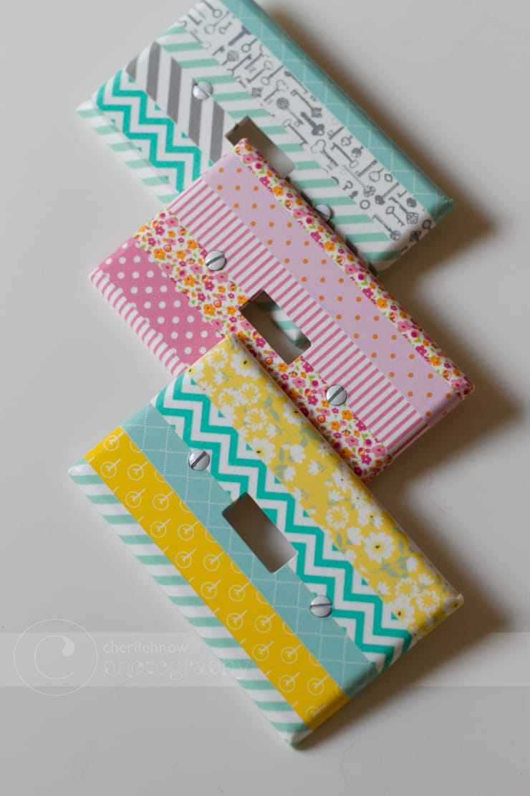

5 Uses For… Washi Tape!

I have a confession. Up until about three months ago, I’d never used washi tape. I knew all about it, thought it was cute, but just never had the impulse to buy any. I thought it was just glorified masking tape (okay, so it kind of is) – but it makes sealing packages or closing letters so cute and special! Then I started looking up other uses for it, and now I’m hooked. Here are five different ways I’ve found to use washi tape that you might enjoy too!

First off, let’s define washi tape! “Washi” is actually a type of handmade paper from Japan consisting of fibers like bark, shrubs, rice, wheat, etc. Quite literally it means Japanese (wa) Paper (shi). I first learned of it in printmaking class when we used it for our prints. If you’ve ever used it, you know it has a slight transparency to it, and while it is delicate it’s also quite sturdy. Washi tape is very similar- only it’s tape! It isn’t as sticky as, say, Scotch Tape. You can put it on something and gently pull it off without ruining the item or leaving behind glue- much like when you use painter’s tape. It’s really fun to use… and let’s be honest- it’s pretty fun to say, too.

I love doing “5 Uses For” posts. They force me to look outside the box for new uses for things I already own and need to get more creative with.

[**Yesterday**](/blog/sunday-funday-issue-18/ "Sunday Funday: Issue 18")

, I told you I had some fun washi tape posts coming up this week, and this is the first. I hope you enjoy all the picks I collected below for great uses for washi tape!

> This round up consists of five totally great projects from other awesome crafters! To see more photos or follow the tutorials for each, click the provided link! All photos are courtesy of them!

The first tutorial comes from

[**MiniFanFan.com**](http://minifanfan.com/2055383/Happy-Keyboard-for-Happy-People "MiniFanFan Keyboard")

. Dressing up your keyboard is easy to do using washi tape, since it’s transparent!

Next, I found a great way to dress up your college dorm room door! I wish I’d had washi tape when I was in college. It would have been used on everything!! For even more dorm room ideas, check out

[**Apartment Therapy**](http://www.apartmenttherapy.com/dorm-diys-10-ways-to-add-personality-to-drab-college-digs-193317 "Apartment Therapy Dorm Room Washi Tape Ideas")

!

This tutorial is one I’m doing as soon as I finish this post!! I need to update my Katie Crafts calendar since it’s getting quite busy, and this is the perfect way to highlight things in it! The idea comes from

[**Take Two They’re Small**](http://take2theyresmall.com/my-calendar-from-overloaded-to-energized/ "Take2theyresmall Calendar with Washi Tape")

!

My new crafting area is just a big desk from Ikea. It’s nice and new and black and extremely plain looking. It’s got lots of my trinkets and crafting supplies on top of it, but I still want to decorate it a bit. Rather than putting items on top of it and cluttering it up, I am going to decorate it with washi tape! My idea was realized when I saw this tutorial on

[**One Tough Mother**](http://onetoughmotherblog.com/2012/08/diy-washi-table.html "One Tough Mother Wash i Tape Table")

!

My last pick for washi tape uses is one I definitely wouldn’t have thought of myself. Thank goodness for Pinterest, amiright? I can’t wait to unscrew the plain white lightswitch plates around my apartment and jazz them up with some washi tape! They will be their own little works of art!

[**Tinker With This**](http://tinkerwiththis.blogspot.com/2013/05/craftilicious-washi-tape-projects-and.html "Tinkerwiththis Washi Tape Projects")

has a ton of great washi tape ideas- this is just one of them!

My hope is that you are now so excited by these new ideas for washi tape that you can’t wait to make something! Especially because later this week, I will be teaching you how to make your own washi tape! That way, you can decorate whatever you like with a design that is totally yours. Make sure to find your way back to Katie Crafts later in the week to learn more!
