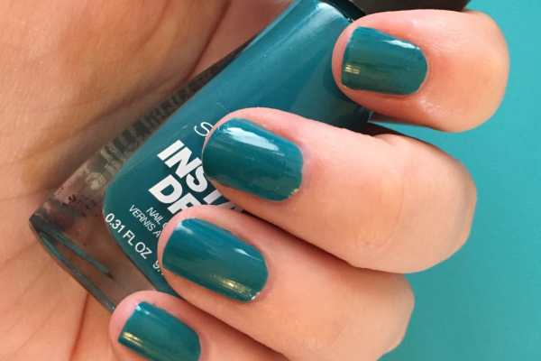
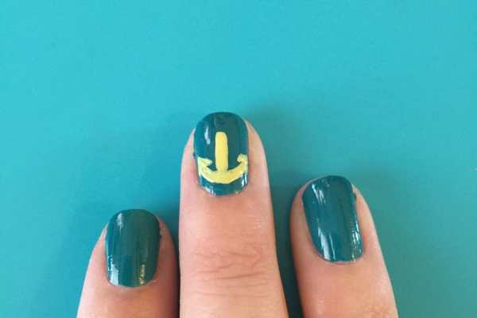
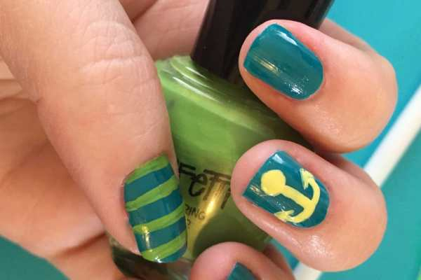
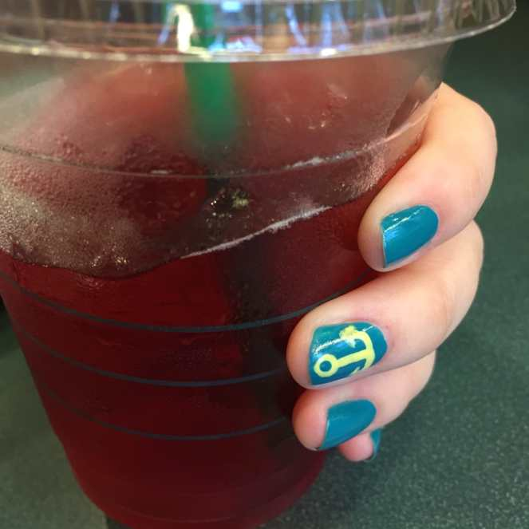

If you remember anything about last year, you may recall my obsession with

**[anchors](/anchors-away-etsy-picks/)**

during the Summer months. I thought it would be cute to do a quick nail art look based on them using some fun aquatic colors!

## Materials:

- Teal quick dry nail polish

- Yellow nail polish

- Green nail polish

- Clear top coat

- Nail art brush

- Dotting tool

## Instructions:

- Begin with the teal nail polish as your base. I used Insta-Dri by Sally Hansen in the color

  _[“Re-Teal Therapy”](http://amzn.to/1MYccez)_

  and only needed one coat! If your polish needs two, let dry in between coats.

- Use the nail art brush dipped in yellow polish to draw a straight line halfway down the middle of your accent nail to create the shank. Then draw an arch under it to make the bottom of the anchor, or the

  _arm_

  . Paint the little arrows (also known as the

  _flukes_

  ) at either end of the arm.

- Use the large end of the dotting tool to make a yellow circle on the top of the anchor. Let dry.

* Use the nail art brush to draw green stripes on your thumb, or second accent nail. Let dry.

* If the large yellow dot at the top of the anchor is totally dry now, use the smaller end of the dotting tool dipped in teal to make another dot in the middle of it, giving the illusion of a hole. Let dry.

* Seal in look with clear top coat.

Enjoy your adorable anchor nail art look wherever it may take you! Mine took me to Starbucks. Anchors away!

Enjoying my cold Passion Tea with my cool anchor nails!

What other Summer nail art looks should I try before the season has shipped off?
