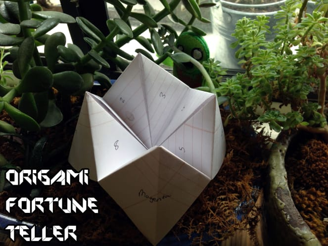
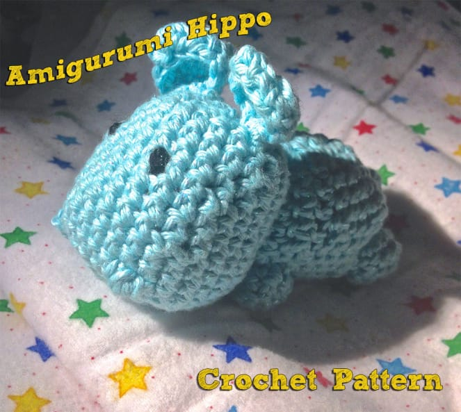
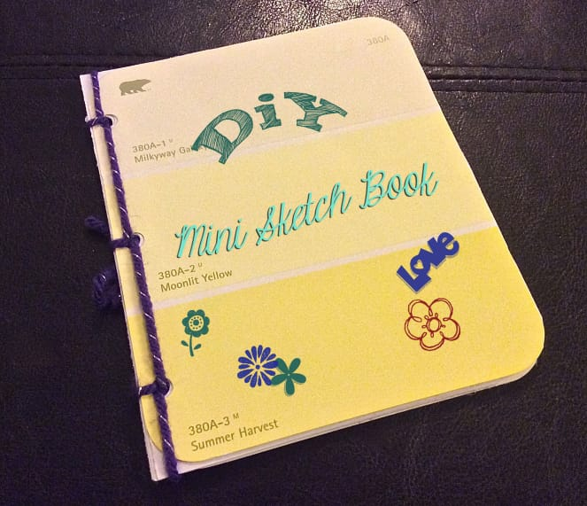
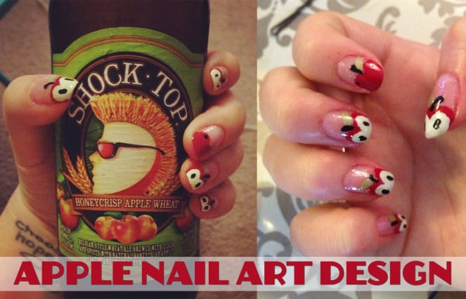
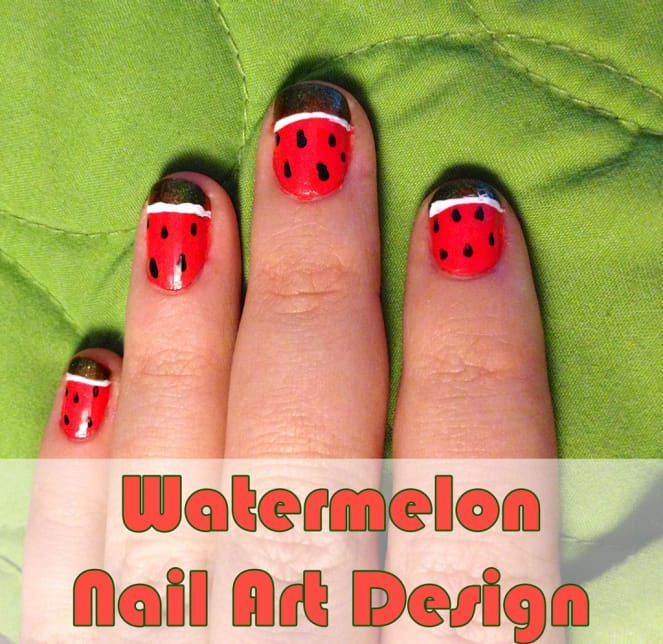
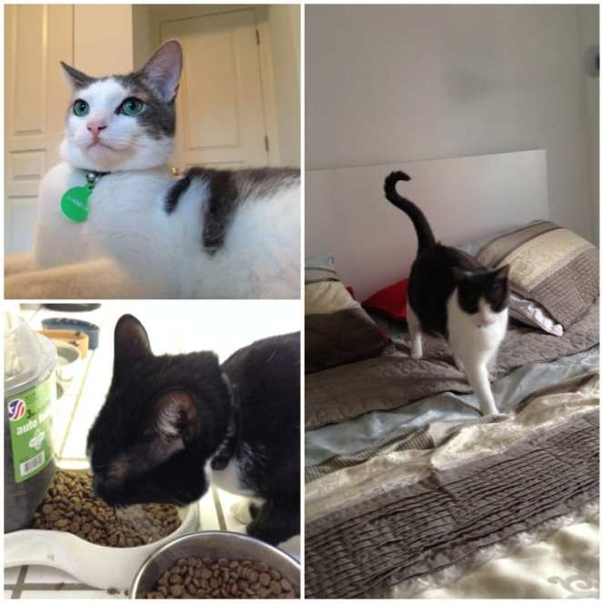

Hello, September! I have mixed feelings about this month. It means Fall is just around the corner (which is my fave!) and it means the anniversary of the first time the Husband and I met/had our first date/officially started dating, but it’s also the anniversary of losing my mom. Now on top of the current plethora of important dates during the month, we are adding buying a house and moving in to the mix. September is QUITE a busy and emotional month! For a minute, let us forget it is September and lets reflect back on August with a round up of my favorite projects from the Summer!

## Crafts

[**DIY Baby Play Mat**](/diy-baby-play-mat/ "DIY Baby Play Mat")

: I had sew much fun (see what I did there?) making this play mat! It was MEGA simple and came out really cute. I will definitely be making them for all the babies in my life in the future!

[How To Turn Your Old T-shirt In To A Pillow](/how-to-turn-your-t-shirt-in-to-a-pillow/ "How To Turn Your Old T-Shirt In To A Pillow")

:

I made this little pillow for my Sister out of my Husband’s old shirt, and it came out pretty cute! At least, she seemed to really love it! She totally could have been lying to me though! 😉

[Origami Fortune Teller](/origami-with-the-husband-fortune-teller/ "Origami Fortune Teller")

:

This one is courtesy of the Husband! I love when he does origami posts for the blog, and this is my favorite so far. It reminded me of childhood so much! Who doesn’t love these kinds of paper crafts?

[**Crocheted Amigurumi Hippo Pattern**](/crocheted-amigurumi-hippo-pattern/ "Crocheted Amigurumi Hippo Pattern")

: While I cannot take credit for the pattern itself, I did make the little hippo using said pattern and it came out crazy adorable! I’m so glad I found it and was able to share it with you guys!

[DIY Mini Sketch Book](/diy-mini-sketch-book/ "DIY Mini Sketch Book")

:

I still think this is such a great school project for a teacher to do with his/her class! Paint chip swatches are free at most hardware stores, you can use computer or notebook paper for the middle and one skein of yarn is way more than enough to bind all the sketch books in your classroom. Fun and easy project for kids!

## Nail Art

[Apples Design](/apples-nail-art-design/ "Apples Nail Art Design")

:

Just in time for back to school, my apples nail art design is perfect for the beginning of the season! It’s still one of my favorite designs! And way easier than it looks!

[Watermelon Design](/watermelon-nail-art-design/ "Watermelon Nail Art Design")

:

Did I really only do fruit related nail art posts in August!? Guess so! This watermelon design is the perfect way to say

_“Good-Bye”_

to the summer!

## Speaking of “Good Byes”…

[**10 Tips & Tricks For Moving**](/10-tips-tricks-for-moving/ "10 Tips & Tricks For Moving")

: Saying “see ya later!” to our apartment and saying “hello!” to a new house is super stressful, but here are my top ten tips and tricks to make your big move easier! They are so handy- you will be glad to have them bookmarked!

We also said g’bye to these sweethearts the last weekend of August! We cat-sat for them for two and a half months and I really do miss them! They were the loviest trio! Meese you Marshall, Samantha and Biggie!!

How was your August? Anything big planned for September?
