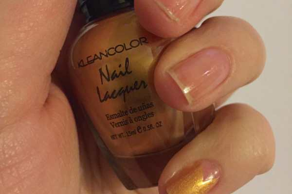
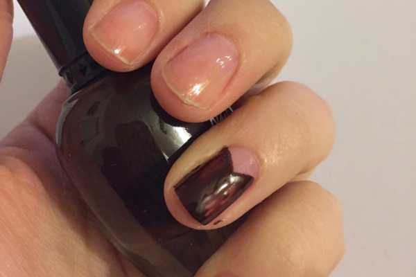
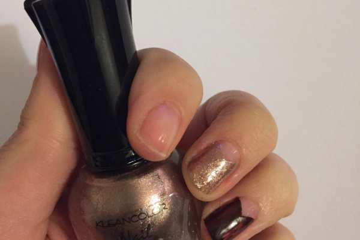
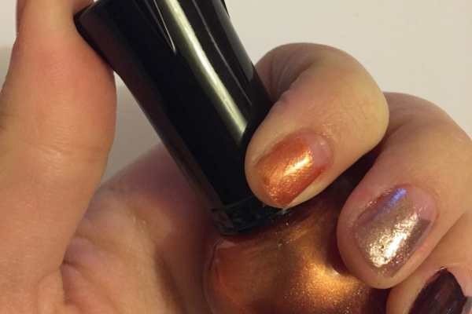
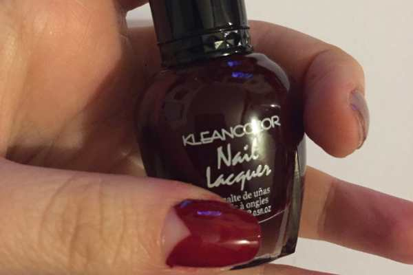
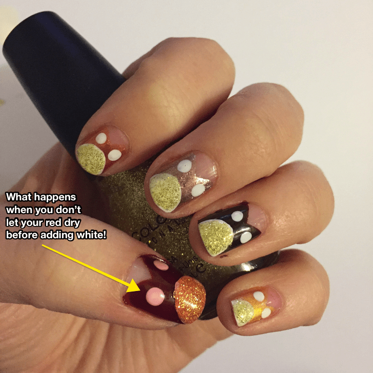
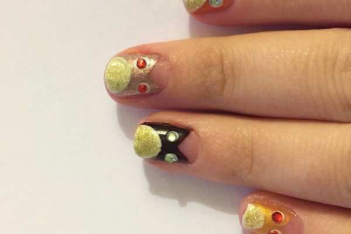
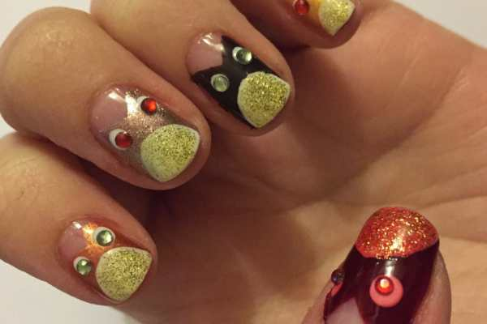
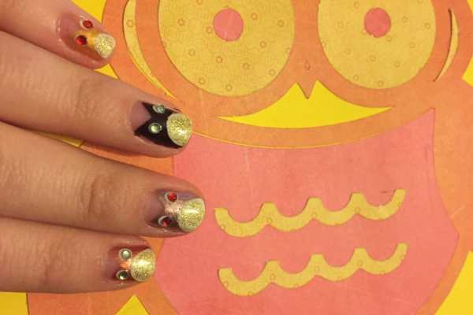
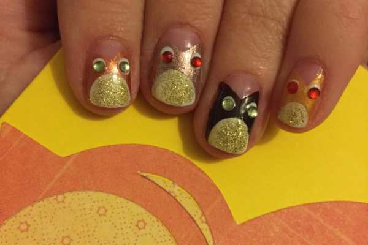

Full disclosure: I’m a little obsessed with owls. There are owl related items in various places around my house. One of my favorite shirts has a big metallic owl on it. I watch cute videos of owls whenever they pop up in my feed. Honestly, I’m surprised it took me this long to make some fun owl nail art- but I think it came out pretty great! Here’s a tutorial so you can get the look too!

Before you close this page thinking these owls are going to take too much time/be too complicated/involve way too many nail polish shades to complete- stop! They are VERY easy, they are quite quick, and you can do every owl the same color if you like, thus cutting down on the amount of different polish shades you need by a ton. I will post everything I used in this tutorial below, but you don’t have to use all the same things!

## Materials:

- Clear base/top coat

- White nail polish

- Brown nail polish\*

- Burgundy nail polish\*

- Copper nail polish\*

- Taupe nail polish\*

- Gold nail polish\*

- Gold glitter nail polish

- Gems for eyes (whatever colors you like, 10 pairs total)

- Dotting tool

\*I don’t know

[if you recall](/fall-nail-art/)

, but these all came in the same Klearcolor Nail Lacquer pack from

[Amazon](http://amzn.to/1Vzywv8)

!

## Instructions:

- Begin with clean, dry nails. Put a clear base coat on each and let dry.

_If you are doing each nail a different color owl, choose which nails you want for each shade. If you are doing them all the same color, you may skip the next several photos and power through doing each nail now!_

- With your first owl body color, swipe the polish from the top corner of your nail to the bottom middle of your nail. Do the same on the opposite side. Fill in any empty spaces on the bottom. This will create the owl ears and owl head/body.

- Continue doing this for each nail until all are completed. When they are totally try, do a second coat on any that need it.

Second coat!

- When your polish is one BILLION percent dry (you’ll see one of my nails was not in a minute!!!), use your white nail polish to swipe on a semi-circle on the bottom of each nail, creating the owl bellies. Let dry completely.

* Use your large dotting tool dipped in white polish to create eyes just under each ear. Let dry.

* With gold glitter nail polish, cover the white of each belly. Let dry.

- When all the polish is all dry, paint clear top coat on each nail one at a time. As soon as you’ve painted a nail clear and it is still wet, place your gems on the white eyes so they stick. Then move on to the next. Painting clear on TOP of the eyes definitely makes them stay a lot longer, but it takes away some of the sparkle of the rhinestones, so for this tutorial I did not do that. You may, however!

- Clean up any stray polish on your fingers and you’re done! Enjoy your new little owl friends!

What do you think of my cute little autumn owls nail art design? What other woodland creatures should I try out?
