I’ve been dying my hair one color or another for over a dozen years now. I’ve had light, medium and dark brown. I’ve had light red penny and dark cherry cola. I’ve had blonde, pink, red, purple, orange and blue highlights- many at the same time. For a few years, the top half of my head was brunette while all my hair underneath was fire engine red (I still miss this look!). Along the way, I picked up a few tricks and thought I’d share them with you!

Once I got engaged a few years ago, I dyed my hair back to regular old brunette, so that by the time the wedding rolled around, my roots wouldn’t be showing as much and I’d be pretty much my natural color (who knows what that is at this point!) When the wedding was all said and done, I decided I really wanted to bring back some of the fun I used to have with my hair, but dying the entire underneath of it was a lot of work. I’ve always wanted to have an entire head of fire engine red, but I know my roots would show quickly and I’d get too lazy to fix them. That’s why just a single strip of red under my hair that shows when it’s pulled up into a ponytail or bun, but can be hidden with my hair down when the roots are growing back and I haven’t fixed them yet was perfect.

Obviously, you should always follow the directions on your box/jar/etc. of dye, but I’ve learned a few tricks and tips along the way that I find valuable, and you may too! If you’re ready to take the plunge with a fun (but hidden) hue, here’s my guide!

## Materials:

- Blonde hair dye\*

- Semi-permanent conditioning hair color of your choosing\*\*

- Aluminum foil

- Petroleum jelly

- Gloves

- Hair clip

- [Hair dye application brush](http://amzn.to/1DmJw6T "Hair Dye Brushes on Amazon")

- Small bowl that you don’t mind getting stained

- Old towel that you don’t mind getting stained

- Old shirt that you don’t mind getting stained

\*You want something with a developer in it that will lighten your hair, which some brands market as “high-lift”. I like L’Oreal brand dyes because they don’t drip much and don’t damage my hair like other brands do, but you can use what you like… as long as it lightens! I used

_L’Oreal Excellence_

in

_Extra Light Natural Blonde._

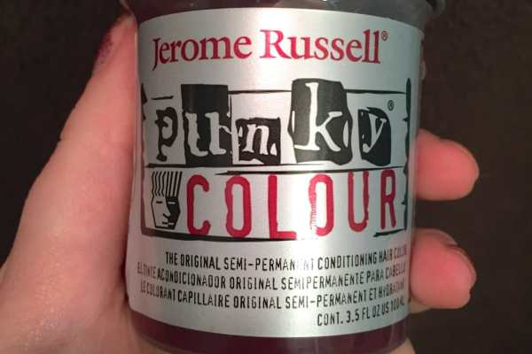

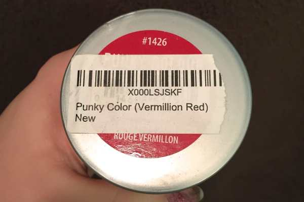

\*\*I have tried Manic Panic, Special Effects and various other fun colored dyes over the years, but

[**Jerome Russell**](http://amzn.to/1LC4l4d "Jerome Russel Hair Color on Amazon")

is my favorite! It stays in my hair longer and is brighter than others I’ve tried. Also, it smells really good. Like some kind of candy or something that I can’t put my finger on. I definitely recommend it. I used

_Jerome Russell Punky Colour_

in

_Vermillion Red_

for this tutorial. My sister has used the Purple in the past and it was great too.

## Instructions:

- Follow instructions on the box of blonde dye. Mine said I needed dirty hair, which they do most of the time. Be sure to check the instructions on yours!

- Put on your old t-shirt, if you haven’t done so already.

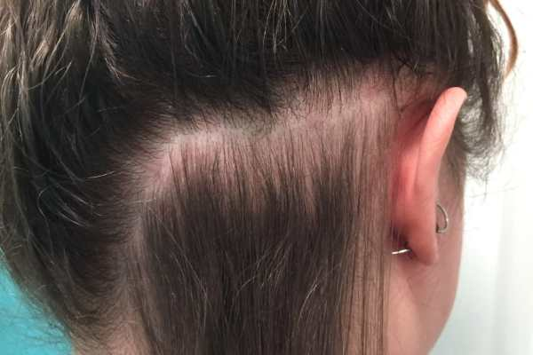

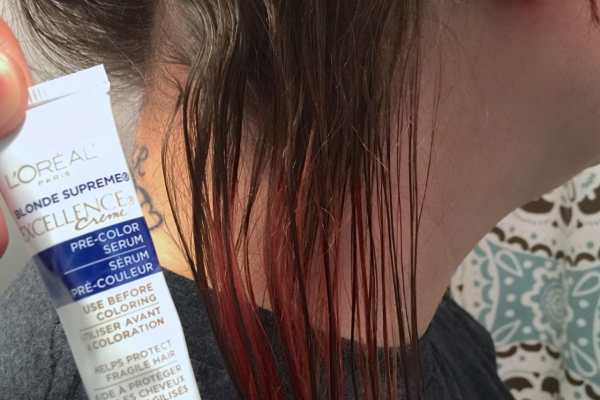

- I parted my hair for the strip I wanted colored and put the rest up in a messy bun, so it was away from the section that would be dyed. Then I applied the pre-color serum that came with my box.

Seriously, how ridiculous is this bun?!

- Since I only wanted a strip of hair bleached, I thought it would be wasteful (and silly) to mix the ENTIRE box of blonde, especially because you can’t mix it and then save it. That’s why I used a small bowl and mixed equal parts of the color and developer so I’d only use what was needed.

- Throw your old towel around your neck so you don’t get bleach anywhere unnecessary.

- Place a piece of foil underneath your hair right up to where the roots are.

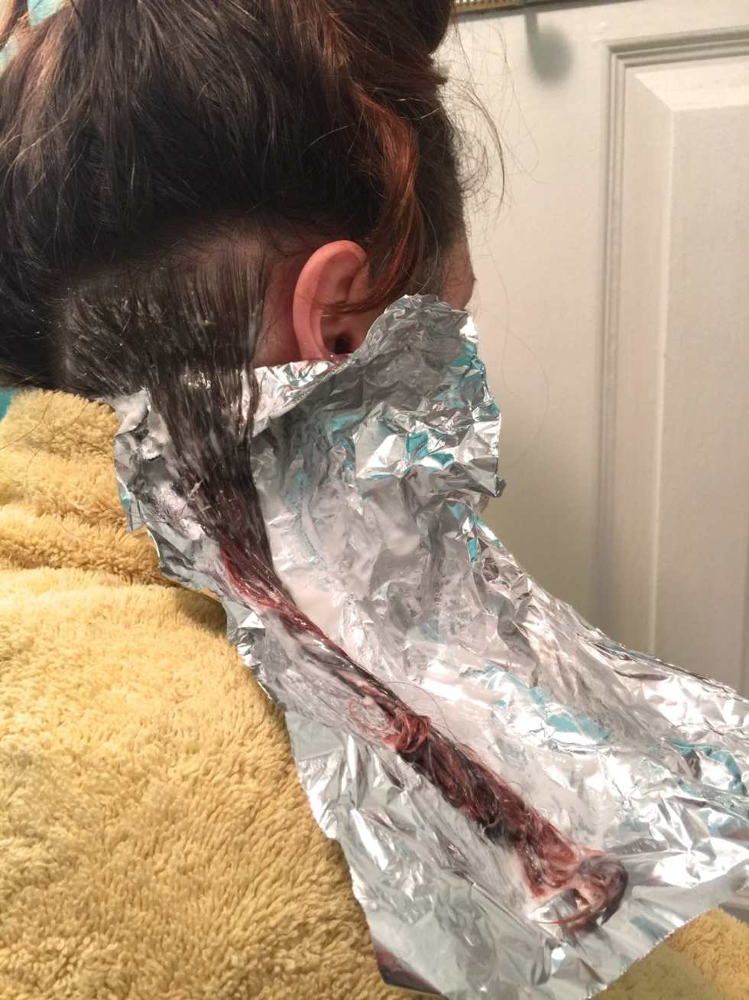

- Don your fancy rubber gloves, grab your hair dye applicator brush and paint it on! Make sure it’s totally saturated. As you can see from the above photo, it’s been awhile since I’ve done my roots. There are quite a few inches between my scalp and the red that is still in my hair. It was definitely time!

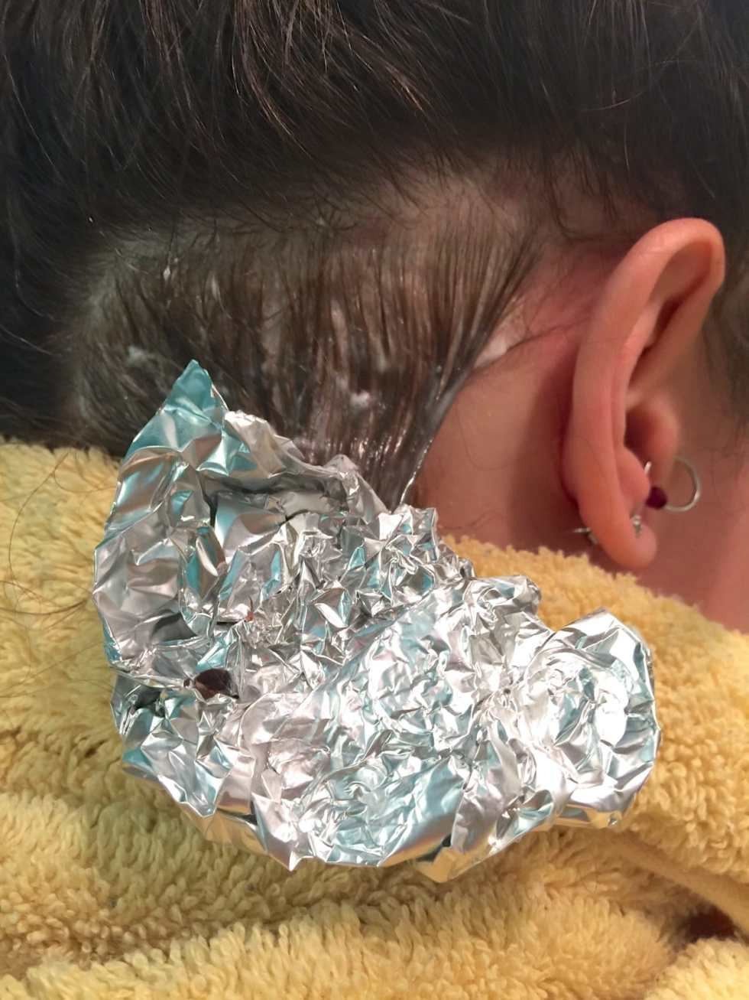

- Fold or crumple the foil all the way up to your scalp and set your timer for whatever the box suggests. Take off your gloves carefully (you’ll use them again soon!) and go write a blog post while it sets.

- When the timer goes off, check your hair. Because I didn’t get the blondest of the blonde dyes, mine was barely lighter than my original color. I applied a little more and folded the foil back up again.

The second time was the charm, though you may not be able to tell from the below photo! Trust me, it’s all I needed to make it work.

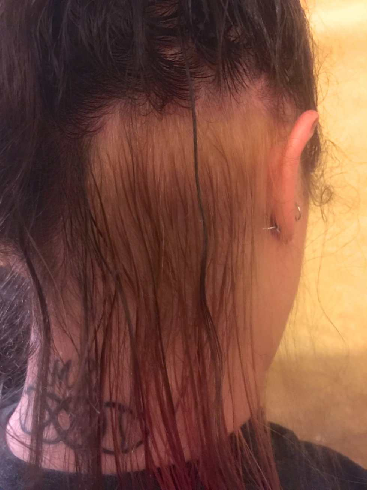

- When your timer is finally done, put your gloves back on and carefully wash out all of the bleach/blonde dye. Remember not to get any in your eyes! If you’re all done with color #1, wash out the bowl.

- Let hair dry naturally or speed it up with your hair dryer. Get out any knots.

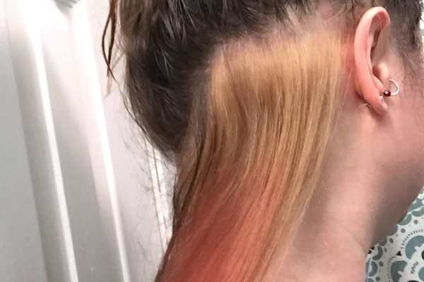

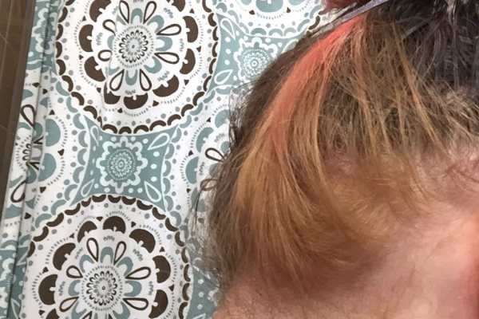

- Clip your hair up away from your neck, and spread as much petroleum jelly on the skin surrounding your hair-to-be-dyed section as you can stomach. Make sure to get the skin on your neck, behind your ears, on your ears and absolutely anywhere else the dye may hit. It’s gross, but it’s a lifesaver.

- Get another strip of foil and stick it right to the petroleum jelly underneath your roots just as before.

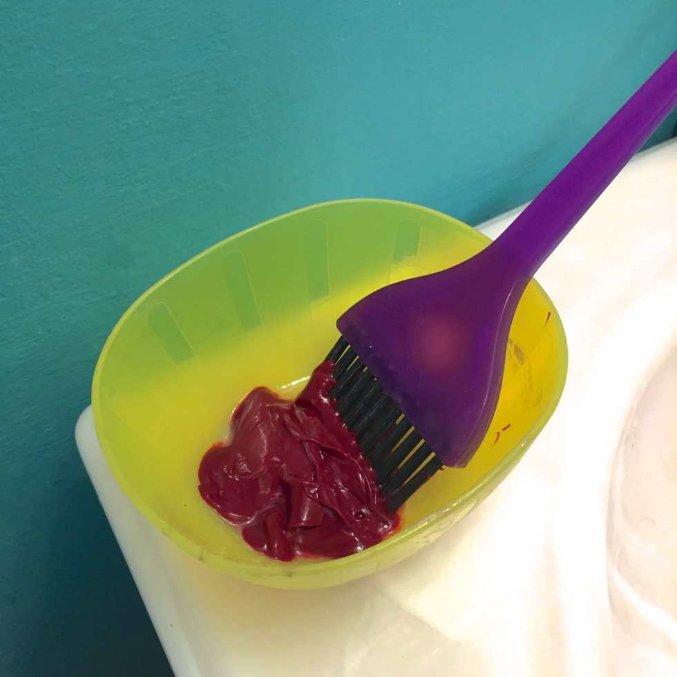

- Dump a little bit of your colored dye in to the bowl and use the brush to apply it to your dry, clean hair. Just paint it all on! Wiggle the brush around a little roughly to be sure you are getting each and every strand of hair. Be generous with it!

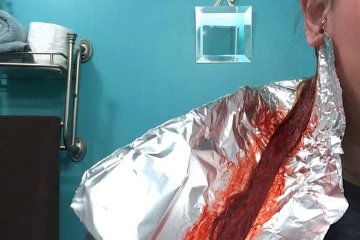

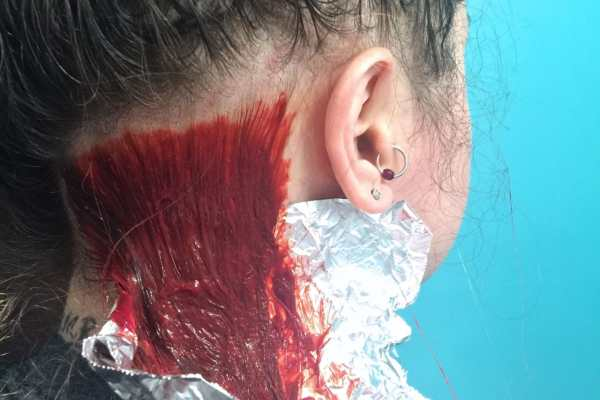

- When finished, once again fold/crumple up the foil, remove gloves, set timer and wait however long the brand recommends! Keep your towel around your shoulders and be sure to NOT LEAN ON ANYTHING during this time! You don’t want to ruin your couch, pillows or cat because you leaned on it with dye. Additionally, remove your glasses, even if you don’t want to. I dyed the very tip of mine a little red. Whoops.

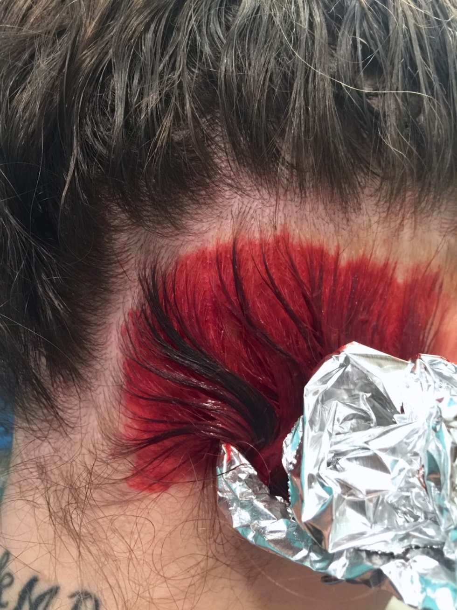

- When the time is over, check your hair. If you’re satisfied, it’s time to wash! Put your gloves back on and choose a sink that isn’t super porous to rinse it out in. I once rinsed it out in a bathtub that held the red color for several months, despite my scrubbing efforts. Stainless steel kitchen sinks are definitely the best for this, but be sure to WIPE DOWN EVERYTHING as SOON as you are finished, just in case!

- Rinse your hair out with COLD WATER (or as cold as you can stand) until the water runs clear. Be sure to remove any petroleum jelly, and get the bits of dye from your scalp too!

- Let hair dry naturally or blow it out with your hair dryer.

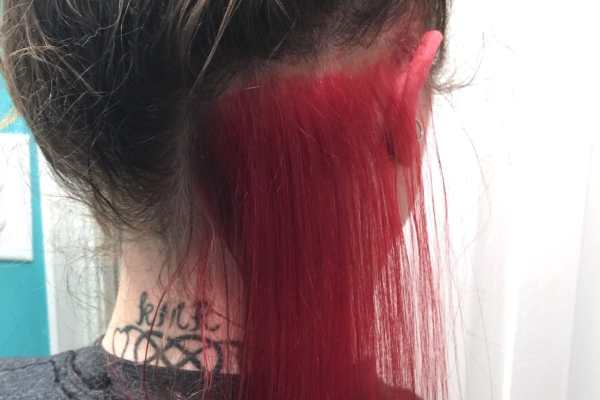

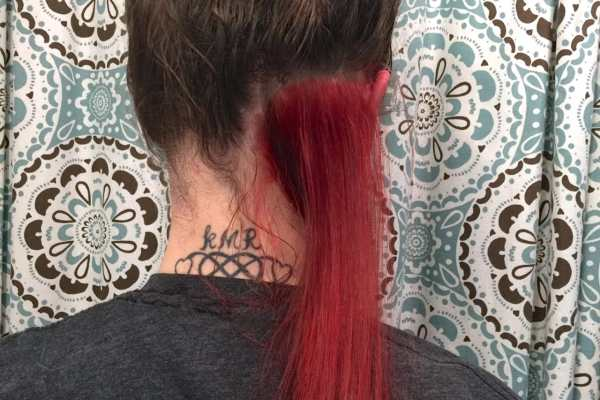

- Put back up in bun for remainder of evening and still be careful about leaning on things, just in case.

- Enjoy your new hair!

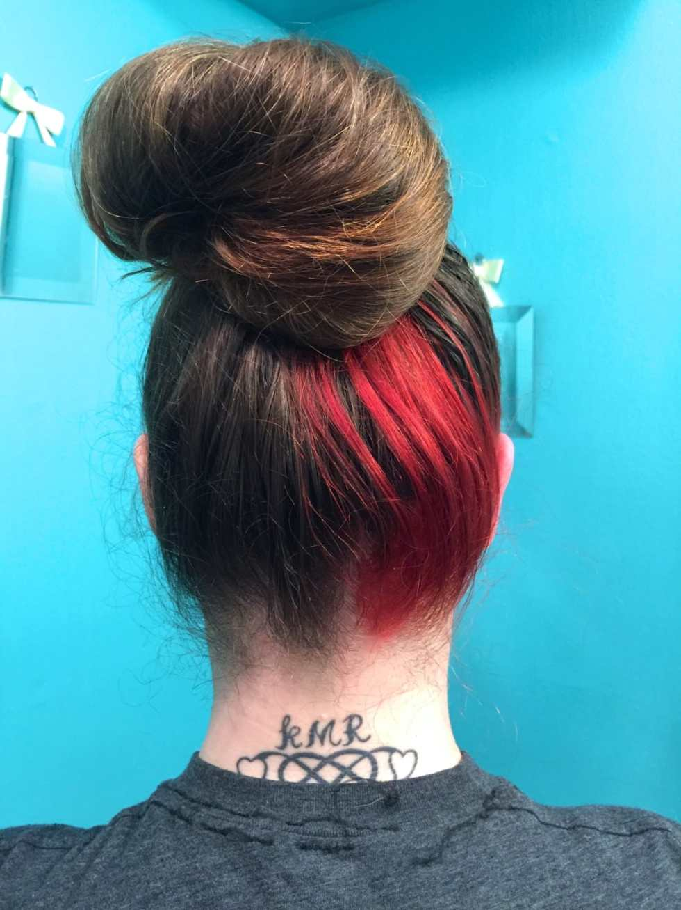

## Aftercare Tips:

- I actually wear my hair up like this for the whole first week that I’ve dyed my hair, so that any red that I didn’t wash out well enough doesn’t get on my clothes. After a couple of washes in the shower, that stops happening though and all is fine.

- I also put an old pillowcase on my pillow for this week as well, since I toss and turn and sweat in my sleep. This makes the dye rub out a little and can stain your sheets. It didn’t happen for my sister, but she isn’t a horrible sleeper like I am, so maybe you’ll be luckier.

- If you’re doing a dye that is red-based especially (but really, this goes for all dyes), shower with COLD WATER. Hot water takes the color out much faster.

- If you must shampoo and condition your hair (will also take the color out faster), make sure to use color safe products. I will typically shampoo all my other hair besides this small strip, and then condition it all. Since it’s a tiny piece of hair, it’s easy to do. How you care for your hair after dying it will determine how long it stays put. Don’t stress if you wash it out accidentally too quickly, you can always re-apply! Since there is no bleaching agent in the color, your hair doesn’t need a long break between dye jobs.

- Wash your towel with the dye on it ALONE in the washing machine, or it will likely dye other items in the load. Make sure you do this the same day you use it, simply because your first shower after dying will most likely result in some color loss and running, and you’ll want to use it again to dry off.

- One last tip… if you know it’s supposed to rain today, and you have somewhere to be tonight, don’t dye your hair. You’re just asking for trouble. 😉

Have you ever dyed your hair a fun color? What shade did you go with? Any other tips to add?
