Happy Monday! With less than three weeks to go til Halloween, I started playing around with the nail art I wanted to try, and came up with this super easy and boo-tiful design! It’s what I wore to New York Comic Con over the weekend (long recap post on that coming later in the week!) Check out how to make these super cute nails below!

I was originally going to make this design as all little ghosts, but decided to go with a couple variations too! The little pumpkins aren’t so perfect, but I love how the little monster-alien-guys came out. The red gem eyes are pretty wonderful! What do you think? You can go with all little ghosties if you prefer, though! It takes out a bunch of the work!

## Materials:

- Clear base coat

- Black, white, neon green, orange and yellow nail polish

- Red nail art gems

- Nail art brush

- Large dotting tool

- Matte top coat

## Instructions:

- Starting with clean, dry nails, paint clear base coat on each nail and let dry completely.

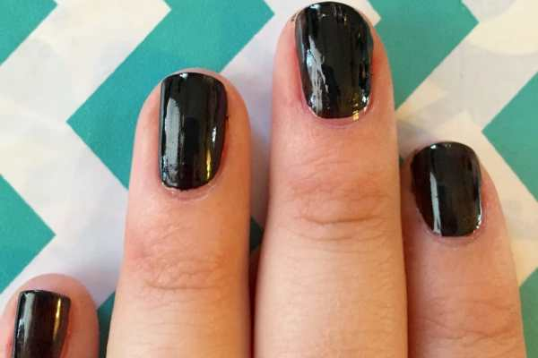

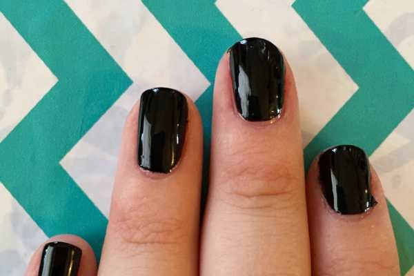

- Do one coat of black polish and let dry. (above left)

- Do a second coat of black polish if needed, and let that dry completely too! (above right)

* Using just the brush your polish bottle comes with, make two or three swipes of white the bottom of each nail to create a ghost shape. Let dry.

- Pick the nails you want to make your pumpkins on and make a little stem of white on top. Let dry. (I forgot to do this step until later, but you should do it now!)

* Now it’s time for your accent nail monsters and pumpkins! Paint orange over the white for the pumpkin nails, and paint green over the white for the monster nails. It’s important to paint these shades over dried white as the colors on top of black will just get lost. Let dry.

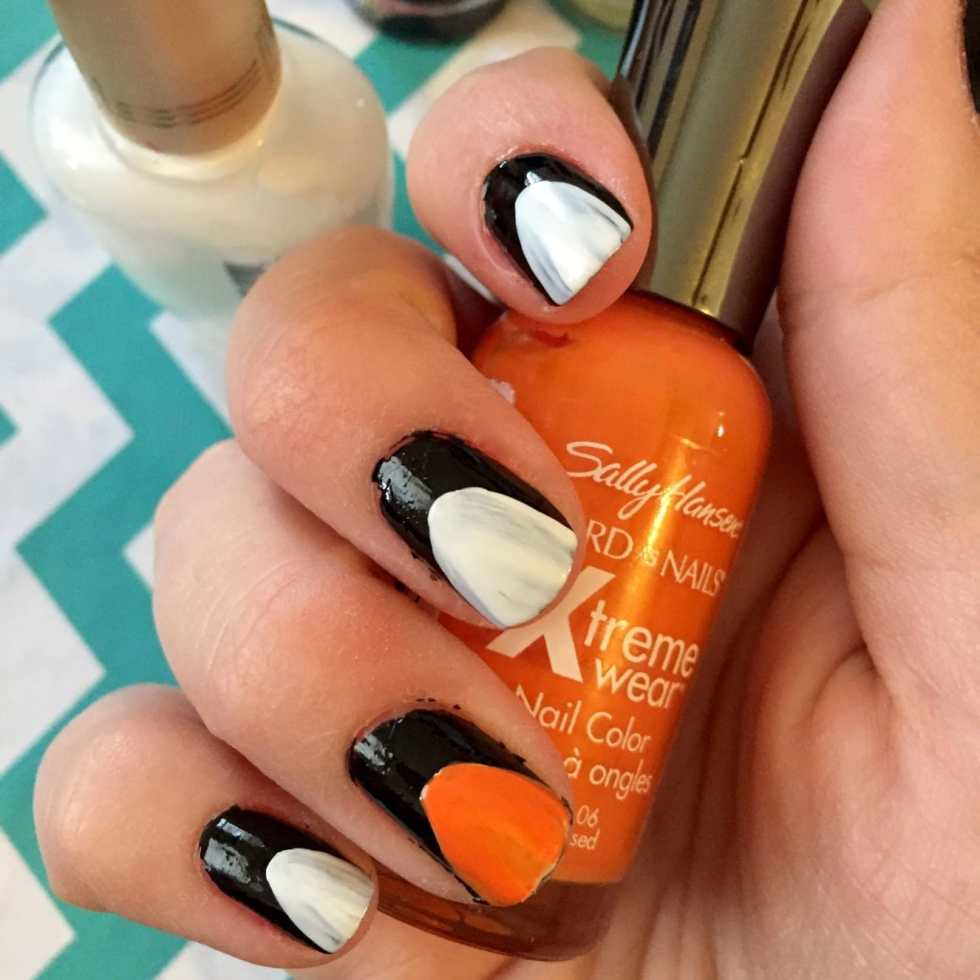

- When

  _completely_

  dry, go over the white ghost nails once again to make sure it’s opaque. Let dry.

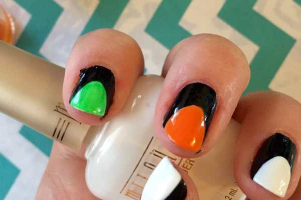

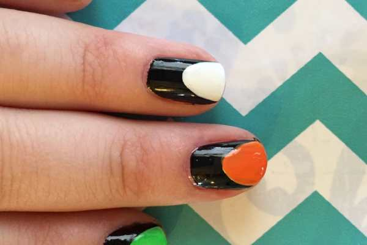

- Use the dotting tool dipped in yellow nail polish to make the eye on monsters.

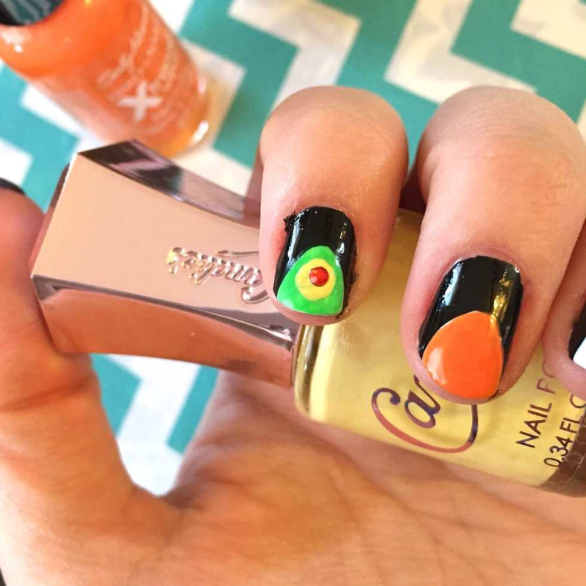

- Place the red gems wherever you like them in the yellow eye to complete the monsters.

- Use the nail art brush dipped in black nail polish to paint lines on the pumpkins. Use the green polish to finish the stems.

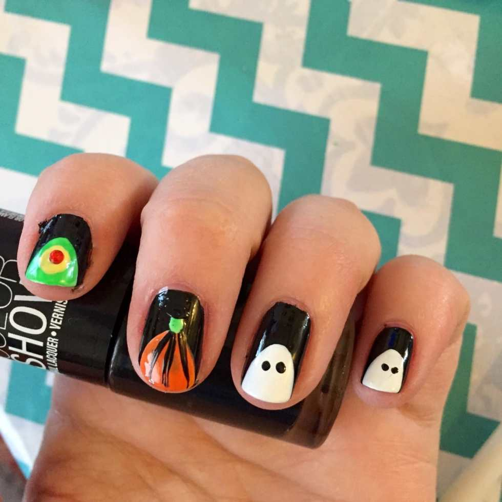

- Use the small end of the dotting tool dipped in black polish to make eyes on each ghost.

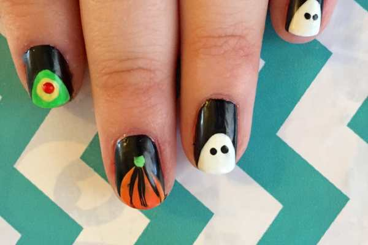

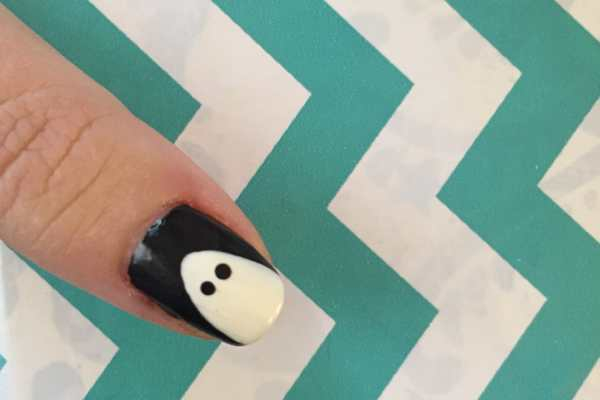

- When all your nails are totally dry (read: I thought mine were dry but they weren’t and some of my ghosts streaked a little!), do a coat of clear matte on each nail to finish off the look.

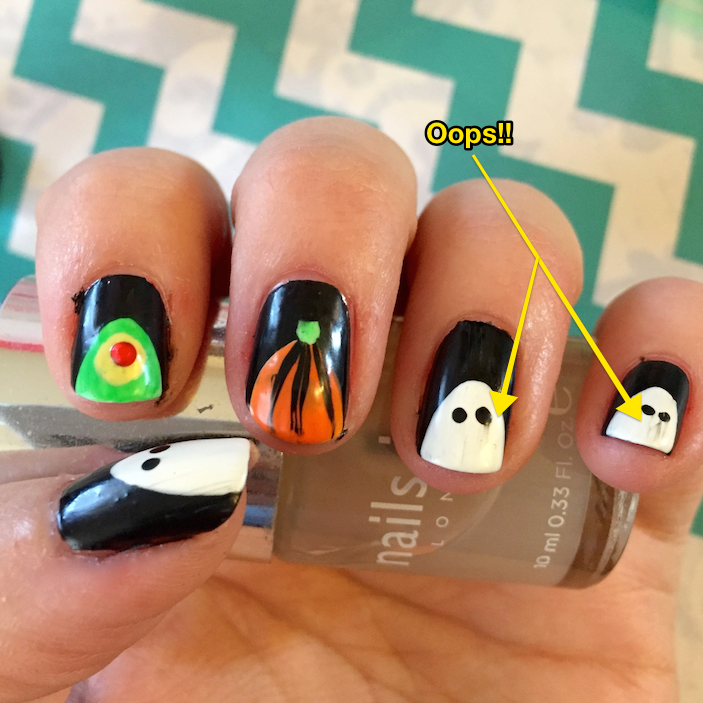

That’s better!

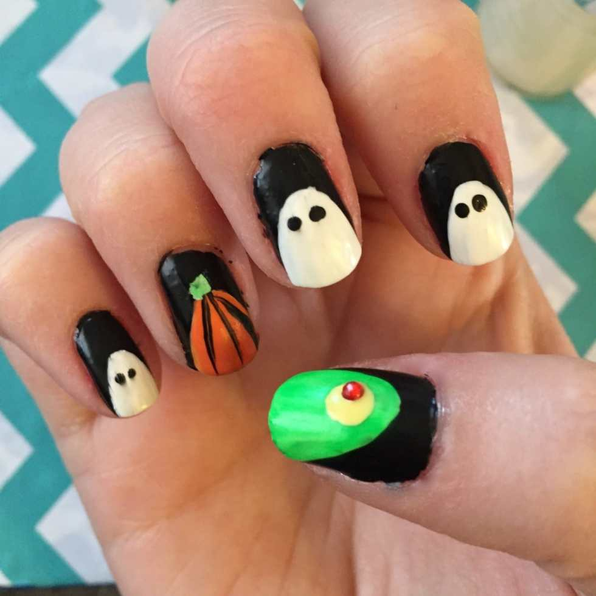

That’s all you need to do to get some totally boo-tiful halloween nails! If you try out the look, be sure to show me a pic in the comments below! And don’t forget about my

[old Halloween nail art tutorial!](/nail-art-design-halloween-manicure/)
