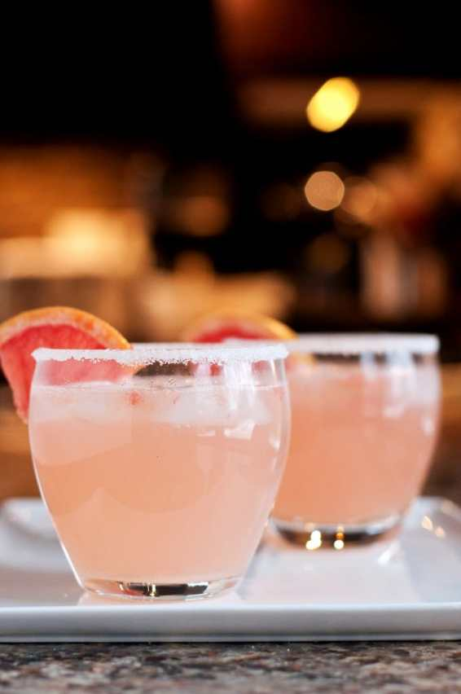
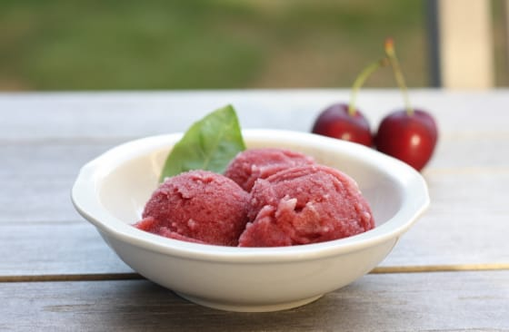

Celebrating National Cherry & Grapefruit Month: Recipes

**\&#xA;**

Did you know that February is both

_National Cherry Month_

AND

_National Grapefruit Month_

? I’m not a

_huge_

fan of either, but there are some recipes that I can’t deny just make my mouth water! Here are five that I found and really want to try out, and thought you may enjoy too.

Cherry Dream Bars

from

[**Chef in Training**](http://www.chef-in-training.com/2015/02/cherry-dream-bars/ "Cherry Dream Bars at Chef in Training")

These bars look so good! The recipe is actually from

**Kathi**

at

[**Deliciously Yum**](http://deliciouslyyum.com/ "Deliciously Yum")

and I will definitely be trying it out in the summer. It seems like the perfect picnic dessert, doesn’t it?

Grapefruit Donuts

from

[**A Beautiful Mess**](http://www.abeautifulmess.com/2013/01/grapefruit-donuts.html "Grapefruit Donuts from A Beautiful Mess")

My favorite fried chicken place here in Philly,

[**Federal Donuts**](http://federaldonuts.com/ "Federal Donuts")

, makes these really amazing Grapefruit Brulee Fancy Donuts, so I was excited when the Husband found and sent this recipe to me! I can’t wait to give it a whirl!

Cherry Oatmeal Crumble Bars

from

[**Mom On Time Out**](http://www.momontimeout.com/2014/02/cherry-oatmeal-crumble-bars/ "Cherry Oatmeal Crumble Bars from Mom on Time Out")

I make bars just like this, only with raspberry preserves! That’s why I’m pretty sure I’d really like this recipe. And I know for a fact that Husband would too!

The Paloma

from

[**BS’ in the Kitchen**](http://bsinthekitchen.com/the-paloma/ "The Paloma from BS' in the Kitchen")

I am pretty psyched to try this drink! It’s super pretty and looks really refreshing. Another recipe that will be perfect for the Summertime!

Cherry-Grapefruit Basil Sorbet

from

[**First Look, Then Cook**](http://firstlookthencook.com/2013/07/24/cherry-grapefruit-basil-sorbet/ "Cherry Grapefruit Basil Sorbet from First Look, Then Cook")

This last recipe combines cherry AND grapefruit! The perfect way to celebrate the month! Of course it’s yet another recipe that may best be suited for the Summer, it being so cold out right now and all! Perhaps I only have to wait til Spring to make it, though. It looks delicious!

Happy National Cherry and Grapefruit Month! Which recipe are you going to try first?
