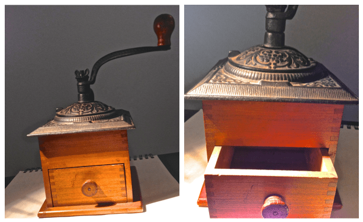
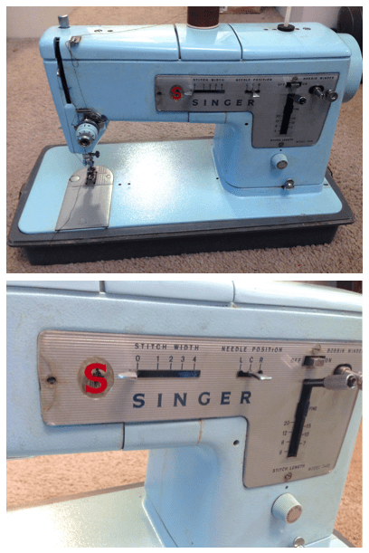
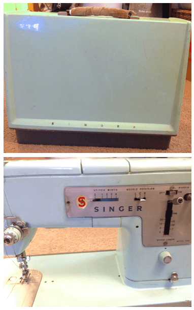
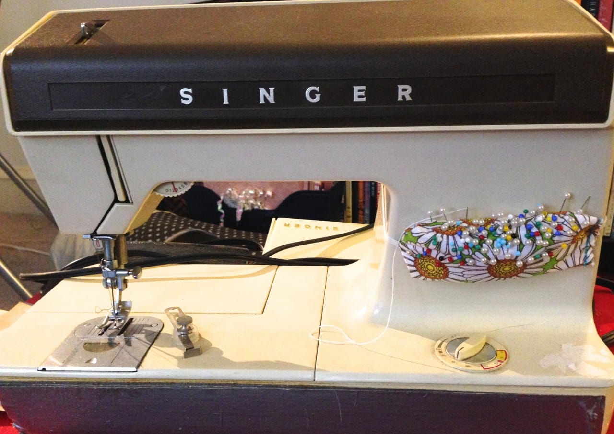
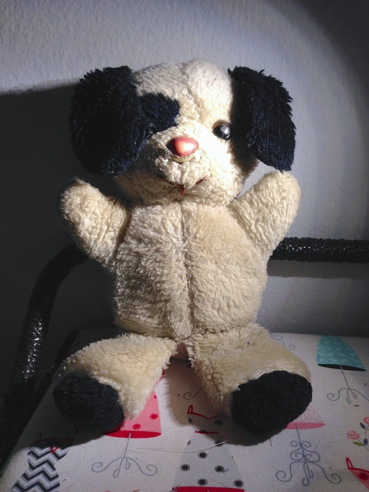

Yesterday, March 2nd, was National Old Stuff Day! Yes, it really exists. It’s a day to appreciate all things antique and vintage! I have a few old pieces in my home that belonged to my Grams, Mom-Moms, Aunt Jo and the Husband that I’m excited to share with you!

By definition, to be considered “antique” something must be over 100+ years old. On the other hand, to be considered “vintage” an item needs only be 20+ years old. With that in mind, I will show you a few ‘vintage’ pieces I have accumulated and the approximate dates they came to be!

First up are two things from my Grams. I’d admired them growing up and was very happy when she recently let me take them with me to Philly to find shelter in my apartment. She also has an awesome 5 gallon black metal milk jug that I will get to my apartment eventually… it just isn’t something I can carry on the train!

This piece I’m not sure of the exact year, but my Grams said she bought it at a flea market or yard sale for 10 cents before I was born, so we know it’s a minimum of 31 years old. It’s a little beat up, but that’s part of it’s appeal to me. I plan on hanging it right by the front door where I typically throw the mail to be sent out, etc. I love the gold lettering!

Something else I have that belonged to my Grams is an old wooden and metal coffee grinder that my Uncle Jimmy had given her in 1974. I know this because she typically writes the name of the gifter along with the date on the bottom of pretty much anything present she’s ever received- a habit I wish I’d taken up earlier. With the high tech gadgetry in our household (including the electric bean grinder) I love thinking about this little guy actually grinding coffee beans.

There’s another reason I always loved this piece. When my sister and I were growing up, we’d celebrate Easter at my Grammie’s house every year. She would buy one or two bags of those little teeny chocolate eggs in the metallic foil and hide them EVERYWHERE. We’re talking about 100 little chocolate eggs waiting for us to search for them. It would keep my sister and I occupied for at LEAST two hours until dinner was ready, and then we’d go back to searching after we ate (and napped). Amongst the hiding spots, there were always certainly one or two eggs hidden in the drawer of this coffee grinder. She also would hide them in the ink well of an old school desk she had! She’s so cute.

My paternal grandmother was Mom-Moms. She passed away while I was young still, but growing up I’d learn about her craftiness which I apparently inherited. She crocheted, knitted, sewed on several different machines, made me baby clothes (which I’d eventually use as doll clothes on my cabbage patch dolls), stuffed animals, blankets and more. She was also an amazing cook with big Italian Sunday dinners that could put anyone to shame. While I unfortunately only remember a little about her, I’m lucky enough to have acquired some of her crochet patterns (which I’ll share one day!), recipes (probably won’t share these.. family secrets and all) and best of the lot: her vintage early 1960s powder blue Singer Model 348! It needs a new belt and certainly needs to be cleaned up, but once that’s fixed it should be fine again. It even has it’s original carrying case. It’s crazy gorgeous for it’s age, isn’t it!?

As lovely as the powder blue Singer is, it isn’t my primary machine. The one I do all my sewing on is still considered vintage though. Should I ever switch to a new machine, I honestly won’t know how to use it at all. The one I do all my work from is also a Singer: a Futura II Model 920 circa 1974 from my Aunt Jo. It’s not very pretty, and for whatever reason my aunt covered the base of it in duct tape, but I don’t care. It works and it’s what I’ve been learning on! I also love knowing I’m creating things on something she used years ago!

My last vintage find of the day is the Husband’s little stuffed animal, Doggy! Sure he isn’t a machine or piece of furniture, but he’s 28 years old and the cutest thing ever, so why not include him!?

I hope you enjoyed all my vintage finds to celebrate Old Stuff Day! What old items do you cherish?
