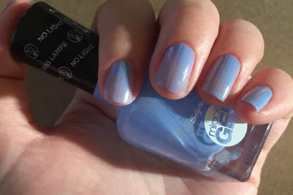
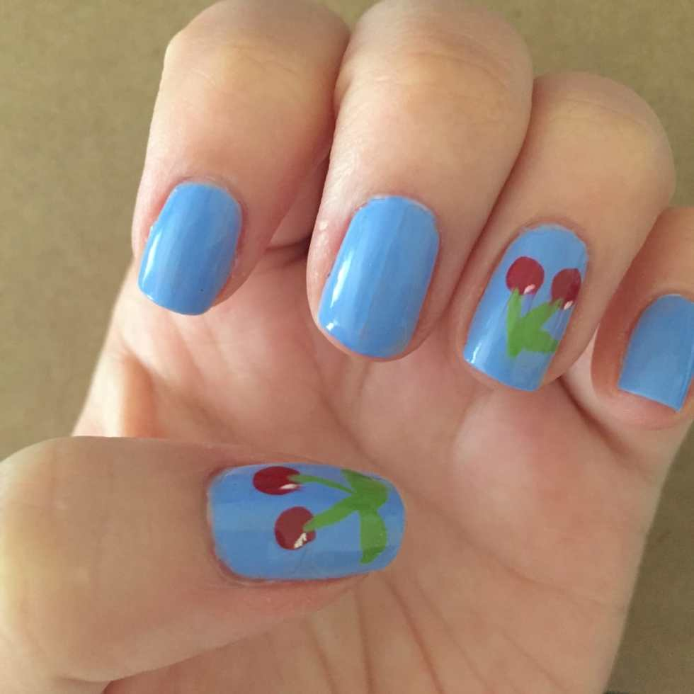

[Cherry pie filling](/blog/cherry-pie-filling/)

,

[cherry tarts](/blog/5-minute-cherry-tarts/)

, an

[amigurumi cherry pattern](/blog/amigurumi-cherries-pattern/)

– it’s time for one last cherry post! I used my Sally Hansen Miracle Gel (no UV light needed!) and made a cute look perfect for the Summer.

I loooove the Miracle Gel polishes! They still chip like regular polish, but they last a little longer and they make my nails feel much stronger. I just really love the feel of them. I’m waiting for a good coupon or sale to grab a few more colors! You don’t have to use the gels to get this cherry nail art look, however. You can use a regular light blue polish and clear top coat if that’s what you have on hand!

## Materials:

- [Sally Hansen Miracle Gel in Sugar Fix](http://amzn.to/1TOdwSk)

- [Sally Hansen Miracle Gel Top Coat](http://amzn.to/1MixcLN)

- Red nail polish

- Green nail polish

- White nail polish

- Nail art brush

- Dotting tool

## Instructions:

- No need to do a base coat with the Sally Hansen Miracle Gels. Do one coat of the pretty periwinkle Sugar Fix, let dry, and do a second coat. Let that dry too!

* Use the large end of the dotting tool to make two cherries on whichever accent nails you intend to decorate. Let dry.

- Use the nail art brush and green polish to draw little connected stems and some leaves. Let dry.

* Use a white striper or white nail polish and nail art brush to create small a small dot or line to create a little “shiny glare spot.” Let dry.

- When your nails are totally dry, give them each a quick coat of the Miracle Gel Top Coat. Let dry and enjoy your nails!

Happy Cherry gives this design a thumbs up!

Cherries not your thing? Don’t forget about my

[apple nail art design](/blog/apples-nail-art-design/)

and

[watermelon nail art design](/blog/watermelon-nail-art-design/)

! Any would be cute for a Summery look!

What other fruits should I paint on my nails?
