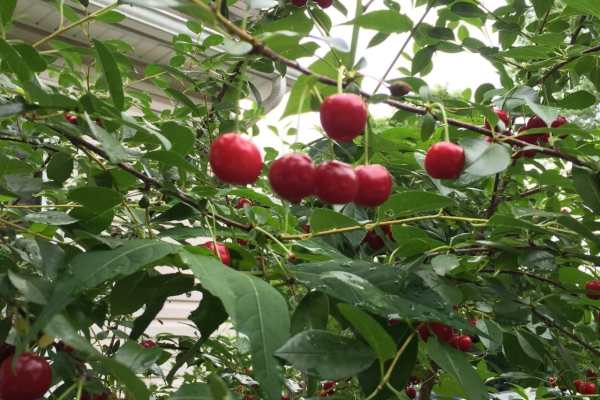
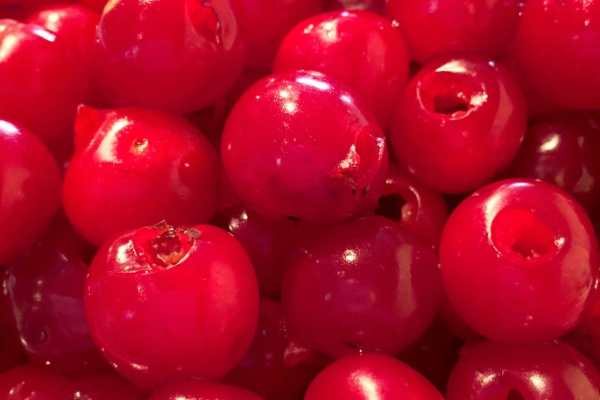
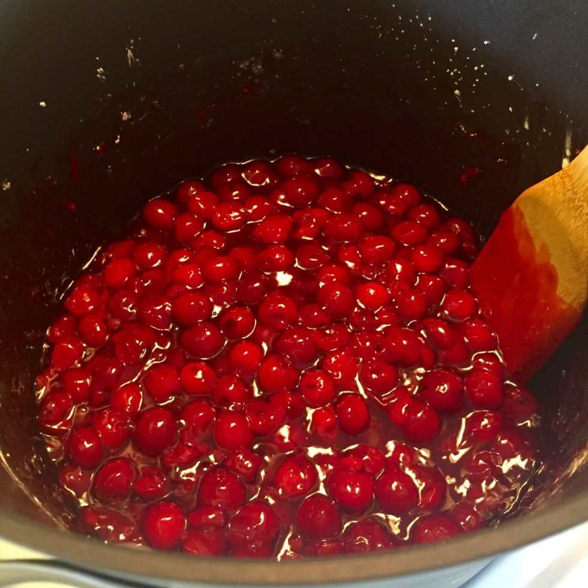

Recipe: Cherry Pie Filling

A few weeks ago, I stole a good amount of sour cherries from my Dad’s cherry tree. I put them to great use last weekend when I made homemade cherry pie filling for some cherry tarts! Next week, I will share the very easy no-bake recipe for those, but today it’s all about the filling!

Fact: I don’t like cherries. I never order cherry pie or cherry flavored things, but I wanted to make a red, white and blue dessert for 4th of July and I really wanted to use Dad’s fresh cherries to do it. When I tried the filling, I just about died. It’s so delicious! Turns out I

_do_

like cherries, but only if they are fresh! I hope you’ll love this recipe too!

## Ingredients:

- 6 cups of pitted tart cherries

- 2/3 cup water

- 2 Tablespoons fresh lemon juice

- 1/4 teaspoon vanilla extract

- 4 Tablespoons cornstarch

- 2/3 cup granulated white sugar

## Instructions:

Before you begin, pit your cherries! This part was time consuming, extremely messy (we’re talking cherry juice flying every which way!- wear gloves!!), but pretty easy to do. You just push a disposable straw through the top of the cherry and pop the pit out of the bottom. Easy peasy.

- Add ALL of your ingredients to a large pot on medium heat. Stir together.

It looks so gross in the beginning!

- Bring to boil. Reduce heat and let simmer for 10 minutes until thickened. STIR CONSTANTLY, making sure it doesn’t burn on the bottom of the pan.

Ahh, turning into a nice syrupy mix now!

- Remove from heat and let cool to room temperature.

- Enjoy the most wonderful cherry pie filling you’ve ever had!

## Tips:

- Refrigerating the filling will turn it into a gelatinous jelly mass, which is totally fine but looks gross. Simply reheat in a pan over medium heat until the filling is back to a syrupy consistency. Then bring it back to room temp before using.

- There is cornstarch in this recipe, so it cannot be frozen.

What is your favorite cherry recipe?
