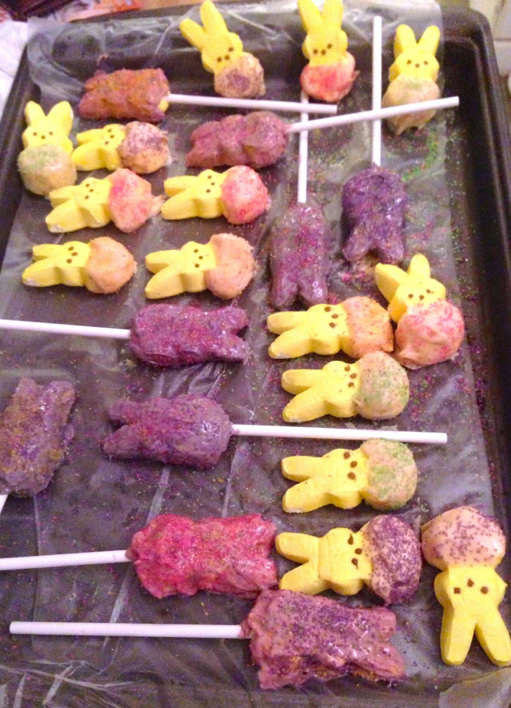

Recipe: Chocolate Covered Easter Peeps!

It’s getting close enough to Easter now that I can start sharing some fun Easter crafts and recipes! Next week I’ll post my super adorable “bird’s nest cupcakes,” but for today we’re going simple with melted chocolate and everyone’s favorite sugary marshmallow treats!

Okay, so I put this one in the “cooks” category, but is it really a recipe if there isn’t any cooking involved? I suppose since you have to melt the chocolate (gosh, so hard!), it can count. It’s edible, so that’s good enough for me.

Honestly, I hate Peeps! Like, really, really don’t like them. Right up there with those black licorice jelly beans. My sister hates both these things as well, but our Grams- she loves ’em. Every year we’d take the black jelly beans and the adorable little yellow Peeps chicks and put them all in her Easter basket. Over the years, Peeps bunnies were born, tons of new colors became available, and even several different new flavors. Still, they all go in Grammie’s basket, because we won’t eat them.

Last year, I tried covering them in chocolate and sprinkles. This made them even cuter, and a little more tolerable! Grammie LOVED them (of course) and they were a hit with the kids after Easter dinner as well! They were very easy (and a lot of fun!) to make, too.

## Ingredients/Materials:

- [Peep](http://amzn.to/1fppJHl "Peeps on Amazon")

  s\*

- White chocolate chips or candy melts

- Food coloring

- Sugar sprinkles

- Cake pop sticks (optional)

\*We used bunnies, but by all means- use chicks if you want!

## Instructions:

- Melt your white chocolate in a double boiler or in small increments in the microwave. Don’t forget to stir

  **often!**

- When it’s melted, add whatever food coloring you want your Peeps covered in. If you want two or three different colors (we did pink, purple and some we left white) then you’ll need two or three different bowls of chocolate. Melt them separately, add the dye, and dip. When finished, go on to your next bowl/color combo. If you try to do all at once, one will likely harden up before it’s used. You must always work quickly with melted chocolate!

- Dip your Peeps however you want! We dipped some only halfway to make it look like they were wearing clothes and/or hatching from an Easter egg. Some we stuck cake pop sticks in to and dipped all the way- these were fun as “lollipops” but once the face is covered it doesn’t much look like a Peep anymore, rather it resembles a white chocolate blob. They still got eaten, though!

- Lay chocolate covered Peeps out on wax paper on a cookie sheet.

- Decorate with sprinkles as soon as they are on sheet. If the chocolate dries and hardens before you add sprinkles, the sprinkles likely won’t stick!

- Throw in fridge to harden up. Enjoy!

## Tips:

- Flavor the white chocolate with peppermint extract for a peppermint-patty-marshmallow tasting treat! Alternatively, use another flavored extract that you think will compliment it. Just go easy on the extracts, they certainly are potent!

- Nix the food dye if you don’t want to use any or don’t have a lot of time, and let the sprinkles be your color source!

What kind of Easter treats are you serving this year? Have any fun ones I should test out and post about?
