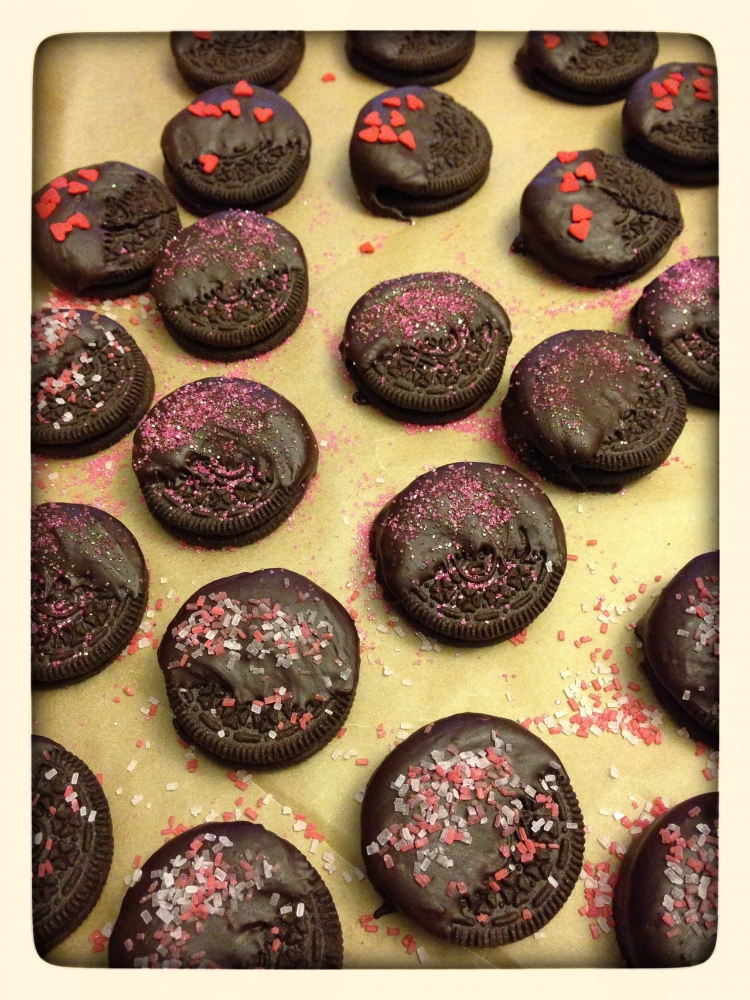
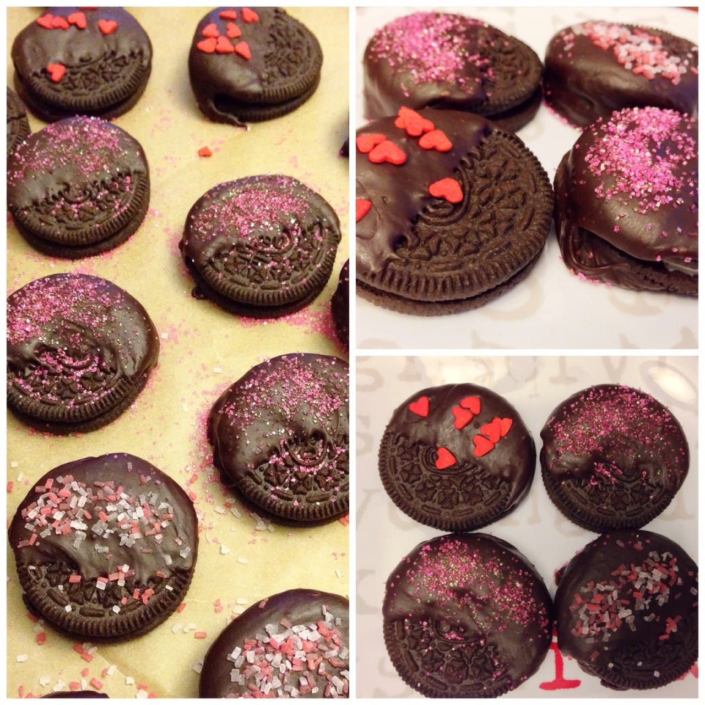

Recipe: Chocolate Dipped Oreos

In addition to the

[**Pixel Heart Pillow**](/pixel-heart-pillow/ "Pixel Heart Pillow by Katie Crafts")

that I made for the Husband for Valentine’s Day, I also got creative in the kitchen- with a box of

[**Oreos**](http://amzn.to/1eSdCW5 "Oreos on Amazon")

and a whole lot of melted chocolate. They aren’t the most gorgeous dessert, but they taste like happiness!

I couldn’t wait to get the Husband out of the house to make these! Except he just wouldn’t leave. So I had to make them while he was here. He did stay out of the kitchen while I made them, though, so at least he didn’t know what they looked like til after they were done. He ate four of them in under 2 minutes, so I’m guessing he approved! They’re pretty simple to make, though you have to work quickly. Here’s what you’ll need:

## **Ingredients:**

- Oreos\*

- Semi-sweet chocolate chips\*

- 1 – 2 teaspoons of light corn syrup

- Sprinkles- whichever kinds you like!

\*To dip 1/2 to 3/4 of every Oreo in a regular sized package of Oreos, you’ll need one whole 12 ounce bag of chocolate chips. I used

[**Nestle Semi-Sweet Morsels**](http://amzn.to/1gridgA "Nestle Semi-Sweet Morsels")

, but if you have a different brand you love, you can swap them in!

## **Instructions:**

- Prep your station: place parchment or wax paper on a cookie sheet for the cookies after they’ve been dipped, and make room in your fridge for the cookie sheet!

- Dump your chocolate in to a microwave safe bowl.

- Microwave the chocolate in 20 second increments, stirring with a spatula in between, until chocolate is completely melted.

- Add the corn syrup and stir in til nice and smooth. If you don’t have any corn syrup, don’t worry about it. It won’t really change the flavor- it just makes it shiny!

- Now you’ll dip your Oreos! Just pop ’em in the chocolate, swirl, and place them on your wax paper. You need to be kind of fast while doing them, as the chocolate begins to harden quite quickly.

- After you’ve dipped them all, it’s time to decorate! I used glitter pink sugar crystals, peppermint flavored sugar crystals, and little red hearts!

- Place your Oreos in the fridge to cool and harden.

- That’s it! Enjoy your delicious, if a bit messy, cookies!

## **Tips:**

- You can swap out the regular chocolate for candy melts in different colors to make your Oreos even more festive!

## **Rating:**

4.5

out of

**5**

stars! We’ll try out different types of chocolate next time and see if we can’t make it a 5 out of 5. Either way, we love Oreos and this recipe was fun and easy and tasty!

What other chocolate covered treats do you make for your family?
