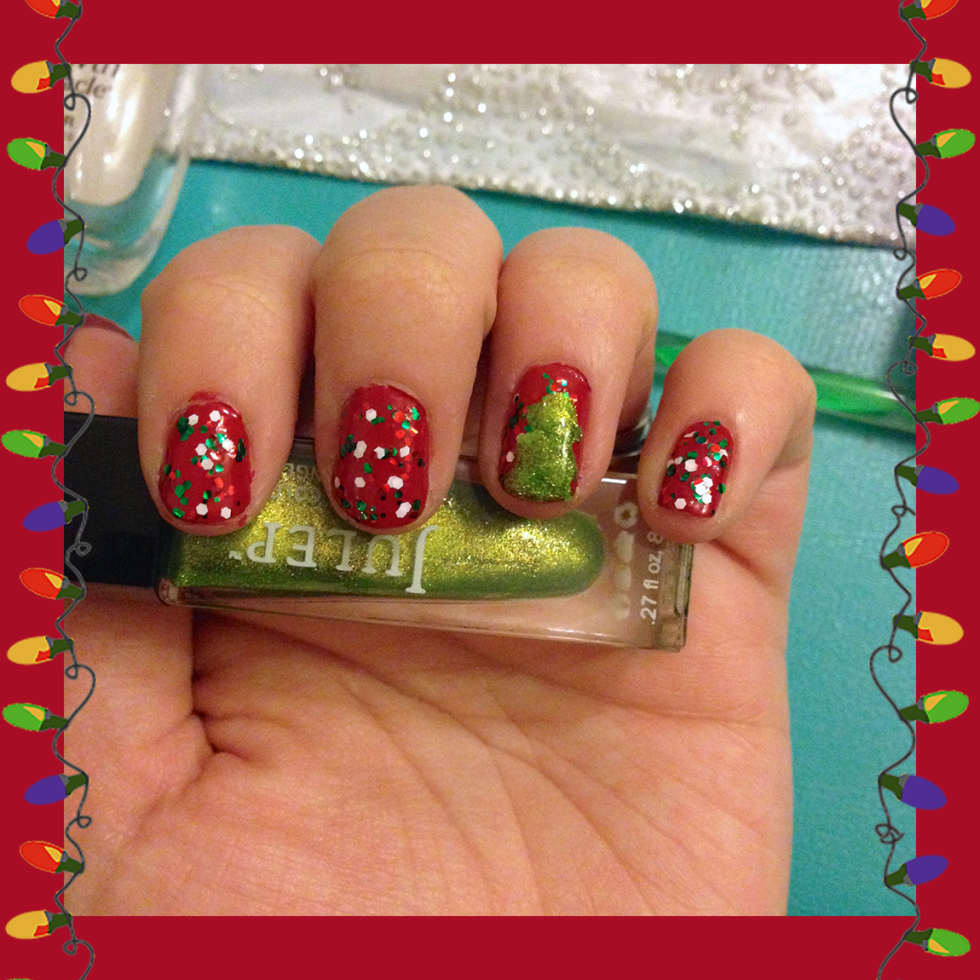
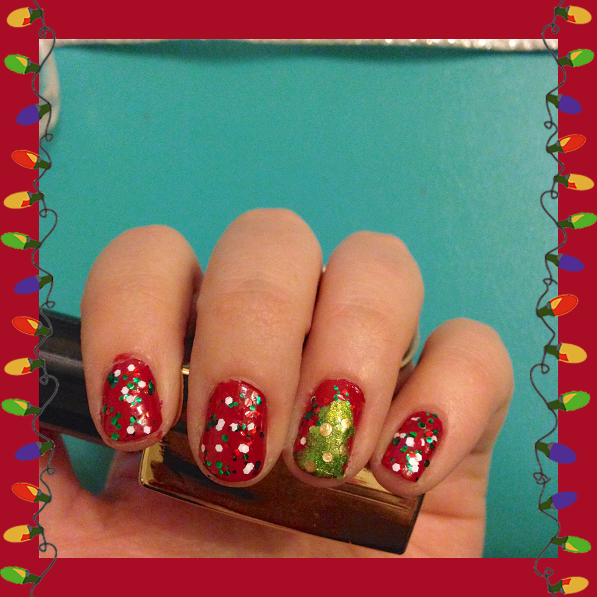
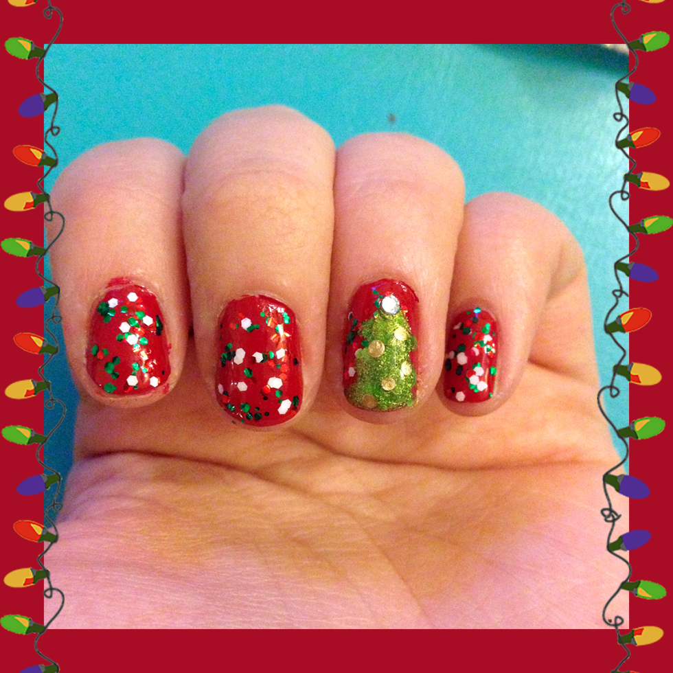

Nail Art Design: Christmas!

**\&#xA;**

Yippee! It’s officially Christmas week! It definitely snuck up on me WAY too quickly. While all my gifts are done and wrapped, I still don’t feel like it’s Christmas yet. Hopefully it hits me in the next couple days, or else I will miss it! To try to get in the Christmas spirit, I whipped up a super cute (and easy!) nail art design that will make my holidays bright!

## Materials:

- Clear top coat

- Christmas glitter polish (this one is red, green and white flecks)

- Red nail polish

- Green sparkle nail polish

- Gold nail polish

- Dotting tool or toothpick

- Acrylic rhinestone nail art gems- 2

## Instructions:

- Starting with clean, dry nails, do one coat of quick dry red nail polish.

- When dry, do a second coat. Let dry completely before proceeding to next step.

* Do one to two coats of your Christmas glitter nail polish, depending your brand and how much you want on your nails. My polish is called

  _“Fra-Gee-Lay”_

  (love the “Christmas Story” reference!) from the brand

  _Funky Fingers_

  . It only required one really good coat on each nail to accomplish this look. Some glitter polishes are thinner, though, and may require more. Let dry completely.

* If you want to call it a day and leave all your nails glittery and nix the Christmas tree, just add a top coat here and you’re done! If you want to have one accent nail tree, read on!

- Using a sparkly green polish (like my

  _Julep_

  shade in

  _“Tammi”_

  ) to make the tree. Starting at the top of the tree, make a small sweeping motion on each side to make the top tier of the tree. Do the same a little larger for the middle tier. Do the same even larger for the last tier, and fill it in where needed. Make sure the last tier reaches the tip of your nail. Do to each finger that you want adorned with a tree. Let dry completely.

- When dry, use your dotting tool or a toothpick and your gold nail polish (my

  _Color Foil_

  from

  _Sally Hansen_

  is super shiny!) to dot little ornaments on the tree in a diagonal fashion, like pictured above. Let dry.

- Now is the time to do your top coat! Usually, you’d do it at the very end of your manicure, but when the little rhinestones are coated in top coat, even though it helps them stay on longer, it really takes away their sparkle. Since I’m using one to be my Christmas tree star, I wanted the sparkle there! If you do too, coat each of your nails in clear top coat now and let it dry completely.

- Use a little bit of that clear polish and your dotting tool or toothpick to pick up your little rhinestone gem and adhere it to the top of your tree.

- When all dry, clean up any red bits of nail polish from your skin and you’re all set.

That’s it! Enjoy your Christmas nail art and have fun showing your manicure off to friends and family this holiday!

## Tips:

- Give the gift of a DIY manicure kit this Christmas! Grab each of the nail polishes listed above from your local drug store, wrap them all up, and stick them in a stocking. Then show your giftee this tutorial page and she can have the same look on Christmas Day!

- You can use a non-sparkly green nail polish for the tree as well if that is what you prefer! I like the sparkly one, however, because it adds a little bit of dimension to the tree and makes it look almost textured.
