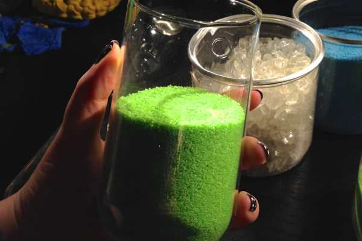
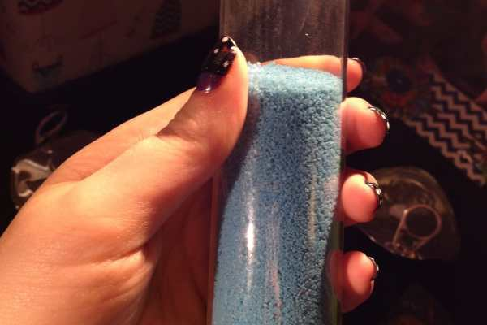

I mentioned that I bought some plants at the

[Flower Show](/blog/2014-philadelphia-flower-show-recap/ "2014 Philadelphia Flower Show Recap!")

the other day. Well, they weren’t just any plants. They were air plants, that are super cool and require little attention and can be mounted on my wall in weird test tube type glass containers. So it’s basically true love.

We stopped by all the vendor booths at the Philly Flower Show, but for the second year in a row,

[**Chive**](https://www.chive.com/ "Chive")

is the only one that held my attention. Their array of unique terrariums, tubes, pots and the like really stand out against the rest. Seriously, go check them out!

If you’re still wondering what “air plants” are, here’s a simple explanation: Air plants, also known as Tillandsia, don’t need soil. They don’t need bright light. They don’t need daily waterings. They are a low maintenance form of succulents- which are already pretty low maintenance as it is. You just give them a good soaking once a week, let them dry out upside down, and place them back on top of their mossy little home. They are also totally perfect for making living wall art with!

We picked up two Wall Tubes to mount on the wall above my new crafting table, and all the makings for new living wall art right from the Chive booth. As soon as I got home, I put them together.

## Materials Used For This Project:

- Wall Tubes in varying sizes

- Turquoise blue sand

- Lime green sand

- Clear quartz-like rocks

- Yellow moss

- Two different air plants

- A little piggy and a little tiger!

The instructions are too easy for me to even list for you. Just pour the ingredients in one by one, layering them sand-rocks-moss. Place plant on top. Finish with little rubber animal. Enjoy your new plant. Need/want photos of the process? Here ya go!

Seriously, how cute is that little piggy!? I placed him right under a spike to make it look like he’s trying to nom it.

I love how the tiger is prowling through a jungle of plant spikes!

While the plants only need to be submerged in water for about

**45 minutes once a week**

(then dried

**UPSIDE DOWN**

for a few hours to prevent the roots from rotting), the moss should be

**misted**

more often than that to keep it from totally drying up. Don’t go crazy watering it, though- it’s just moss!

I can’t show you the rest of the wall yet, since my craft area still isn’t ready, but what do you think about my new little air tube plants? I can’t wait to show you the other things I have in store for this craft station! {hint: my mom’s gorgeous wooden tea cart made it to the apartment to serve as a sewing table next to me!}
