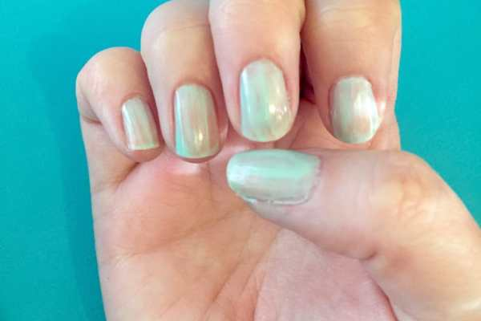
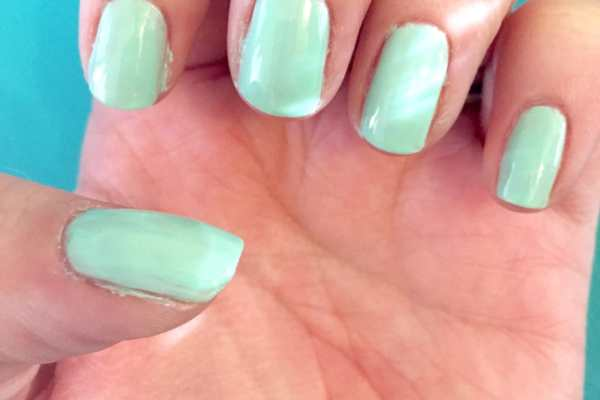
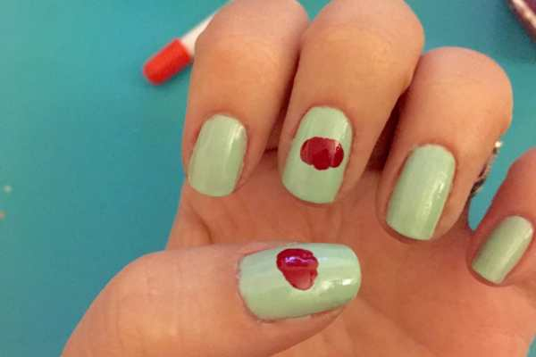
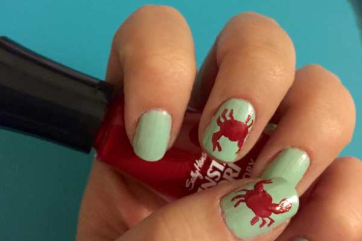
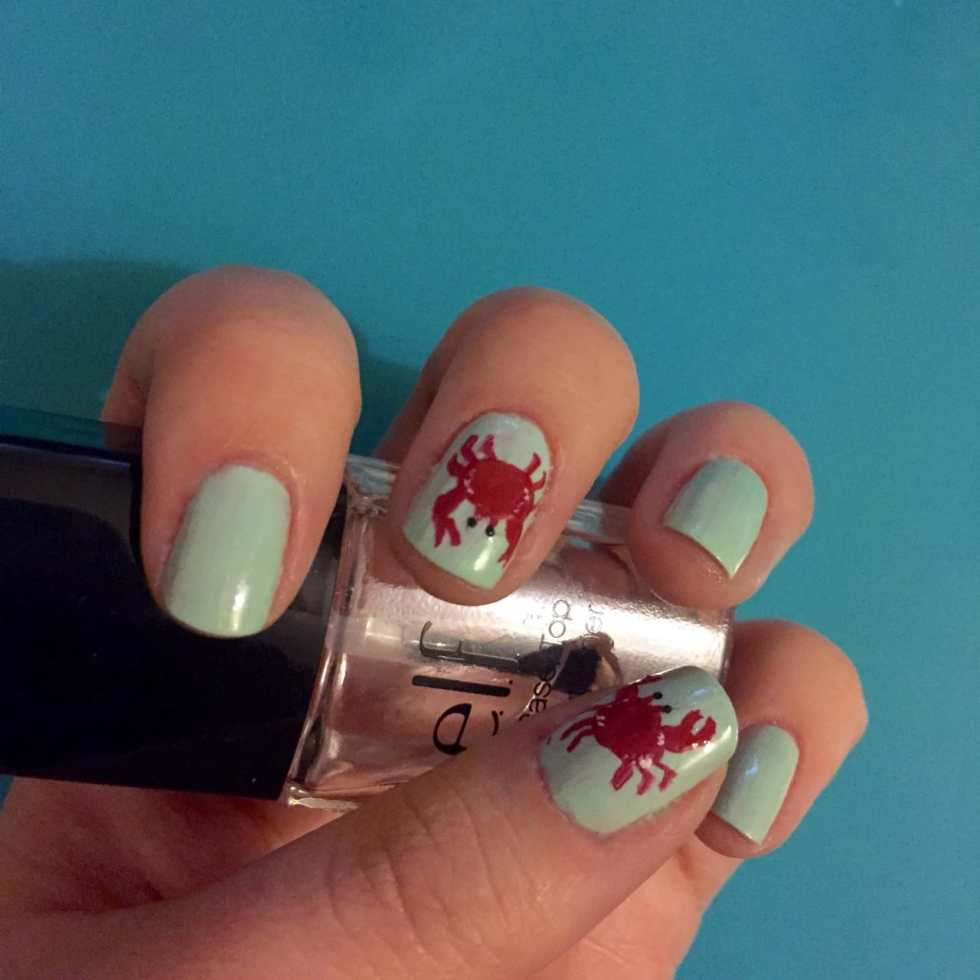
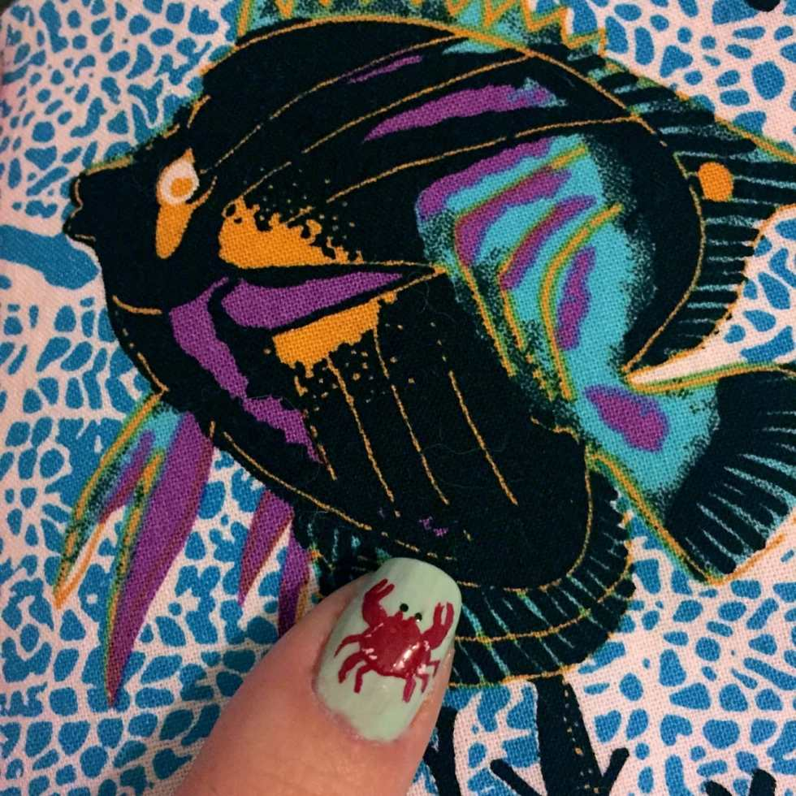
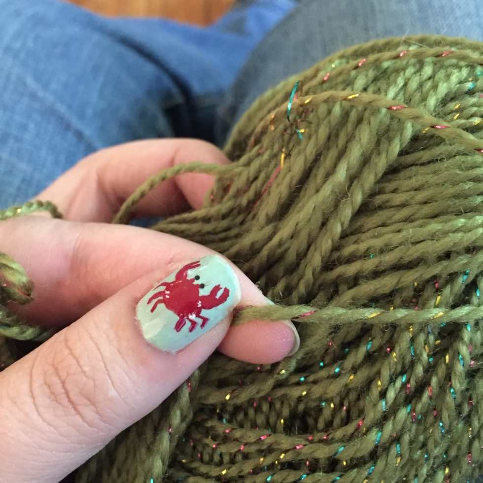
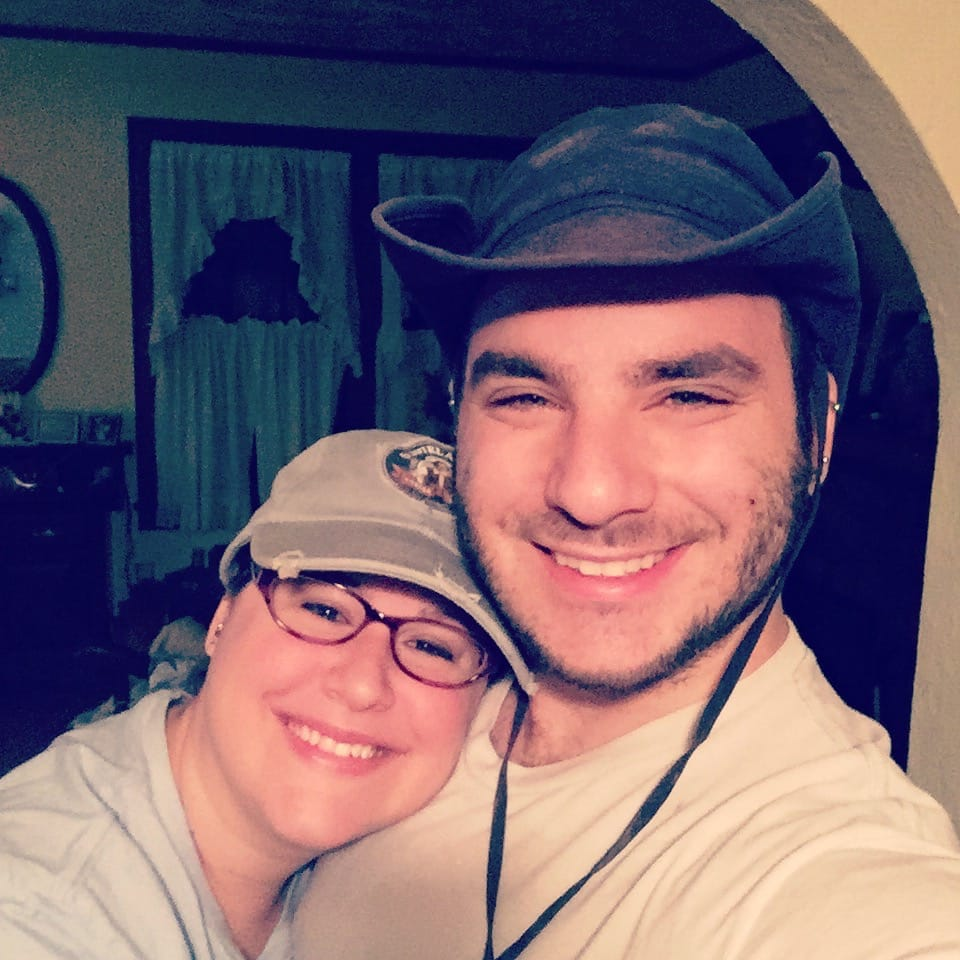

If you saw my

**[Instagram page](https://instagram.com/imkatiecrafts/)**

over the weekend, you may know I went on my annual crabbing trip with my Dad. We did absolutely terribly, but we had a good time! In celebration of the trip, I painted cute little crabbies on my nails. They were easier than they look!

We were out on the boat for almost 6 hours and we only caught about 30 crabs. They just weren’t biting! I had been hoping my fun nails would lure them to the boat, but no dice. Additionally, the motor broke twice while we were out AND the world’s most gigantic bumblebee flew out to the middle of the river where there was no land, just to sting me- twice. Even with all of that craziness, the annual trip was fun. And seriously, how gorgeous is this just-before-sunrise view of the river?

Sunrise on the Navesink River in NJ.

All right, on to the nails!

## Materials:

- Light blue-green nail polish

- Red quick drying nail polish

- White nail polish or striper

- Black nail polish

- Dotting tool

- Nail art brush

- Clear top coat

## Instructions:

- With clean dry nails, paint one coat of your light blue-green polish. I used

  [Essie’s “Fashion Playground.”](http://amzn.to/1TMVRIX)

  Let dry. (above left)

- Paint a second coat and let dry. (above right)

- Using the large end of your dotting tool, make a large crab-shaped dot on your accent nails with the red polish. I used

  [Sally Hansen Insta-Dri in “Rapid Red.”](http://amzn.to/1JmBL8J)

  (above left)

- Next, load up your nail art brush and draw little crab legs and claws. It’s very simple if you just drag it slowly! (above right)

- Make two tiny bumps on the top of the head for the eyes to go later! (I forgot to do this until the end, as you’ll see! But you should do it now while you’re still using the red!)

* Use the white nail polish and tip of nail art brush OR white striper and make tiny marks around the outside of the crab shell.

- Use the small end of the dotting tool and black polish to make eyes on the end of the previously made bumps. Let dry.

_I thought my Insta-Dri red would be dry by now, and covered my nails in clear polish, dragging the red into little streaks all over my cute nails. I was so mad! Make sure yours are TOTALLY TOTALLY DRY before you do the last step or you’ll mess up your work too!_

- Coat in clear polish to lock in the look.

The fish is totally eyeing up the crab!

Such a cute crabbie look! I had fun making these! They only chipped a little while on the boat, though even after my shower they were covered in some kind of dirt that wouldn’t come off, so I had to remove all the polish. Poor little crabs had a short life of three days! Ah well. C’est la vie.

Post-shower-very-tired-but-can’t-sleep-sitting-in-rocking-chair-and-knitting nails

It’s still Summer, so making these cuties are totally necessary. Next week I will share another aquatic nail art look too! For now, I’ll leave you with a shot of a very sleepy Husband (and me!)

Me & the Husband at 4AM!

What do you think of my crab nails? What other ocean friends should I paint on my nails?
