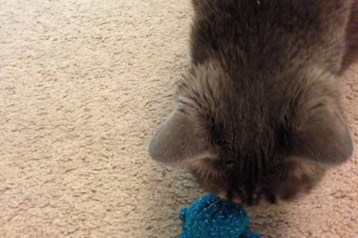

Project: Crochet Octopus Toy Pattern for Kitty

I love making these for my kitties (and friend’s kitties, and all kitties!) I stuff a little catnip inside and the furbabies love them. This pattern is mega easy, and can be adjusted to make larger toys for babies too -just maybe exclude the catnip. 😉

## Materials:

- Yarn, worsted weight

- G hook

- Polyfill stuffing

- Catnip

## Key:

ch = chain

dc = double crochet

dec = decrease

sl st = slip stitch

sc = single crochet

st = stitch

> _Need a quick reminder? Don’t forget about my_
>
> _**[crochet crash course!](/blog/crash-course-in-crochet/ "Crash Course in Crochet")**_

## Instructions:

- ch 4 on hook

- form ring by joining first and last ch st with a sl st

- round 1: 8 sc in middle of ring

- round 2: (2 sc) in each (of 8) st; if you use them, put a marker on 1st stitch to remember your place!

  _(you should now you have 16 st!)_

- rounds 3-7: \[(1 sc) in each (of 16) st]\*

  _(repeat these steps for each round)_

- round 8: dec until almost closed

- when only a little opening is left, pull the tail from the beginning through the hole and pull tightly. Then, gently push in the stuffing and catnip

- dec until completely closed, but don’t fasten off yet! It’s time to make the arms!

- still attached to body, ch 10 to begin first arm

- skipping last st in ch, (1 sc) in each ch st back to base

- sl st in base of head to keep arm in place

- repeat 7 more times to create a total of 8 octopus arms

- fasten off

- give to kitty to play with!

## Tips:

- I hate using markers to mark where my stitches are as I go. Some people swear by them, so I included them in the pattern above! Instead, I count out loud as I do my rounds to be sure I’m in the right place. For example, during rounds 3-7, I’m crocheting 16 single stitches around, so I could 3-1, 3-2, etc. til I hit 3-16 for the third round. Then I begin counting 4-1, 4-2, etc. I find it much easier this way!

- Make a large sized version of this using a larger hook, thicker yarn and adding more to each round! Once you’ve mastered how to make this small version, you will be able to eyeball how big you need to make a larger one. Here’s one (below) that I made on a bigger scale for my cousin’s pirate themed bedroom!
