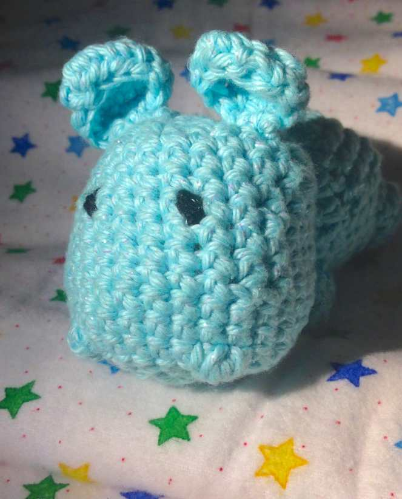

Project: Crocheted Amigurumi Hippo Pattern

A few people in my family and friends circle are currently pregnant! That means come 2015 there will be a few baby showers that I’ll be attending, so I figured I better start making a ton of baby gifts now in preparation! Since we don’t know the sexes of the babies-to-be yet, I’m looking for gender-neutral projects that any little one could play with. In addition to some cute baby blankets (post-to-come!),

[_play mats_](/diy-baby-play-mat/ "DIY Baby Play Mat")

and clothing, I have been busy crocheting little zoo animals at my weekly Crochet/Knit class! The first one I completed was this adorable little hippo!

All credit for this adorable hippo comes from the original pattern at

[_Sweet N Cute Creations_](http://sweetncutecreations.tumblr.com/post/71012665271/amigurumi-hippo-free-pattern "Amigurumi Hippo Pattern from Sweet N Cute Creations")

, where you can find a lot of other great patterns as well! If you are a crocheter, definitely check it out! Copied below is their pattern verbatim, with any changes or notes I had in

**_\*italics & bolded!_**

Be sure to pop over to

_Sweet N Cute Creations_

if you want to see more!

Sweet N Cute Creations’ little hippo, Ella, is way cuter than mine! But that’s okay- I like mine too!

## Materials:

- 4 ply acrylic yarn in blue and cream \[or any color combination you please]

  **_\*I used only aqua- the sparkly kind from Hobby Lobby called[I Love This Cotton Yarn](http://web.archive.org/web/20150624054621/http://shop.hobbylobby.com/products/aqua-sparkle-i-love-this-cotton-yarn-110213/ "Aqua Sparkle I Love This Cotton Yarn at Hobby Lobby")_**

- safety eyes \[10mm]

  _\***I used black yarn for eyes instead**_

- crochet hook in G

- embroidery floss in pink – optional

- fiberfill stuffing

- tapestry needle

## **Pattern Notes**

inc \[increase] – making 2 sc in one stitch

dec \[decrease] – making an sc2tog

all decreases are done invisibly —> decrease through the back loops!

## **Pattern**

HEAD

USING CREAM

_**\*Or in my case, beginning with aqua and continuing through whole pattern!**_

rnd 1: magic circle, make 5 sc \[5]

rnd 2: inc 5 times \[10]

rnd 3: inc in next st, sc in each of the next 3 st, inc 2 times, sc in each of the next 3 st, inc in last st \[14]

rnd 4: sc in next st, inc in st after. sc in each of the next 3 st; \[sc in next st, inc in st after] twice; sc in each of the next 3 st; inc in last st \[18]

rnd 5: \[sc in next st, inc in st after] 9 times \[27]

rnd 6-8: Sc all around

rnd 9: \[sc in each of the next 7 st, dec] 3 times \[24]

SWITCH TO BLUE

_**\*or simply continue if you are using just one color!**_

rnd 10-11: sc all around \[24]

safety eyes to be inserted here. make sure they are 6 st apart \[or as far or near as you would like]

_**\*If you aren’t adding safety eyes now, skip this step and simply stitch on with black yarn at very end.**\&#xA;_

rnd 12: \[sc in each of the next 6 st, dec] 3 times \[21]

rnd 13-14: sc all around \[21]

rnd 15: \[sc in each of the next 5 st, dec] 3 times \[18]

rnd 16: \[sc in each of the next 4 st, dec] 3 times \[15]

start stuffing HERE

rnd 17: \[sc in each of the next 3 st, dec] 3 times \[12]

rnd 18: \[sc in each of the next 2 st, dec] 3 times \[9]

fasten off leaving a long tail for weaving in the ends

EARS

USING BLUE

rnd 1: magic circle, make 5 sc \[5]

rnd 2: inc 5 times \[10]

rnd 3: sc in each of the next 2 st, hdc in each of the next 2 st, dc in each of the succeeding 2 st, hdc in each of the next 2 st, sc in each of the remaining 2 st \[10]

fasten off leaving a long tail for sewing

BODY

USING BLUE

rnd 1: magic circle; make 6 sc \[6]

rnd 2: inc 6 times \[12]

rnd 3: \[sc in next st, inc in st after] 6 times \[18]

rnd 4: \[sc in each of the next 2 st, inc in st after] 6 times \[24]

rnd 5: \[sc in each of the next 3 st, inc in st after] 6 times \[30]

rnd 6: sc all around \[30]

rnd 7: \[sc in each of the next 3 st, dec] 6 times \[24]

rnd 8: sc all around \[24]

rnd 9: \[sc in each of the next 4 st, dec] 4 times \[20]

rnd 10-12: sc all around \[20]

rnd 13: \[sc in each of the next 3 st, dec] 4 times \[16]

rnd 14: hdc in each of the next 6 st; sc in each of the succeeding 3 st, hdc again in each of the remaining 7 st \[16]

rnd 15: sc in each of the next 6 st; slst in each of the succeeding 3 st, sc again in each of the remaining 7 st \[16]

rnd 16: sc in each of the net 2 st, dec. sl st in each of the next 8 st. THROUGH BLO hdc in each of the remaining 4 st \[16]

rnd 17: hdc in each of the next 2 st. sl st in next \[3] do not mind if it doesn’t finish the entire row.

fasten off leaving a long tail for sewing

FRONT LEGS

USING BLUE

rnd 1: magic circle; make 4 sc \[4]

rnd 2: \[sc in next st, inc in st after] 2 times \[6]

rnd 3-5: sc all around \[6]

fasten off leaving a long tail for sewing

HIND LEGS

USING BLUE

rnd 1: magic circle; make 4 sc \[4]

rnd 2: inc 4 times \[8]

rnd 3-5: sc all around \[8]

fasten off leaving a long tail for sewing

TAIL

ch 7, hdc in 3rd ch from hook. sl st in each of the next 4 st.

flip to the other side

sl st in each of the next 4 st. hdc in last st.

fasten off leaving a long tail for sewing

## **Assembly**

1. Fully stuff the head and weave all ends together to close the small opening.

2. attach the ears to the head using safety pins

   _**\*I did not have pins at class with me, so I just used my yarn needle and stitched everything on without using pins.**_

   Once you’re happy with how it looks; sew it to the head. to properly secure it, i suggest drawing the yarn out through the middle part of the back of the head. this is because the body will cover that part

3. stuff both hind and front legs; and the body

4. attach the legs to the body.

   the front legs are placed diagonal to the hind because the body becomes smaller as it goes towards the body

5. sew on all the legs to the body. in sewing, you may opt to remove the stuffing in the body to give you an easier time to sew

6. after sewing the legs, sew on the tail to the body as well

7. fully stuff the body now

8. take note of the diagonal of the body. the diagonal is where the head will rest

9. Once you’ve pinned the head onto the diagonal of the body, you can now sew it in place

10. once you’re done sewing it in place, your hippo is all ready to go!!!!

__

_**\*After everything was sewn together, I added the eyes with black yarn and a few stitches, and some little nostril nubs like hippos have to give the face a little dimension!**_

Isn’t Sweet N Cute Creations little hippo pattern just awesome!? How did mine come out?

