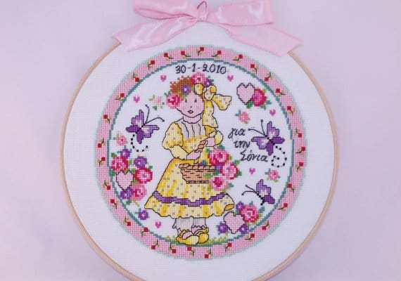
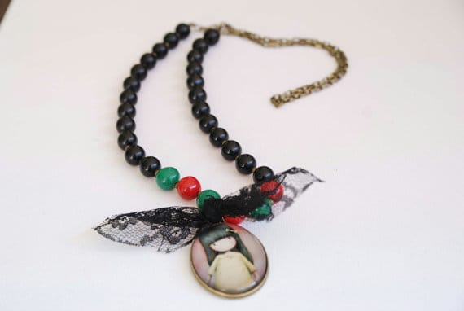
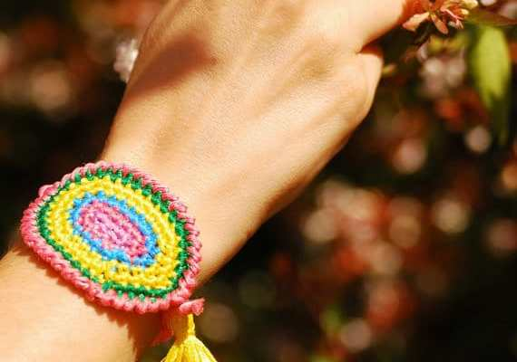
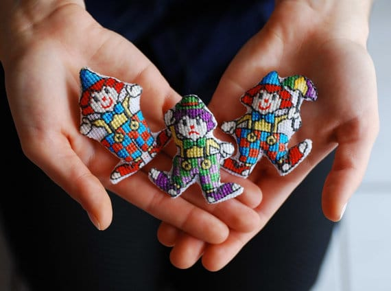
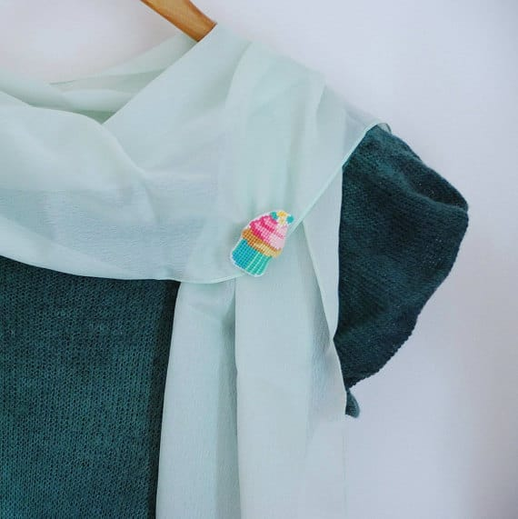

_?On the fourth day of Christmas, Katie Crafts gave to me…?_

A cute little

[Kawaii cupcake brooch](https://www.etsy.com/listing/215378045/kawaii-strawberry-cupcake-brooch-cross?ref=shop_home_active_10)

from

[Me and Mama Creations](https://www.etsy.com/shop/MeandMamaCreations)

! Today’s giveaway is a handmade cross stitched strawberry cupcake brooch from the talented Lia. Read her interview below, check out some of her other adorable works and enter to win the absolutely

_sweetest_

stocking stuffer ever!

What is your name, your shop’s name and where are you located?

_I am Lia from_

_[Me and Mamacreations](http://www.etsy.com/shop/MeandMamaCreations)and I am located in Thessaloniki, Greece._

photo from Me and Mama Creations

Tell me about the process behind your craft and what inspires you to create.

_As the name of our shop suggests, what you see is what I and my mother create. Creation process starts…with a cup of greek coffee! Then we open my huuuuge cupboard where I keep our craft supplies and….off we go! What is exciting about working with my mom is that we constantly exchange ideas during the creation process, so that when the item comes live into our shop has some “characteristics” of her and me as well._

photo from Me and Mama Creations

Share a photo of your favorite item you’ve ever made!

__

_[This is picture of my favorite item.](https://www.etsy.com/listing/235346571/red-heart-drop-crystal-earrings-holiday?ref=shop_home_feat_1)_

photo from Me and Mama Creations

What is your favorite part of the holiday season?

My favorite part of the holiday season is that kids are off from school and we can do crafting together.

photo from Me and Mama Creations

Great interview, Lia!!! Now it is giveaway time! One lucky winner will receive:

- The below photoed Kawaii Strawberry Cupcake Brooch. Cross stitch, hand embroidered dessert pin. Size is 4.5cm (1.38in) x 4.5cm (1.38 in). 10 Colors of thread making it an intricate piece. Comprised of 350 cross stitches (that’s 700 stitches!)

photo from Me and Mama Creations

Raffle open Worldwide! Must be 18 or older to enter. No bots or fake accounts. All entries are verified. Please read Rafflecopter terms and conditions.

Giveaway ends at 11:59 PM ET on 12/12/15! If you haven’t seen the giveaways earlier this week, check out how to win an

[e.l.f. cosmetics haul](/elf-haul-giveaway/)

,

[a pair of pearl earrings](/pearl-earrings-giveaway-with-natalia-khon/)

, and

[a hand crocheted baby hat](/crocheted-baby-hat-giveaway/)

… and come back tomorrow for

_another giveaway!_

[a Rafflecopter giveaway](http://www.rafflecopter.com/rafl/display/64ecfabc31/)
