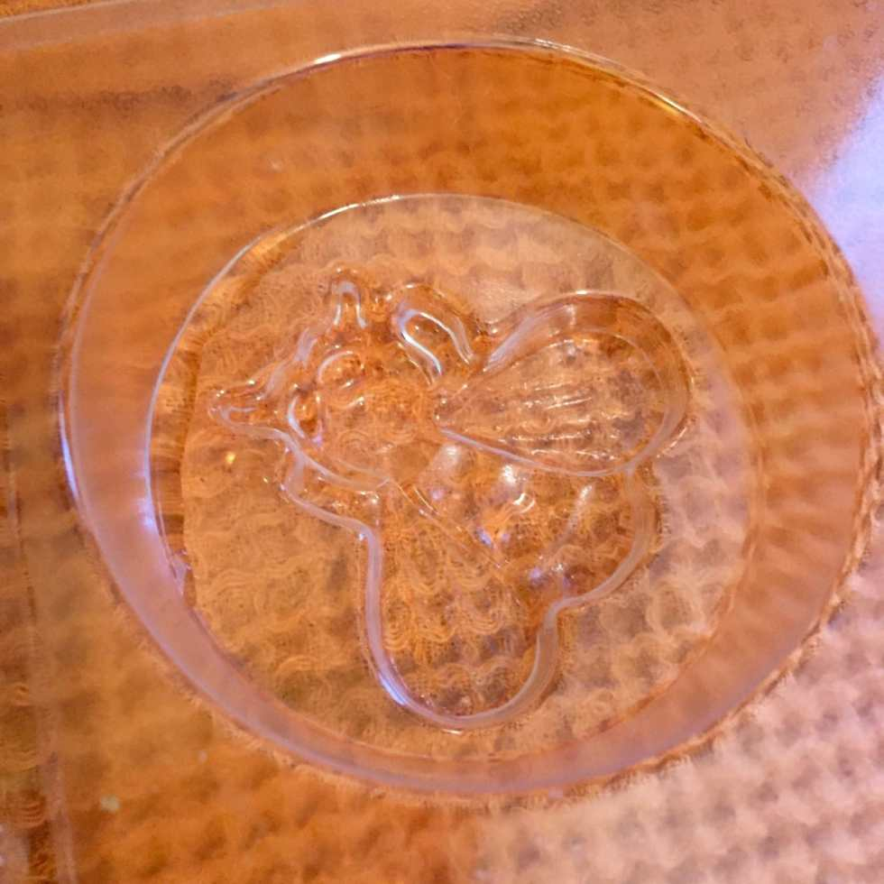

_?On the eighth day of Christmas, Katie Crafts gave to me…?_

A fantastic handmade gift idea for the holiday season! This DIY 2 ingredient Milk & Honey Soap tutorial is so easy you’ll be whipping up homemade soaps for everyone in your family this holiday season! But don’t forget to keep some for yourself!

## Ingredients:

- [Goat’s Milk Soap](http://www.amazon.com/gp/product/B002PNV3DI/ref=as_li_qf_sp_asin_il_tl?ie=UTF8\&camp=1789\&creative=9325\&creativeASIN=B002PNV3DI\&linkCode=as2\&tag=katicraf-20\&linkId=GTBQJH3LKT3EAN76)

- Raw Unfiltered Honey

- Yellow Dye (optional)

## Instructions:

- Cut 1/4 (which is about a half pound) of the Goat’s Milk Soap into cubes with a knife. It’s soft so it will cut pretty easily. This will yield three large bars of soap!

* Use a metal spatula or something similar to help you left the cubes out of the packaging and put them into the glass measuring cup. I accomplished this with a pie server!

- Microwave for 30 seconds. Stir.

- Repeat the microwave-30-seconds-&-stir step until everything is melted and liquid. This usually is about 3 to 4 intervals.

- While it’s still hot, add 2 Tablespoons of Raw Unfiltered Honey to the soap. Stir until completely mixed.

- I also stir in three drops of yellow coloring to make it a little more “honey” like in color, but this is completely optional.

- Pour into soap molds and let set in freezer for an hour.

- Remove molds from freezer, turn over and gently pop out the soap bars. If they are still frozen to the molds, use your hand to warm them up for a minute and try again. They should come out fairly easily.

- That’s it! Enjoy your milk and honey soap!

What do you think of my super easy DIY soap recipe? If you decide to use it for a quick holiday gift idea, share a pic in the comments!
