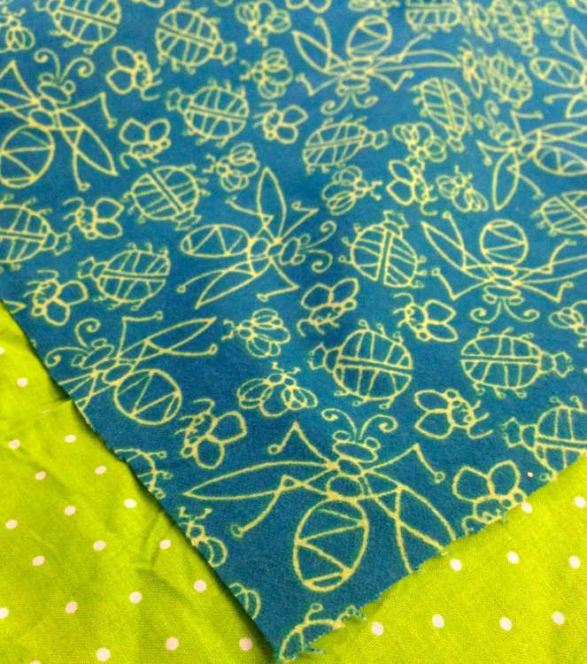
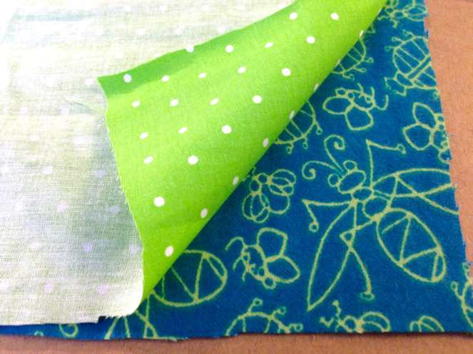
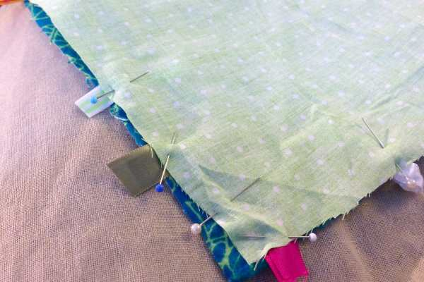
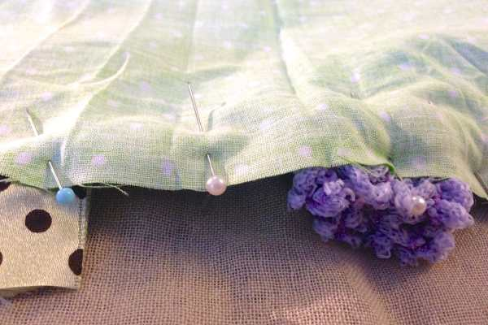
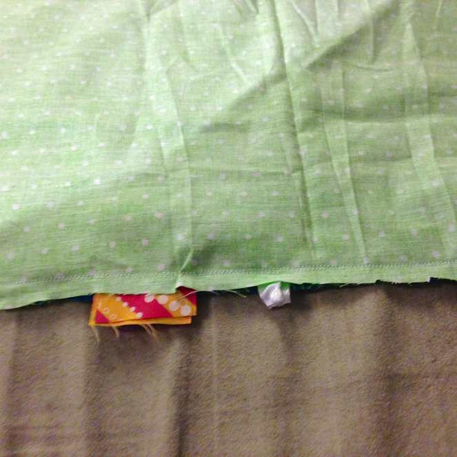
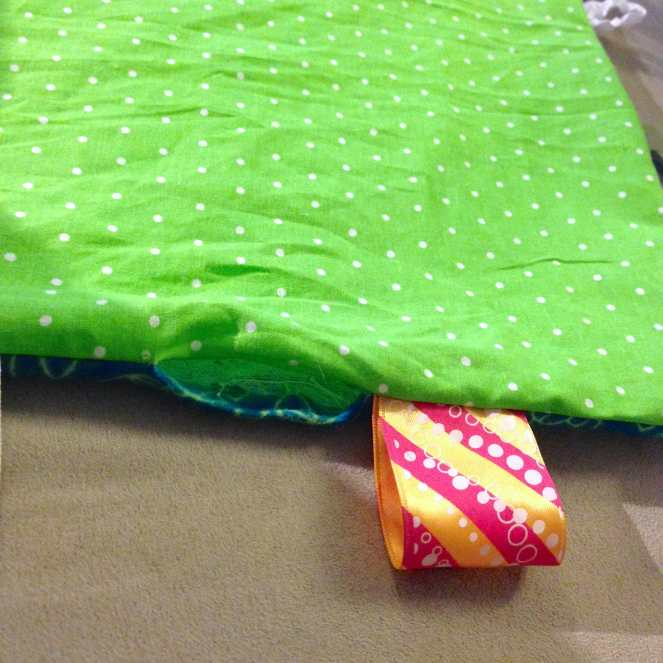

Project: DIY Baby Play Mat (with Tags!)

Today’s project is a very simple sewing one, perfect for a beginner! If you’ve done any of my other projects successfully, you can certainly pull this one off with ease. It would make an adorable gift for a mommy-to-be for her future little one as a play mat to play on or a tiny blankie to cuddle with! The different sized and textured tags will keep baby stimulated and occupied. Plus it’s adorable!

I didn’t pad the inside of this project, since I don’t have any on hand- but you certainly can! Just add it to your list of materials below if you’d like the extra softness!

## Materials:

- flannel fabric

- cotton fabric in coordinating color

- Tape measure

- Scissors

- Pins

- Various sized and textured ribbons

- Sewing machine and matching thread

## Instructions:

- Measure your cotton fabric and cut a 17″ x 13″ piece.

- Measure your flannel fabric and cut a 17″ x 13″ piece.

- Place right sides of fabric facing.

- Begin placing folded pieces of ribbon inside the panels of fabric (making sure the looped part is nice and flat on the inside, and the two ends of each ribbon are sticking out on the outside. Make sure they are all different sizes! Pin them all down. Pin any additional openings as you see fit.

- Stitch all the way around with a half inch seam allowance, leaving a gap of about two inches for turning.

- Stitch all the way around a second time to make sure everything is secure. Usually I’d just backstitch over the ribbon but since there are so many of them in this project, it is easier to simply stitch back over everything again. Feel free to backstitch over pieces that are thicker and need the extra securing!

- Cut off any excess fabric and ribbons.

- If you are using batting/padding, cut a piece slightly smaller than the fabric panels and place on top now.

- Turn inside out through the gap.

- Use a needle and thread to do a blind stitch by hand, or if you don’t mind some thread showing, do a decorative stitch (I did a simple zig zag!) to close the gap.

- Iron it out if you like to make it pretty!

- That’s it! All done! Your final project should be 16 x 12 inches- the perfect size for a baby to snuggle with while playing or lay on with a toy!

This project is so simple (and fun, and cute!) that I will definitely be making it for all my pregnant friends and family members in the future! Hope they like them as much as I do!

What do you think about my DIY baby play mat tutorial? If you give it a try, send me pics!
