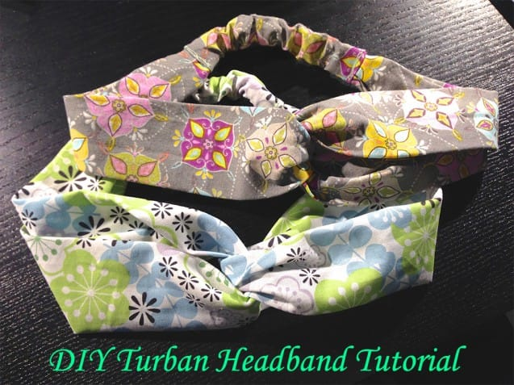
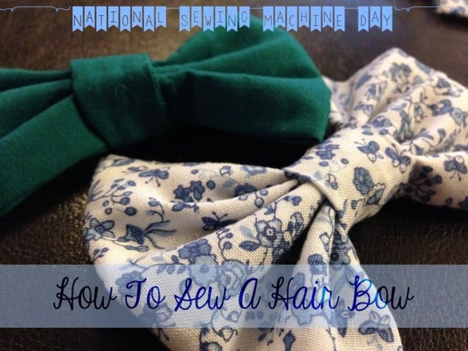
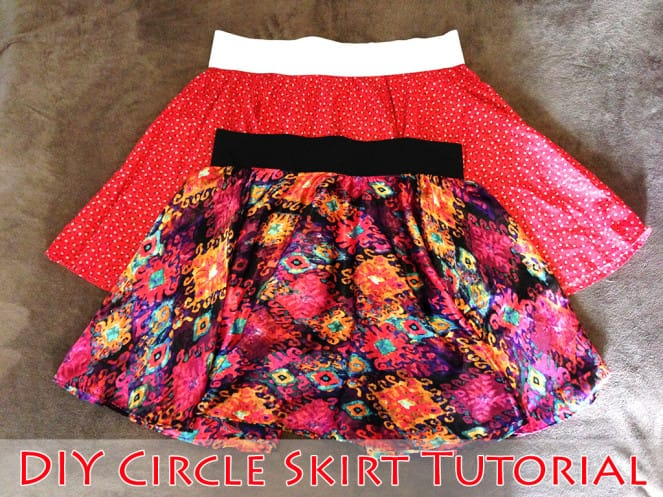
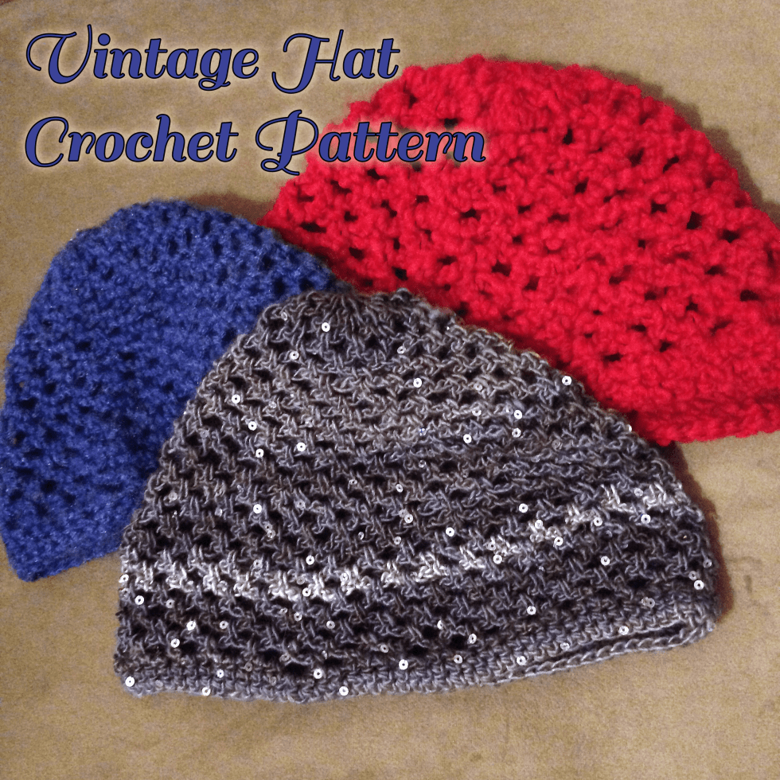
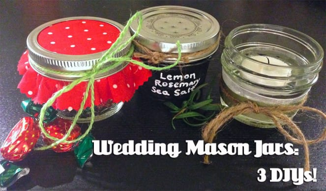
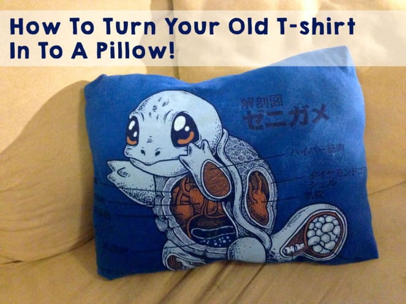
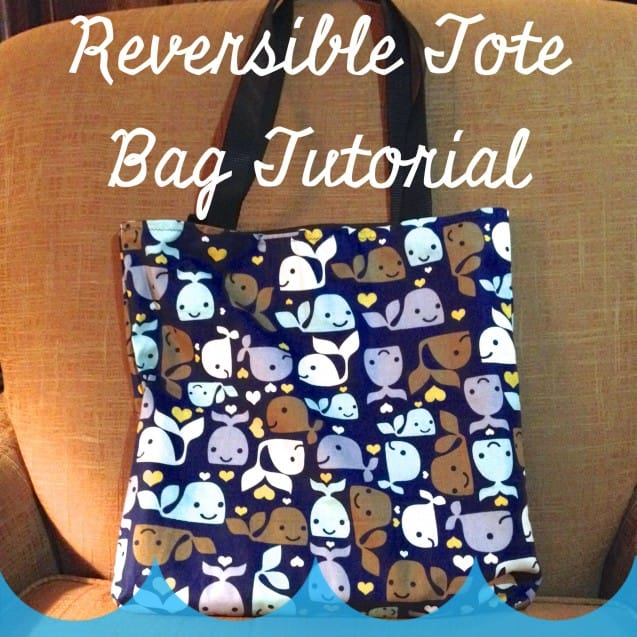
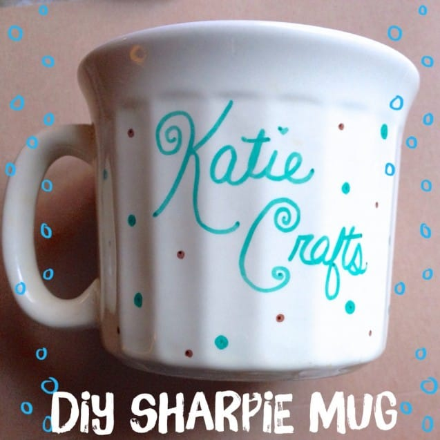

With Thanksgiving in just a few days and my

**_12 Days of Christmas\*_**

right around the corner (December 1st through December 12th!), I thought it would be a good idea to do a round up of past DIY projects that would make great Christmas gifts!

\*First, let me explain what to expect during the 12 Days of Christmas! Every day for twelve straight days, Katie Crafts will have a new post relating somehow to the holidays. We will kick it off with a great giveaway, and continue with awesome holiday recipes, guest bloggers, more giveaways and some easy and fun DIY projects that you may want to make as Christmas gifts! Before we delve in to new projects, though, today’s post will re-visit a dozen past projects that anyone would be happy to see under their tree!

First are a few gifts that are great for the baby, or mom-to-be in your life! Above is a cute little

[_**crocheted amigurumi hippo**_](/crocheted-amigurumi-hippo-pattern/ "Crocheted Amigurumi Hippo Pattern")

, and below is a

[_**baby plat mat with tags**_](/diy-baby-play-mat/ "DIY Baby Play Mat")

on it for your little one to play on!

Next up is a gift perfect for your favorite aunt, mother-in-law or grandma! Using a vintage brooch, some wire and a toothed comb, you can make a beautiful

[_**hair comb**_](/diy-hair-combs-from-brooches/ "DIY Hair Combs From Brooches")

that will be unique and lovely.

Another fabulous DIY is one you can make for your sister or best friend:

[_**a turban headband**_](/diy-turban-headband-tutorial/ "DIY Turban Headband Tutorial")

! These can be made in any fabric you like, so it can be made to match a Christmas outfit, in someone’s favorite color, or even using fabric patterned with their fave sports team’s logo!

If your bestie isn’t really in to headbands, but really loves hair accessories, try making her a

[_**hair bow**_](/how-to-sew-a-hair-bow/ "How To Sew A Hair Bow")

! These are really fun to make and work up pretty quickly! Don’t want to make any? You can buy them from

[_**my Etsy shop**_](https://www.etsy.com/shop/katiecrafts?section_id=15601965\&ref=shopsection_leftnav_1 "Katie Crafts' Christmas Shop on Etsy")

!

If you have the time to spare, a homemade

[_**circle skirt**_](/diy-circle-skirt-tutorial/ "DIY Circle Skirt Tutorial")

is a fabulous gift for any lady in your life! It can be made to fit anyone, as long as you have their measurements! It’s also a super fun skirt for twirling in! 🙂

Looking for something to give a little warmth? You should definitely try this

[_**vintage crocheted hat pattern**_](/vintage-hat-crochet-pattern/ "Vintage Hat Crochet Pattern")

! It works up in under two hours and is an amazing gift this Winter!

A few gifts that are good for anyone in your life are up next! If you have extra

[_**mason jars**_](/wedding-mason-jars-3-diys/ "Wedding Mason Jars: 3 DIYs!")

lying around, you can make salt shakers, candles or candy jars like those above. If you have a brother or boyfriend who really loves his band t-shirts but they are old or shrunken, you can give them new life by making

[_**pillows**_](/how-to-turn-your-t-shirt-in-to-a-pillow/ "How To Turn Your Old T-Shirt In To A Pillow")

out of them like below!

Last Christmas, I made pretty much everyone I know a

[_**reversible tote bag**_](/reversible-tote-bag-tutorial/ "Reversible Tote Bag Tutorial")

(like above)! They were a big hit, since everyone can use a tote. Practical gifts that are also adorable are pretty much the best! Another one that is great for all is

[_**Sharpie mug**_](/diy-sharpie-mug/ "DIY Sharpie Mug")

you decorated yourself! Personalize it with your friend’s name, or a fun design, and add some packages of hot chocolate and mini marshmallows for a great gift to your co-workers or anyone else you make take coffee breaks with!

Lastly, you can’t forget your furbabies! You can make this

[_**cozy catnip pillow**_](/cozy-catnip-kitty-pillow/ "Cozy Catnip Kitty Pillow on Katie Crafts; http://www.katiecrafts.com")

for your feline friend, or nix the catnip and make a fluffy bed for your pup! They will be thrilled to have a new soft place to sleep, when they aren’t on your lap of course.

Be sure to check out

_[**Katie Crafts’ Christmas Shop**](https://www.etsy.com/shop/katiecrafts?section_id=15601965\&ref=shopsection_leftnav_1 "Katie Crafts' Christmas Shop on Etsy")_

for lots of Christmas hair bows and fabric button earrings, just in time for the holidays! As always, there’s an array of jewelry, accessories and more for your shopping needs. Happy Holidays!
