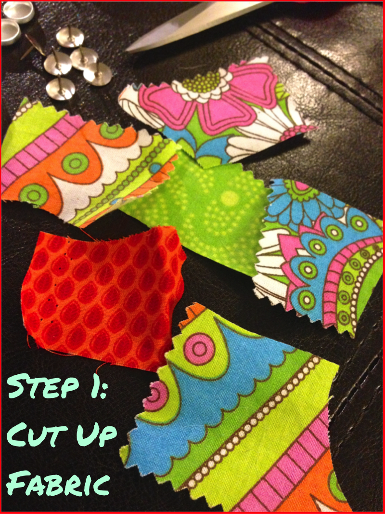
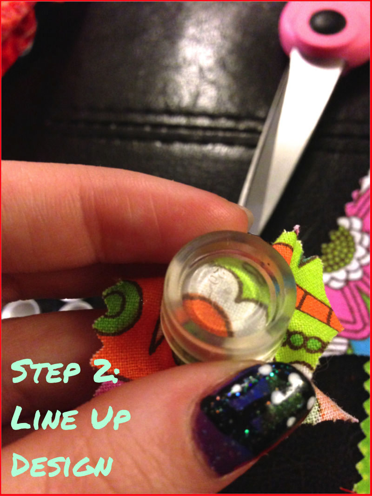
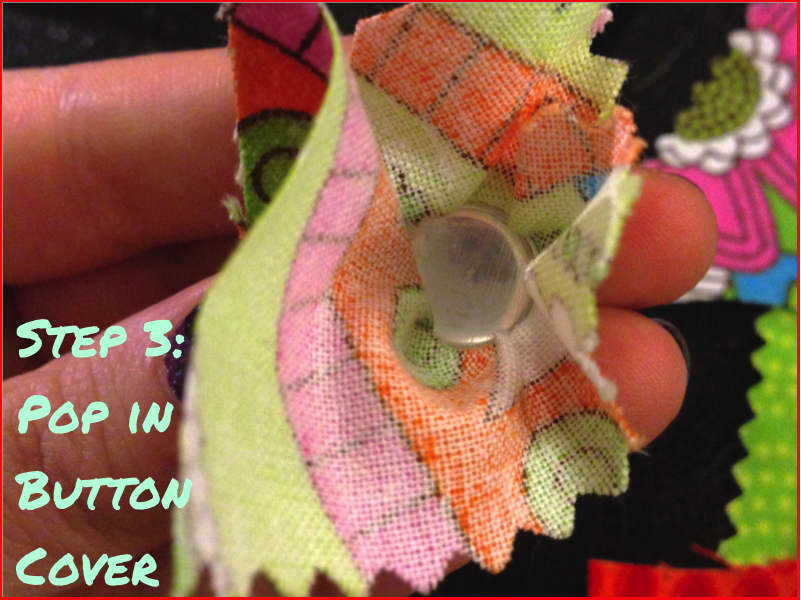
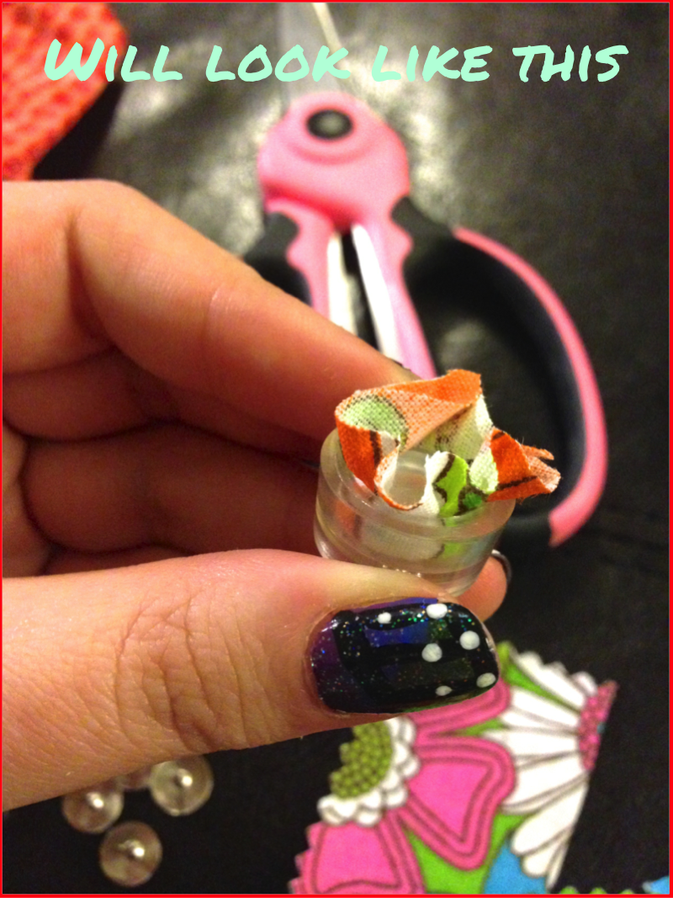
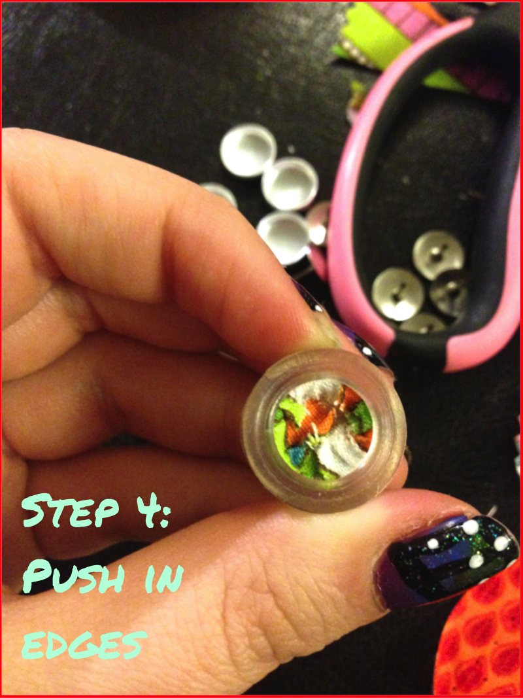
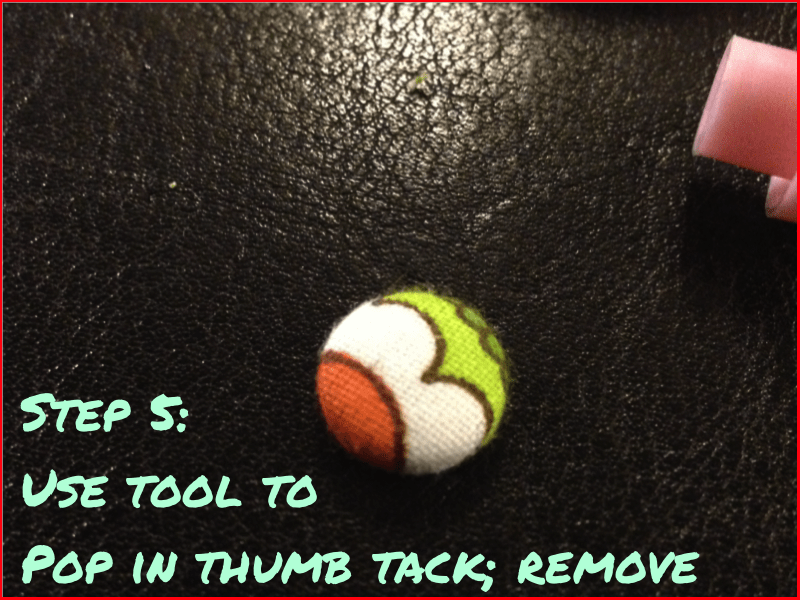
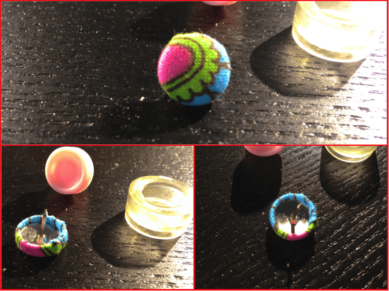
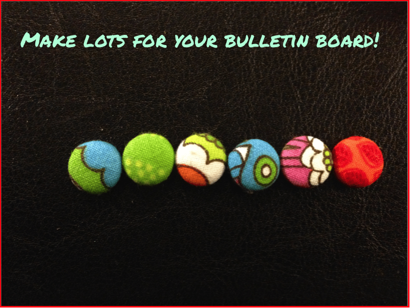

Project: DIY Decorative Thumb Tacks

I bought two really cute

[Martha Stewart](http://www.staples.com/Message-Boards/cat_CL204819 "Martha Stewart Message Boards at Staples")

(of course!) message boards at Staples to go above my new work area, and while some of the push pins come in fun colors, it wasn’t quite enough. Obviously I had to make my own! I love the way these fabric covered thumb tacks came out, and love even more that they only took 5 steps!

I love these little decorative thumb tacks and plan on making more for my second board. It’s also a chance to use up more fabric from my scrap basket! Yay for fabric scrap basket projects!

## Materials:

- Aluminum button covers and tool\*

- Fabric scraps

- Scissors

- Thumb tacks

\*Tool consists of two rubber/plastic pieces and comes with most kits. Just check!

The thumb tacks I used fit EXACTLY inside the covered button tops,

**sans**

backs (I used

**Size 20**

, 1/2 inch). If you have larger button covers, you can still make the tacks! Just

**use**

the back and then glue the thumb tack to the back.

## Instructions:

And now on to the five easy (if not SOMETIMES ANNOYING) steps- don’t let the annoying part deter you. I think I just need a new tool!

- Cut up the fabric in to the pieces you want to use. Small little squares or circles will do just fine. You don’t need to really measure or anything, as long as it’s twice the size of the button, it will work!

- If the large part of your tool is clear, you can take a line up exactly where you want the fabric to be. If it isn’t clear, you can just kind of eyeball it!

- Using the second, smaller half of the tool, push the button cover top on the layer of fabric into the larger half of the tool. (So it would look like a sandwich- Tool 1-fabric-button cover-tool 2)

- Once it’s pushed in, it will look like the above photo. If there are extra shreds of fabric, or a lot of fabric sticking out the top,

  **CUT**

  it. You don’t want too much fabric! But don’t cut it too short, either!

- After cutting the excess fabric off (even with the edge of the tool is fine), use your finger to push all the edges inside the button cover.

- The next part I couldn’t photograph, since I needed two hands! You’ll place a thumb tack on top of the pushed in fabric, and use the second piece of the tool to pop it in! If you are using a larger button cover, this is where you’ll pop the back on to it, and then glue the thumb tack to the back. I always have a hard time with this part. It takes pretty much all of my strength and putting the weight of my whole body on to the tool to pop it in, but I am currently blaming this on the tool. I have a larger button cover set and tool and that one is mega easy! It takes me only a minute rather than 20 per button!

That’s it! Just a few steps and you have really easy decorative thumb tacks for your bulletin board. I’m going to make a cute set of these for a giveaway soon! I hope you’ll enter!

## Tips:

- Use larger button covers and replace the thumb tacks with mini magnets instead! Pop them in your locker or on your file cabinet or fridge- super cute!

