Project: DIY Flip Flops Tutorial!

Summer may already be halfway over (Ugh! Where did the time go?!) but that doesn’t mean you have to put away your flip flops just yet. Actually, why don’t you do the opposite and make a few new pairs yourself! These flippies are so incredibly easy to make (and will cost you under $5!!) that you’ll want a pair to match each of your outfits!

I don’t know about you, but I am a flip flop snob. Sadly, the cheap Old Navy ones that come in every color of the rainbow have that hard plastic thong that I cannot STAND having between my toes. I always always end up with cuts or blisters from them. I can only handle soft fabric between them! When I learned how to make my own flip flops as part of my wedding DIY’s (all the bridesmaids had green high heels to wear for the wedding that I knew would hurt their feet, so I provided everyone with homemade matching flippies for dancing later on!), I was pretty stoked. Flip flops I could ACTUALLY wear that were ACTUALLY cute!? I’m in!

When pedicure season rolled around again this year, I was really excited to make a few new pairs to go with my new outfits. You’ll even recognize the materials! I made a pair to match one of my

[circle skirts](/diy-circle-skirt-tutorial/ "DIY Circle Skirt Tutorial")

and a pair that matches my new favorite

[hair bow](/how-to-sew-a-hair-bow/ "How To Sew A Hair Bow")

!

I’ll show you two slightly different ways to make them, but since they are SO similar, I’ll explain them side by side rather than two separate tutorials. Here we go!

## Materials:

- Cheap pair of flip flops with rubber/plastic thong (I bought these at the Dollar Tree!)

- Fabric (one fat quarter will do!)

- Scissors

- Hot Glue (optional, and not used in this specific tutorial)

## Instructions:

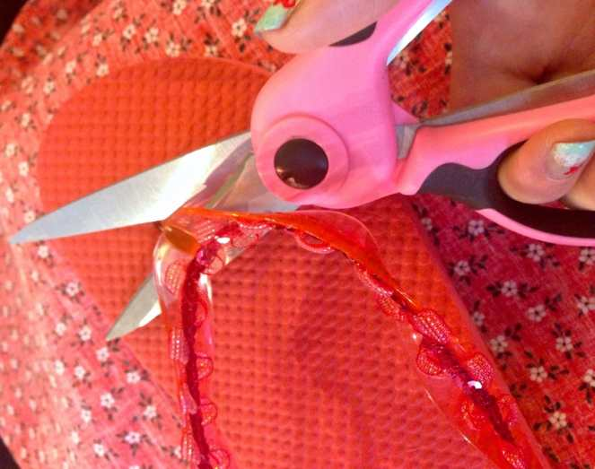

- Cut the rubber thong out of the flip flops to use the bottom as your “base” by cutting off the bottom parts of the rubber, leaving the thong in tact. Repeat for other shoe.

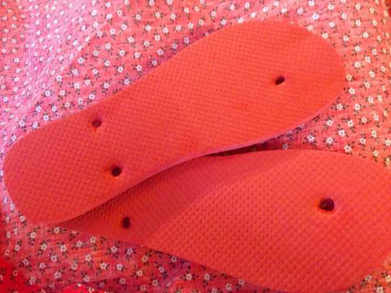

- For the look on the

  _**left**_

  with no additional middle loop, you’ll need only

  _two long strips per shoe_

  . For the look on the

  _**right**_

  with the additional loop between the toes, you’ll need

  _one extra long strip and one short strip per shoe_

  .

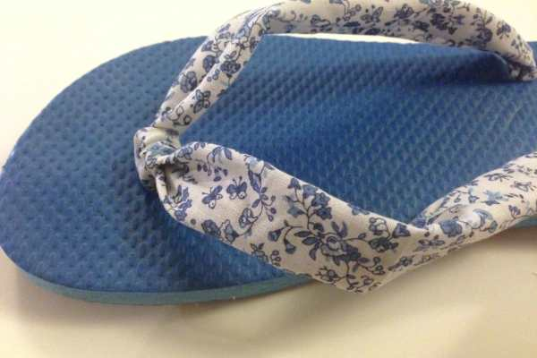

- To measure length for an extra long strip: Stretch out the thong and use that to measure how much fabric you will need. Get it as straight as you can and add on an additional two inches to that length. Again, you’ll need ONE for each shoe.

- To measure length for a long strip: Make one extra long strip and cut it in half! Again, you’ll need TWO for each shoe.

- Width for both long and extra long strips is the same: Depending on how wide you want your fabric thong on your foot to be, cut your fabric accordingly! Remember it will be HALF the width that it currently is once it’s finished, so be sure to double up on that initial width. For example, my blue ones are about 3 inch wide strips to make about 1.5 inch wide thongs later while my red ones are about 4 inch wide strips to yield 2 inch wide thongs! It’s your preference!

- To measure length for a short strip: 8″ x 2″ should do the trick! You can cut off excess later.

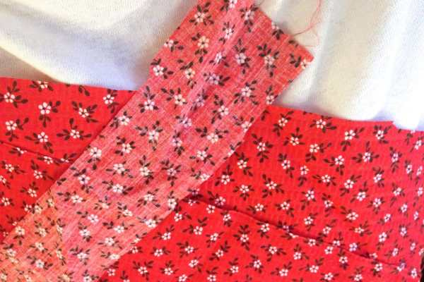

- Fold all strips in half lengthwise with right sides of fabric facing each other, pin across.

- Using your sewing machine (or hand stitch), straight stitch across to form tubes. Be sure to back stitch!

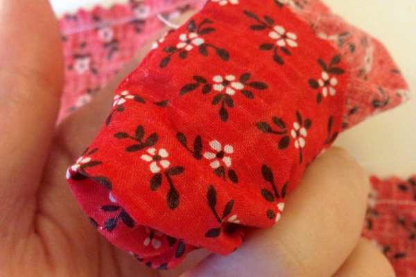

- Using your fingers, a chopstick, a pencil or the like, turn all tubes inside out so right sides are now facing you. Iron out wrinkles if you like.

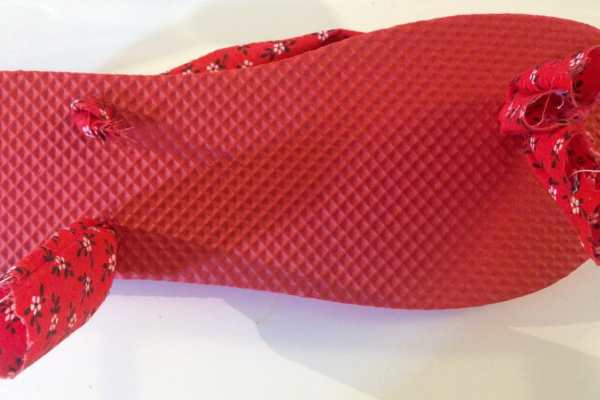

- If you

  **are not**

  making a middle loop sandal, simply take one end of each of your long tubes (seams facing downwards so they aren’t visible) and stick them both through the top hole of the flip flop. Knot twice.

- Take each of the other ends separately and stick them through the left and right holes, knotting twice. Use some hot glue to hold in place underneath the bottom, if you like (I did on some pairs and did not on others, and never had a problem either way!) Cut off excess fabric.

- Done!. ..

-. .. Unless you

  **want**

  a middle loop. If you do, simply pull each of the ends of the extra long tube through the two bottom holes, seams down, and knot ONE of them (above).

- With your short tube, make a loop around the extra long tube to act as the thong between the toes (again, with seams facing inwards so they are not visible) and stick it through the top hole. Pull through as much as you like (think of how big it is on your favorite pair of flip flops now and go from there) and knot it twice.

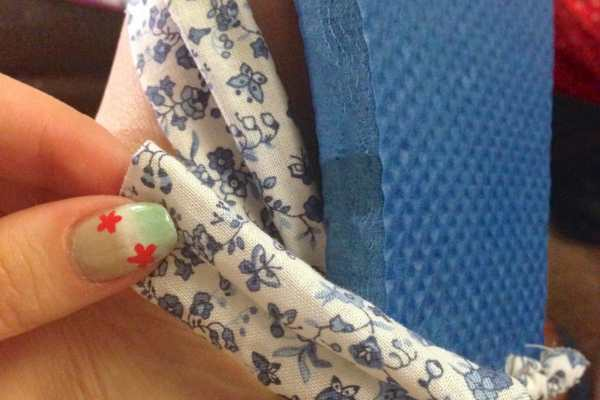

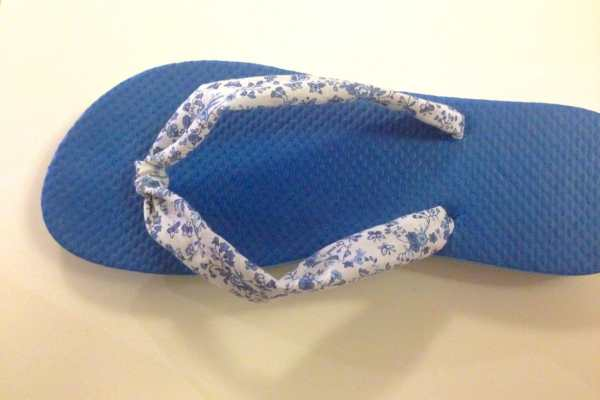

- Place shoe on your foot, making sure it’s tight enough with the middle loop. If all feels okay, knot that last knot to complete shoe. Otherwise, adjust it to fit comfortably and knot. Done again!

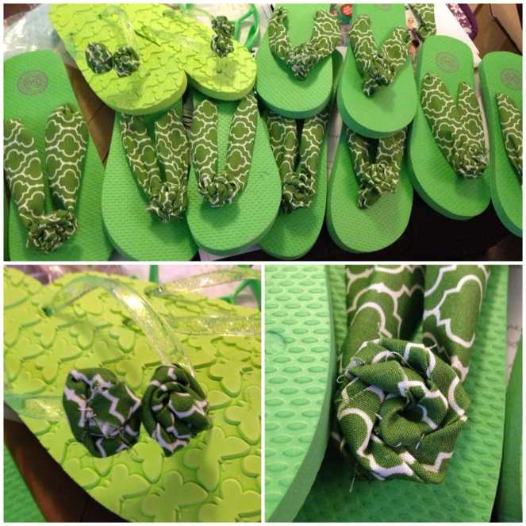

Wear your new customized flip flops to the beach, out shopping, or let your cat play dress up with them. Mabel took over mine almost immediately. She loves shoes. Such a girl, that one. Hope you enjoyed this tutorial!

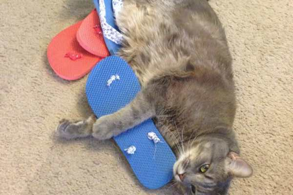

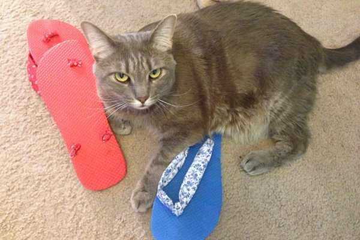

## Tips:

- Make a basket of flip flops for your favorite college student before they head off to their dorm! There is nothing more comfy than a pair of sandals to lounge around in!

- Make a batch for your bridesmaids like I did, or maybe for a bachelorette party enjoying a spa day!

Cute rosette detail!

- Use my

  [fabric rosette flower tutorial](/diy-shabby-chic-rosettes/ "DIY Shabby Chic Rosettes")

  to make pretty fabric flowers to decorate the tops of the flip flops (pictured on the green wedding ones!) Just use a couple stitches or some glue to keep them in place!

- Ditch the sewing all together and try this out by simply ironing the ends in! With fabric laying right side down, fold both ends (lengthwise) towards the center and iron flat. Pretend that is your “seam” as you pull through and knot. There is more chance of fraying or of the bottoms moving around and showing but it still isn’t super likely. My green pairs were done this way, no sewing involved!

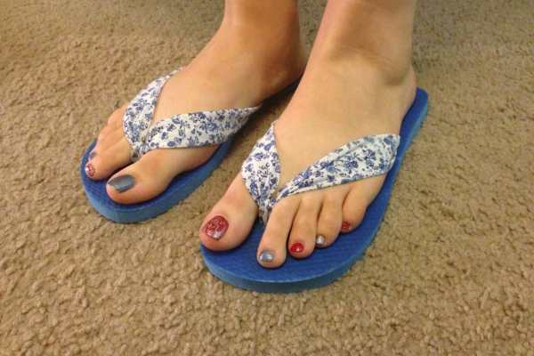

If you make a pair of flippies yourself, share a pic in the comments!
