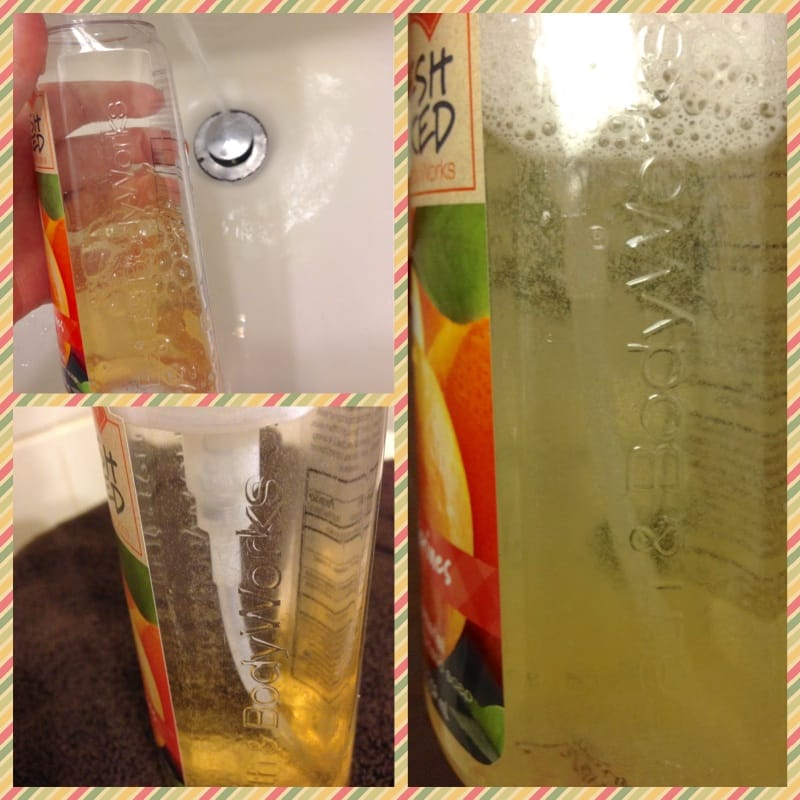

**Project: DIY Foaming Soap Refill**

**\&#xA;**

A few weeks ago, I told you about a project I wanted to try that was all about making your very own

[foaming hand soap](/sunday-funday-issue-4/ "Sunday Funday: Issue 4")

. Well, I finally got around to trying it out, and it really was crazy simple! I’ll be doing this from now on!

Foaming hand soap is my favorite! I just love the bubbles. I was excited when I first learned that I could make my own, but skeptical that it just wouldn’t be the same. I’m glad I finally tried it, since it’s very much the same, and easy, and cheaper, and I can make it at home. All things I love!

## Materials:

- Empty foaming soap bottle

- Your favorite body wash

## Instructions:

- Wash out your foaming soap bottle thoroughly! The one I had was a previous home to a tangerine scented soap. I didn’t have any body wash in that scent on hand, so I washed it extra well so there were no traces of tangerine left!

- Next, fill your bottle up with your favorite body wash about an

  **INCH**

  from the bottom.

- Using

  **hot**

  (not boiling, but very hot!) water,

  **slowly**

  fill your bottle almost all the way. Leave about an inch on top empty.

- Carefully stir as much as you can of the soap/water combo. When it doesn’t look like you can stir any more, close it up tightly and

  **GENTLY**

  turn the bottle from one side to the other. The soap will begin to mix nicely with the water.

  **DO NOT SHAKE!**

- Give it a few pumps and it’s ready to use! That’s it!

I’ll probably decorate the outside of the bottle with a paper sleeve or something, so that people who go to use it aren’t duped in to thinking there is tangerine soap inside! How would you decorate it?
