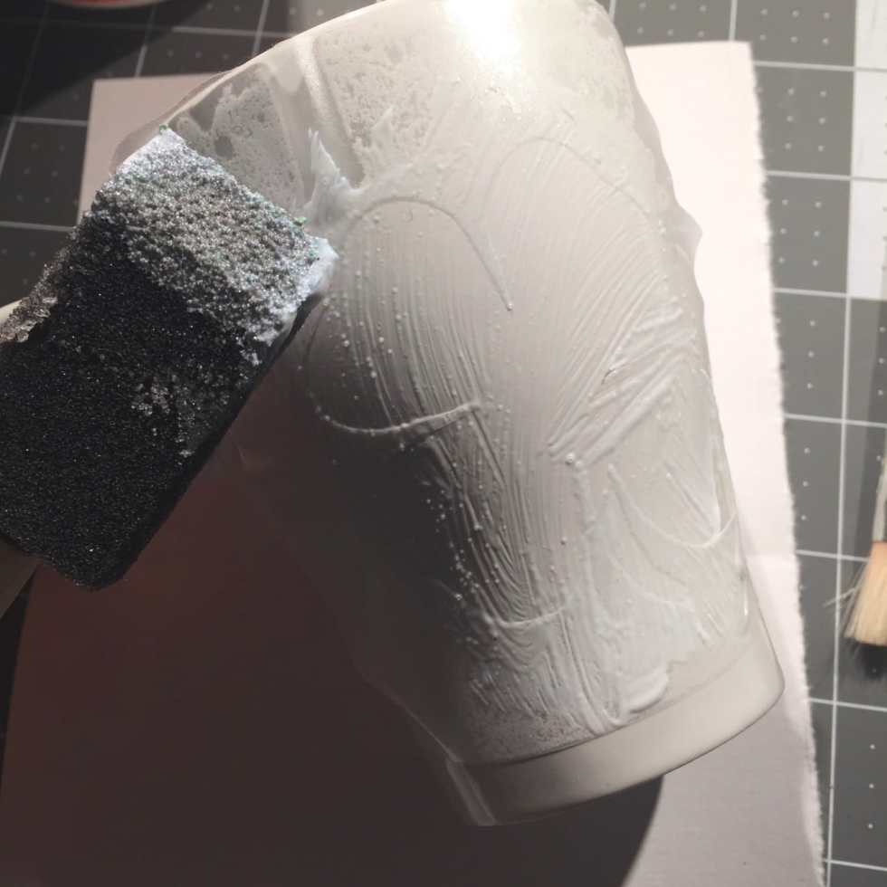
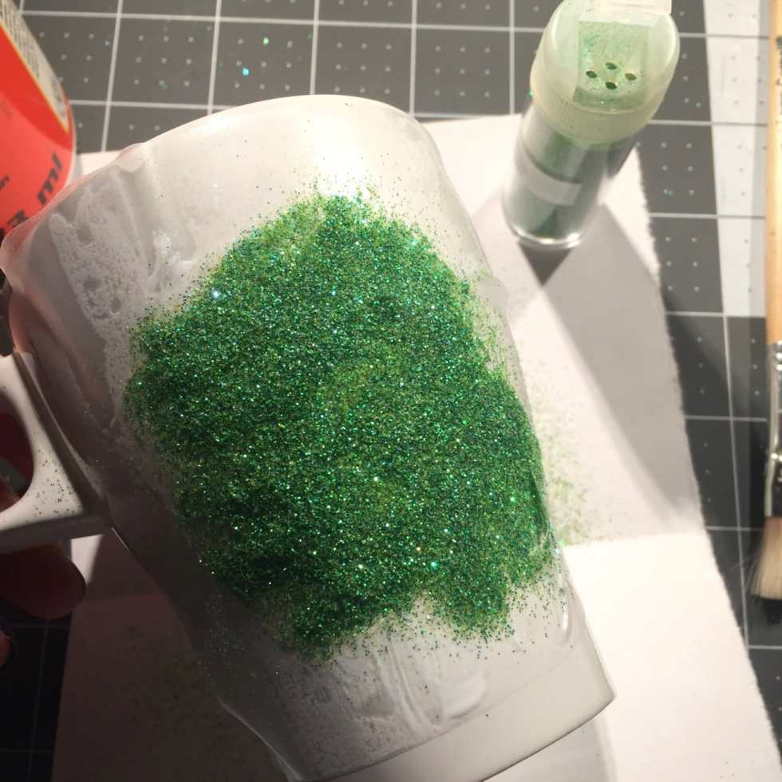
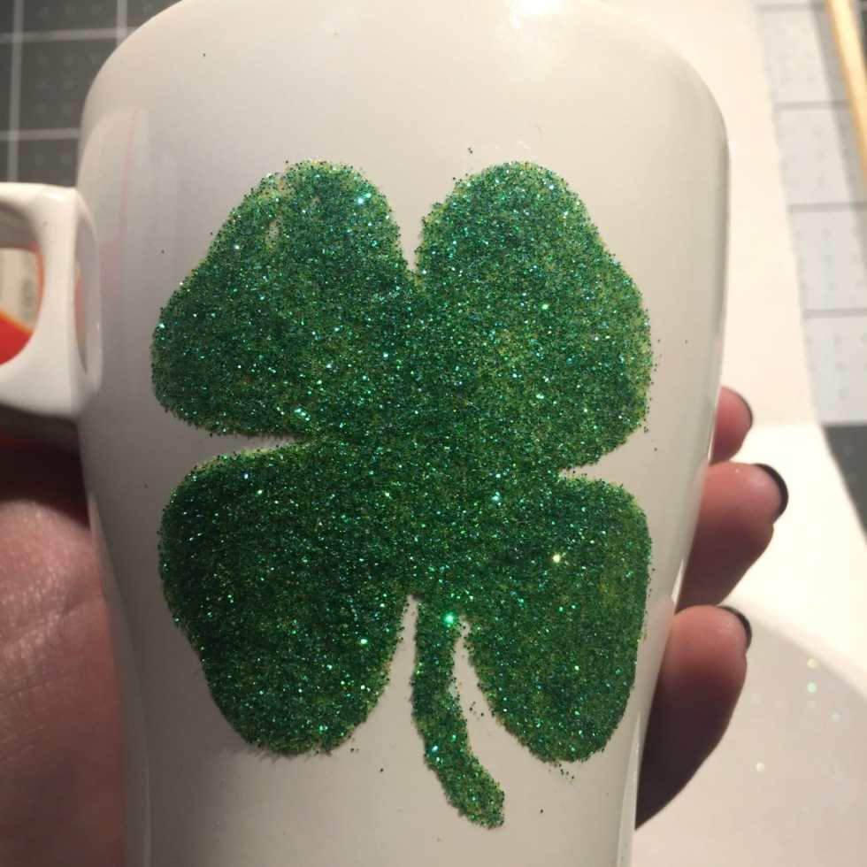
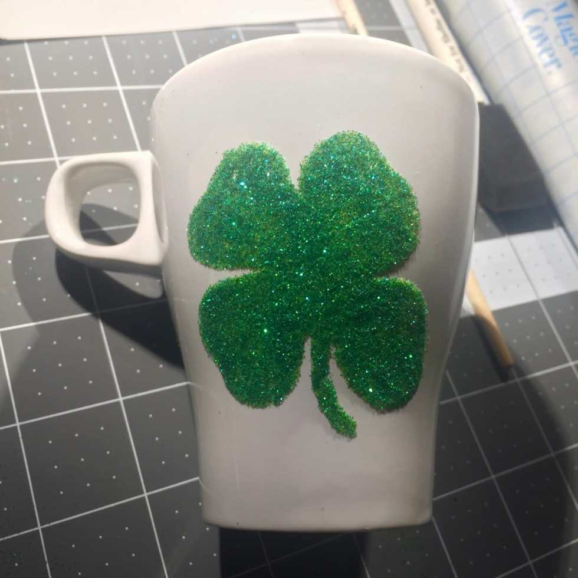
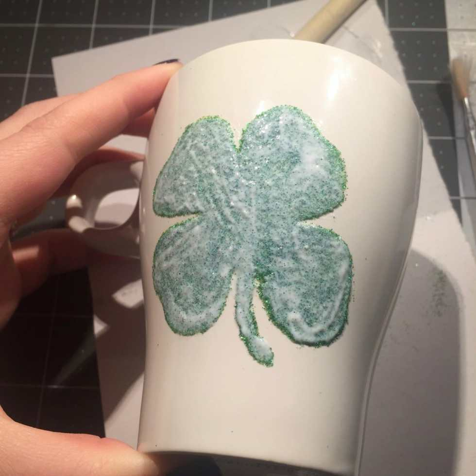
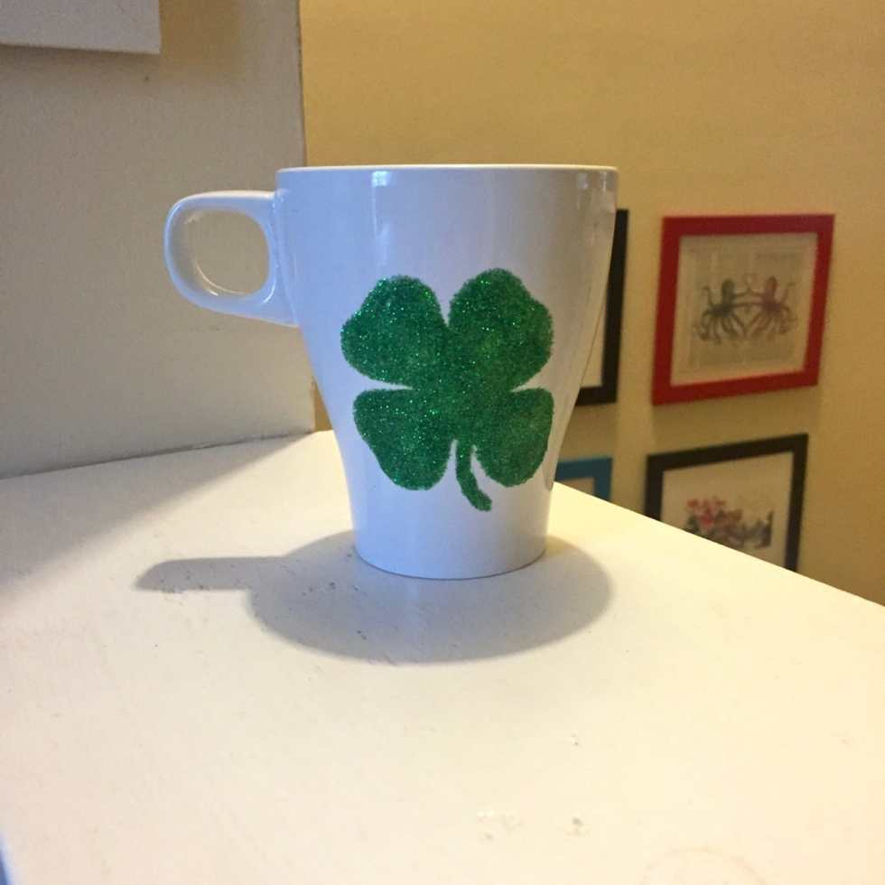

Glitter may be the “herpes” of the craft world, but I love it just the same! I’ve been glittering everything lately, and thought I would show you guys how to do it as well. You can do ANY shape you like, or even your initial if you prefer. I have several mugs with “K” already on them, so I decided I’d do something to celebrate today, St. Patrick’s Day: a 4 leaf clover! Let’s whip out the

**[stencil we made yesterday](/how-to-make-an-adhesive-stencil-two-ways/)**

and get to work!

Just because I made a shamrock for my mug, doesn’t make this a St. Paddy’s Day craft exclusively- as I said you can do anything your heart desires! You can even glitter just the bottom half of the mug instead of a shape if you like. Tips for that are at the bottom of the page.

## Materials:

- Adhesive stencil\*

- Glitter in your choice of color (I used

  **[Martha Stewart’s Iridescent Glitter](http://amzn.to/1T8BOch)**

  again!)

- Mod Podge, Gloss

- Ceramic mug

- Dry paint brush

- Foam brush

- Paper

\*

_Make your own adhesive stencil by hand_

or

_use your Silhouette Cameo machine to craft one_

!

**[Click here to learn how to make an adhesive stencil by hand or with your Cameo!](/how-to-make-an-adhesive-stencil-two-ways/)**

## Instructions:

- Pick where on your mug you would like the image to be. Take into account whether you are right- or left-handed. When you bring the mug up to your mouth, only one side of the mug shows (while the other is hidden). You want the design to be on the correct side so everyone around you can enjoy the cuteness too!

* _Slowly_

  and

  _gently_

  place your adhesive stencil down on your mug. You may need to pull it up and re-lay it a couple of times to get it perfect. That’s why contact paper stencils are so great! They aren’t going to permanently stick to your mug instantly thus they give you the flexibility to shift things if needed.

* Be sure all the inside parts of the stencil are totally flat and adhered to the mug.

* Fold your paper in half and create a crease, then unfold it and lay it on your table in front of you. You’ll be using this as your workspace.

- Use a thin coat of Mod Podge on your foam brush to completely cover the inside of the stencil- in my case, the shamrock. On places that are thinner cuts that may want to come up (like the inside slivers of the clover leaves), sweep the Mod Podge on from the outside towards the inside. If you go from the inside to the outside, your brush may pull up the stencil.

- Tap the glitter all over your Mod Podge’d area until it is completely covered. Be sure to do so over the paper so you don’t make a mess!

- Let the mug sit and dry for an hour.

- Use a dry paintbrush to gently brush off any excess glitter from the design. Be sure to go over the middle of the design as well, to get rid of loose glitter.

- Repeat the Mod Podge/Glitter steps a second time if there are spots showing through without glitter.

- Remove stencil and let mug dry for an hour.

- Use dry paintbrush to again brush off excess glitter. Use your fingernail to scrape off any parts that bother you and make it look pretty!

- Dab some Mod Podge on your foam brush and go over the image one last time, this time to seal the glitter in.

- Replace excess glitter back in it’s container using the folded piece of paper.

- Let mug dry for a day before you use it!

## Tips:

- If you just want to glitter the bottom half of your mug, you’ll do almost all the same steps. There are only a couple changes:

  - Instead of a using a contact paper stencil, you will just use electrical tape around the bottom of the mug to get a clean line. I balance a pencil on something the height I want the line and gently turn the mug, marking it all the way around. Then I tape right above that line all the way around to get it straight.

  - I also use a different sealant for those. I opt for Triple Thick rather than Mod Podge, as it gives it a glass-like feel so it’s not glittery/gritty feeling. You can do the same for today’s tutorial, but since your hands aren’t wrapped around the image you are doing it really isn’t necessary. Especially because I do 2 – 3 coats of Triple Thick (waiting 24 hours in between each) rather than just one layer of Mod Podge sealant like in this tutorial.

- Really want to try this tutorial but don’t want to ruin one of the pretty coffee mugs in your cabinet? I got this one for a dollar at Ikea! There are usually also really nice ones at your local Dollar store too! They do the job perfectly. The Dollar Tree is also where I buy my contact paper!

- Don’t forget to

  _wash your foam brush_

  in between layers! It starts to dry pretty quickly and once it does, there is no bringing it back to life.

- These mugs are

  **HAND WASH ONLY**

  !!!! Do not put in dishwasher, do not let soak in water. Simply hand wash the inside. The sealant on the outside will keep the glitter from falling all over the place, but if hot water is blasted on it or it’s soaked for a period of time, it will sadly come off. There IS a dishwasher safe version of Mod Podge that will hold up better, but it takes 28 days to cure before it can be used/washed. If you are that patient, that’s awesome! I am not. 😉

What will you glitter on your mug?
