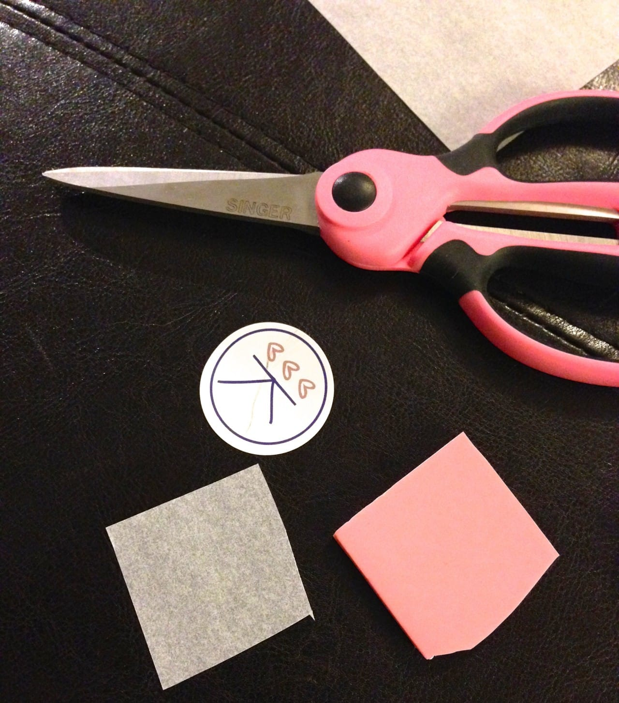
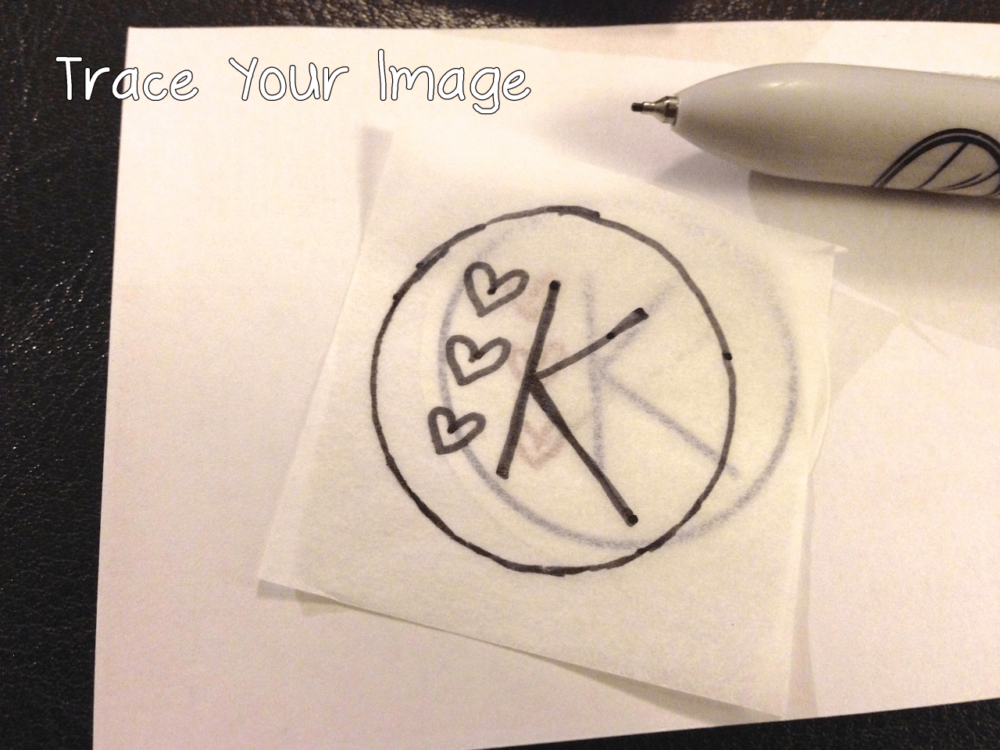
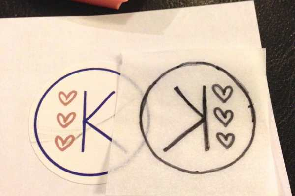
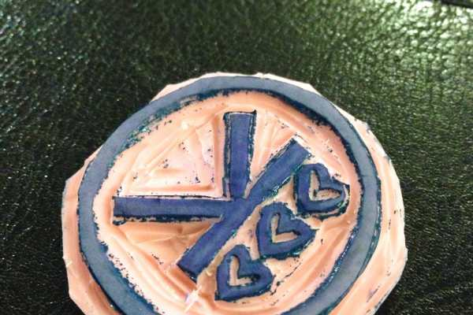

Project: DIY Handmade Stamps

I recently bought little kraft brown jewelry boxes to ship my rings and earrings on

[Etsy](http://katiecrafts.etsy.com "Katie Crafts on Etsy")

, but they are plain and I wanted to give them my personal touch. I have Katie Crafts logo stickers, and they are cute! But they are white. I really wanted to keep the handmade kraft brown look with a logo stamp instead. They can get expensive- so I decided (of course!) to just make it myself. It was SUCH a fun little project and I can’t wait to make more!

A couple of years ago, I took a printmaking class that focused on three techniques: lithography, etching (aquatint) and relief (linocut). The linocut printing technique is about removing ALL the negative space, and leaving your image raised so that it’s the only part that catches the ink- much like a stamp.

I bought a super cheap kit (it was under ten bucks!) that included a 4×6 sheet of rubber, wooden handle, 1 cutter tip, 1 gouge tip, tracing paper and instructions. I only used an eighth of the rubber sheet for this stamp, so I’ll certainly be making more stamps soon! The rest was following the instructions and taking my time to make it perfect. I’m quite happy with the results!

## Materials:

- [Speedball Stamp Making Kit](http://amzn.to/1jHoI2i "Speedball Stamp Making Kit")

  (or the above contents of such a kit)

- Ink pad, water-based

- Fine-tipped permanent marker

- Scissors

## Instructions:

- First, you’ll need to either draw, print or find the image you want to use. In my case, I took one of my logo stickers and stuck it to a piece of paper to use as my image. I sized how much tracing paper and rubber I’d be using for it, and cut it with scissors. If you are using the whole sheet of rubber for one large image, you can skip that part.

- Next, use the tracing paper to trace your image. Go over it a couple of times to make it nice and dark.

- Your image will be backwards on the rubber, but once inked will print correctly.

- When you’re happy with your image, it’s time to transfer it to the rubber block. Center and place the tracing paper ink-side down (backwards) on the rubber. Gently (but firmly) press and rub the image with your fingers to transfer the marker drawing.

- If you’d like to darken the image on the rubber so you can see it better, just use your marker again or a pen. I intentionally thickened my lines a little when I did this.

- Using your took and the smaller tip, start removing the negative space around the image! This means scraping out everything EXCEPT the circle, the “K” and the hearts. Even the inside of the hearts had to be scraped out.

- If you don’t remove enough of the rubber, ink will catch on the highest points that you left and transfer to your paper when you use the stamp. Test if you’ve done a good job by inking up your stamp on your ink pad, and giving it a shot.

You can see the spots around the circle where I didn’t quite take enough rubber off.

- Go back in with your tool and remove the extra pieces that need removing and any excess. Be careful not to get ink all over you! Test again to see if the stamp is how you want it.

Have fun stamping everything you can get your hands on!

Let me know in the comments if you try out this project, and what stamps you create!
