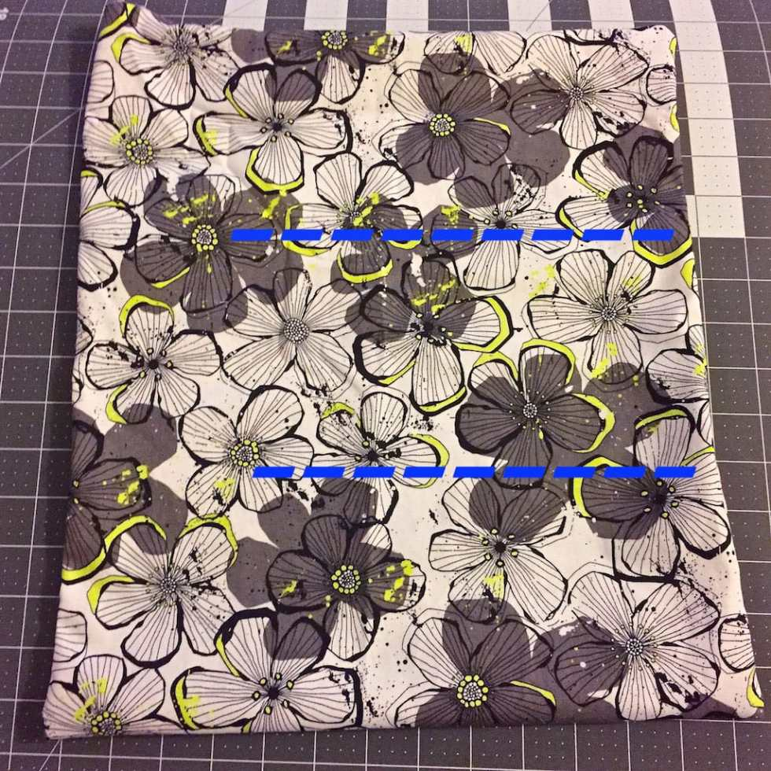
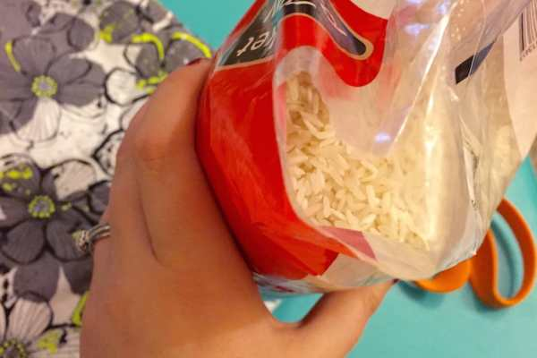
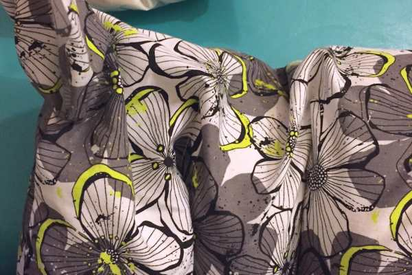
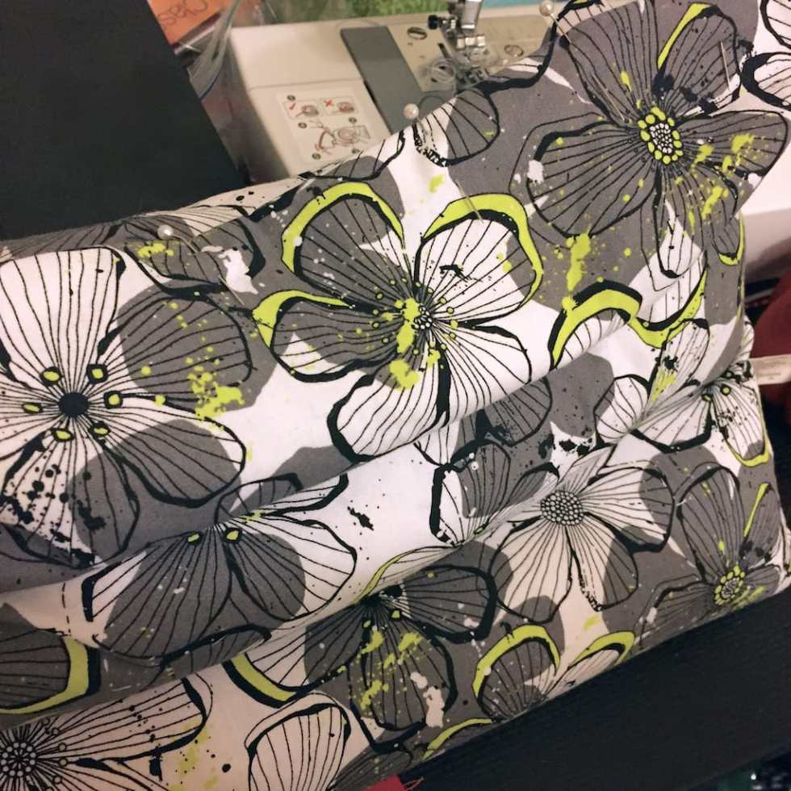
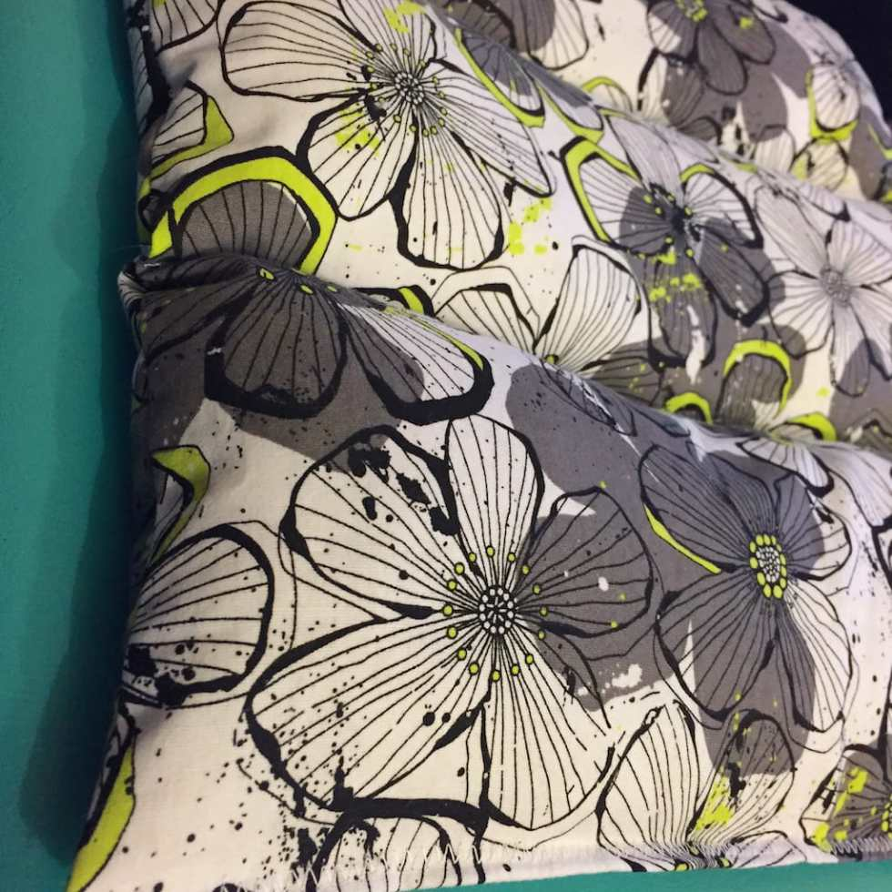
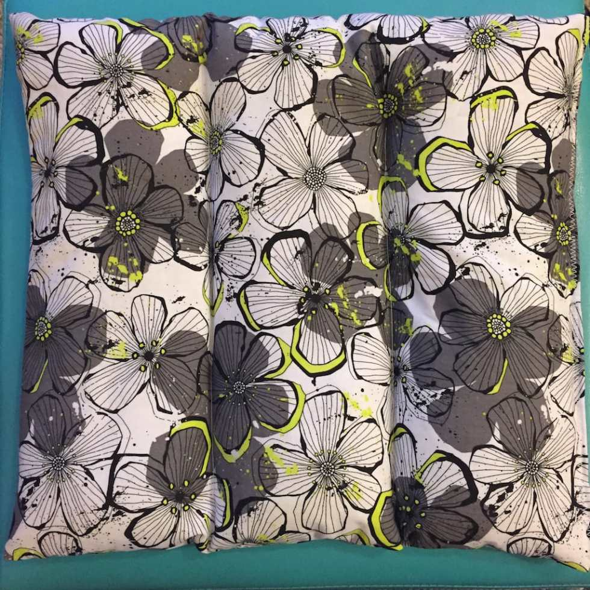

Project: DIY Heating Pad

I’ve mentioned before that April is National Stress Awareness Month. It’s the perfect time to make a

[Stress Relief Basket](/blog/stress-relief-basket/ "Stress Relief Basket")

for someone, whip up a batch of

[All Natural Lip Scrub](/blog/all-natural-lip-scrub-recipe/ "All Natural Lip Scrub Recipe")

or

[Honey and Lemon Face Mask](/blog/diy-honey-and-lemon-face-mask/ "DIY Honey and Lemon Face Mask")

. It would also be a great idea to make yourself a hot pack too! This project works up SUPER fast, is perfect for your aches and pains… and it smells awesome.

I made this heating pad to be a very large square, as I wanted it to be for the back. However, I’ve also made longer rectangle ones that are good for shoulders or stomachs as well. The amount of fabric you will need depends on your preference for where you’ll be using a hot pack the most. Instructions will be the same, and you’ll never use over a half yard, so that’s what I’ll list below! Please adjust the size of the heating pad to your liking!

## Materials:

- 1/2 yard of cotton fabric (see above)

- 1 to 2 bags of plain white rice (depending on what size you make, and how full you want it)

- Dried lavender (at least a Tablespoon- more if you want it to smell extra fresh!)

- Scissors

- Sewing machine, matching cotton thread, pins

> _Please note: Cotton fabric and thread are used for this tutorial as the heating pad will go in the microwave, and you don’t want anything melting or catching fire!_

## Instructions:

- Decide what size/shape you want your heating pad to be, and cut out two squares/rectangles accordingly (or one very long rectangle, folded in half). Be sure to make them a quarter or half inch bigger on all sides for the seam allowance.

- Place right sides of fabric together and pin all the way around.

* Sew (remembering to back-stitch at beginning and end) with a straight stitch all the way around, EXCEPT for a three inch gap on one corner. See below for example.

- Trim corners and excess fabric and turn project inside out through the gap.

- Fold your project like an accordion in to thirds, to see where your breaks should go. Then using chalk or a pencil, draw your lines about 3/4 of the way down. Sew along them with a straight stitch. Don’t forget to back-stitch!!

- Cut the corner of your rice bag and use it as a funnel (or use an actual funnel, should you have one!) to slowly pour the rice in to the heating pad. You’ll need to do this SLOWLY and CAREFULLY, or rice will end up all over. Gently shake the rice in to the pockets.

- Once one pocket is almost filled, add a little lavender. Then add more rice, and lavender. Repeat process til you are happy with how full the pack is.

- Fold in fabric from the open gap and pin. Make sure to push down any rice from around it so nothing is stuck in or above the pins.

- Use a zig zag stitch to sew all the way across, closing the gap and making the entire side uniform. Back stitch, again!

- Make sure all pins are removed, give your hot pack a little shake to make the rice even in each pocket, and enjoy!

- Microwave for 2-3 minutes for moist heat that your muscles will love!

## Tip:

- I add lavender because of it’s wonderful (and calming!) smell. If you HATE lavender, nix it! A plain old rice heating pad will still be great!

Do you enjoy your heating pad at home? Would you consider making your own now that you know how easy it is?
