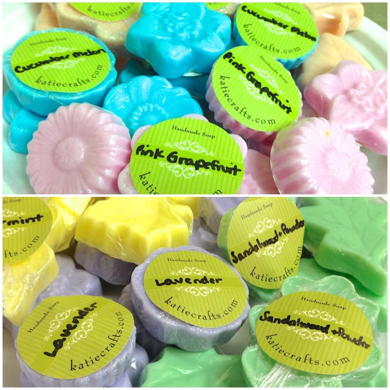
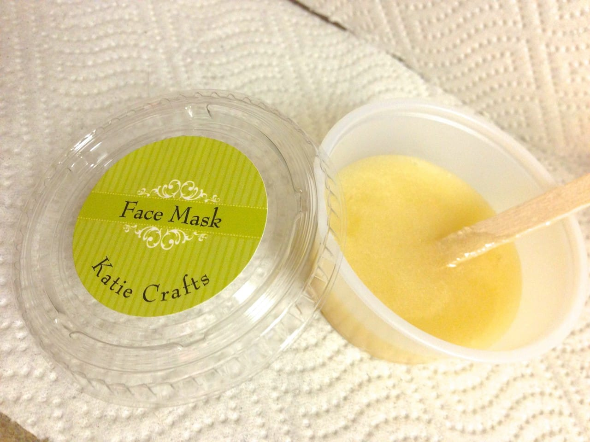
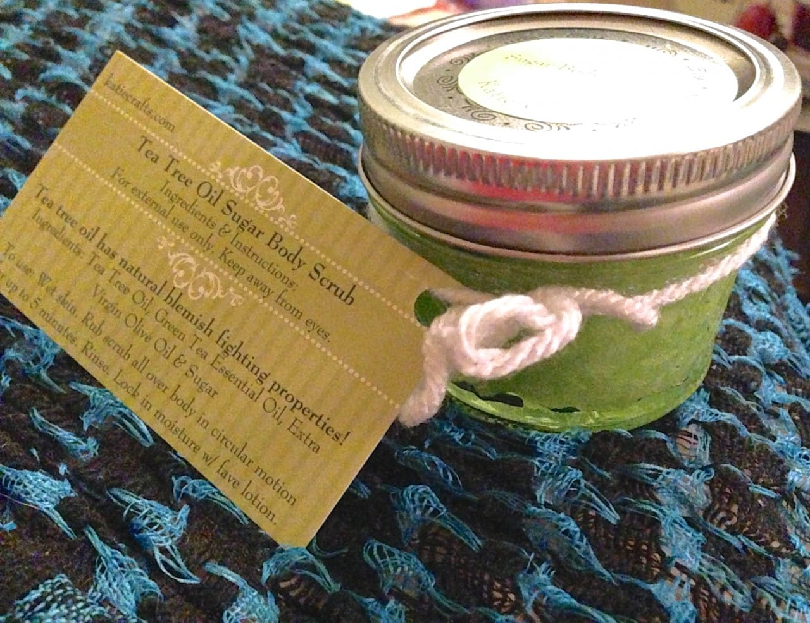

Project: DIY Honey and Lemon Face Mask

If you liked my post about making your own

[lip scrub](/all-natural-lip-scrub-recipe/ "All Natural Lip Scrub Recipe")

, you’re going to

_love_

today’s post! This face mask contains only three ingredients and is all natural. It’s great for your skin and will leave you feeling refreshed. It also makes a great homemade addition to an Easter basket!

For my own bridal shower, I insisted on making the favors myself. Not typical, I know. I just knew how much my bridal party was doing, and how much everything was costing, and I wanted to take off a little stress and money from their plates. I thought some soaps and scrubs would be a cute favor that everyone would both like and use!

I bought 4 oz.

[Ball quilted mason jars](http://amzn.to/1h3zAqa "Ball Quilted Mason Jars")

, made up cards saying what the favors were along with their ingredients and instructions on using them, and enlisted my sister to help me make two giant batches of scrubs- one was a tea tree oil sugar body scrub and the other was a honey & lemon face mask. I also made little mini flower and leaf molded soaps, but that’s a whole different post altogether. 🙂

## Ingredients (& Their Properties) For Every 1 ounce:

- 1 Tablespoon of White Granulated Sugar:

  _great for exfoliating_

- 1 teaspoon of Lemon Juice (freshly squeezed, if possible):

  _natural astringent_

- 1 teaspoon of Pure & Natural Honey:

  _antimicrobial, antibacterial & antiseptic properties_

_With these all natural ingredients, this mask (like the lip scrub) is totally edible!_

## Instructions For Recipe:

- Add all three ingredients in a bowl.

- Mix well with fork, breaking up any clumps of sugar.

- Store in airtight container in your refrigerator for up to 3 months. Mix before each use.

## Instructions On Use:

Stir pot of scrub. Using fingers,

_gently_

rub SMALL amount of mask in circular motion all over face, avoiding eyes. \*You don’t need a lot! You may use more, but you will get less uses out of the pot that way. Let dry at least five minutes, up to ten minutes. The longer the honey sits on your blemishes, the more it will work. Rinse with warm water. May use favorite lightweight face lotion afterwards to lock in moisture.

That’s all you need to do! If you are interested in trying some before buying all the ingredients to make yourself a larger batch, you can get some from my

[Etsy shop](https://www.etsy.com/listing/128543692/all-natural-face-mask-lemon-honey-facial?ref=shop_home_feat_3 "Katie Crafts on Etsy: Honey Lemon Face Mask")

!

Next time I’ll teach you how to make the tea tree oil sugar scrub! Or maybe not. Don’t want to give away ALL my secrets just yet. 😉

