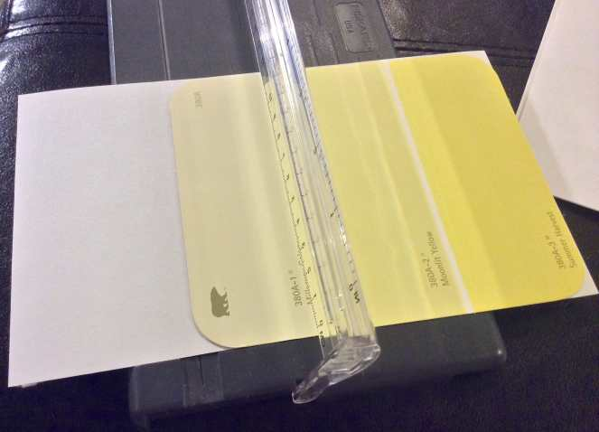
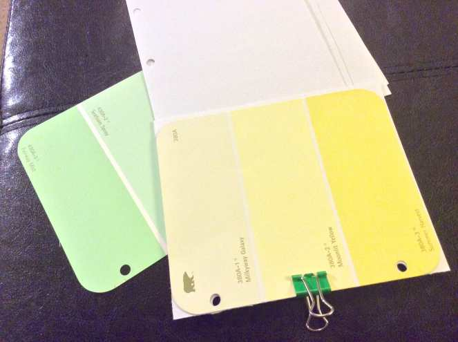
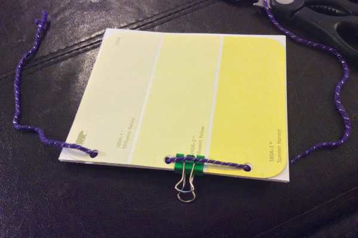
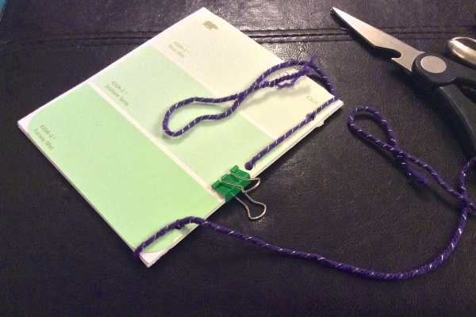
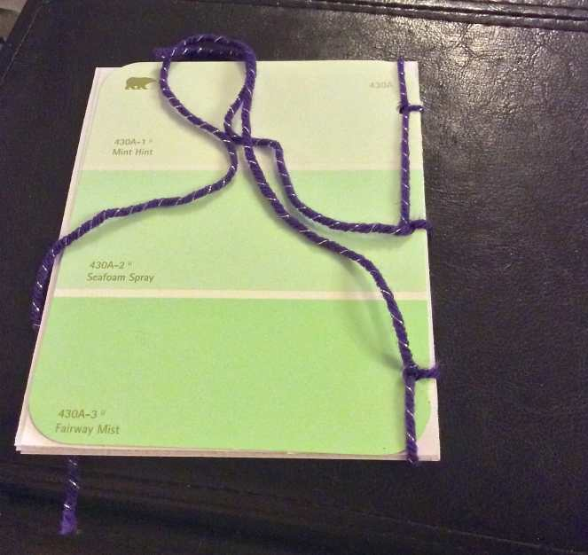
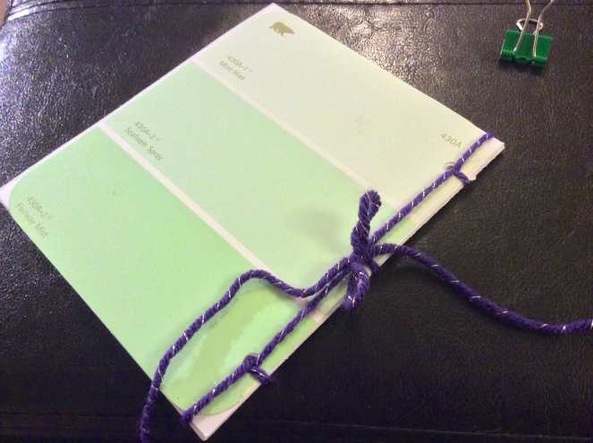
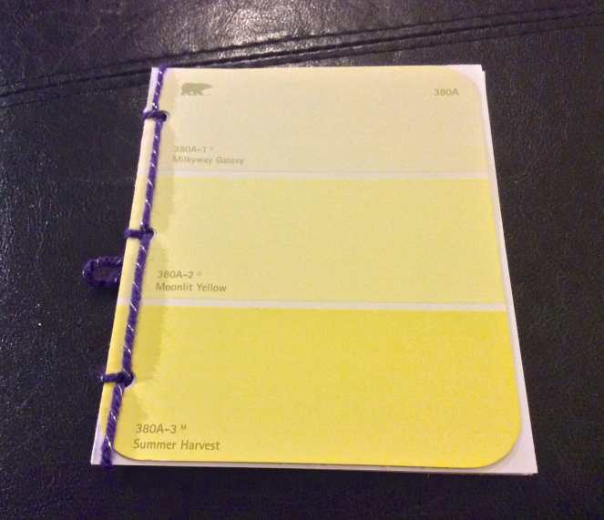
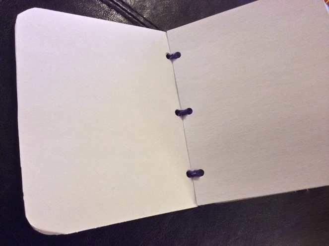
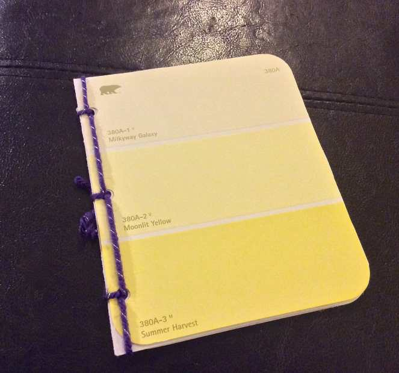

Project: DIY Mini Sketch Book (or Notebook!)

A few weeks back, I found myself in one of my greatest inspiration stores. Nope, not the fabric store, or the craft store, or even the art store- Home Depot! Seriously, I love it there. We were visiting my Dad for the weekend and painting my childhood bedroom a sunny shade of pale golden yellow. While browsing the paint aisles, I decided to grab a few different paint chip swatches, knowing when I had the time I would be able to find a fun little project to use them for. Well, now is the time!

This project is super easy, great for kids and teachers, and uses very few materials. The list may look long, but it’s really not a lot of stuff! I used white cardstock so that I could use this as a mini purse sized sketch pad, but you can use lined paper to make it a notebook, graph paper or even (and this option is very fun for young kids!) wax paper to make it a sticker book! You can use anything you like as the “covers” but I stuck to the paint chip swatches because they were both colorful and free! To make exactly the type of mini book I made, you will need the following materials.

## Materials:

- Paint Chip Swatches – at least two for a front and back cover

- Hole Puncher

- Cardstock Paper – each sheet will give you two pages, so keep that in mind when you pick your amount. I used 4 sheets/8 pages total for this mini book.

- Scissors

- Yarn or String

- Binder Clip

- Paper Cutter (optional, but extremely helpful!)

## Instructions:

- Line up paint chip swatch corners with the corners of your paper.

* Cut the paper to be the same size as your paint swatches. I did two sheets of paper at a time to get through it quicker, though if I’d been using my better paper cutter (which is sadly already

  [packed for the move](/blog/10-tips-tricks-for-moving/ "10 Tips & Tricks For Moving")

  !) it would have been able to handle more sheets at a time. You can use scissors for this part too- just make sure to mark your lines with a pencil first!

- Choose where you want the holes to go on your front and back ‘covers’ and with their wrong sides/insides facing each other, punch the holes through them. Then use your binder clip to hold together a few pieces of paper at a time with the cover, line up where the holes need to go, and punch them as well until all sheets have holes.

- Line everything up, place the pages and front and back cover together and clip them all. Start weaving your yarn in and out of the holes like you are stitching it up to bind it. Each hold should have the yarn going through it three times.

- After you’ve pushed and pulled through the yarn three times in each hole, you should end up with the tails of the yarn both loose on the back of the book like below.

- Make a tight little bow to keep the book together and snip off the extra yarn.

- You can end at this step, or you can use your scissors to cut off any excess paper that may not fit perfectly in the book. I chopped off the corners to make my book have rounded edges like the paint chip swatches do.

- That’s it! Super easy project for any teacher to do with their students this coming school year, or great for any crafty person who wants a cute handmade sketch book in their bag!

Enjoy your new little sketch book / notebook / school project / DIY / handmade adorable mini book! What will you use yours for? Have a great weekend!
