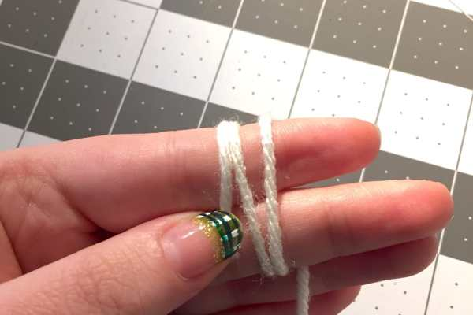
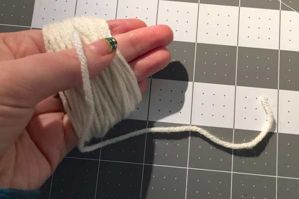
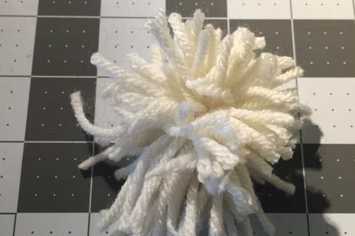
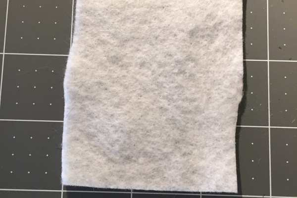
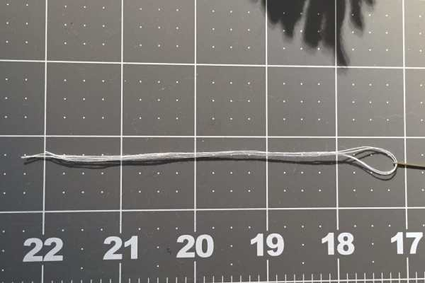
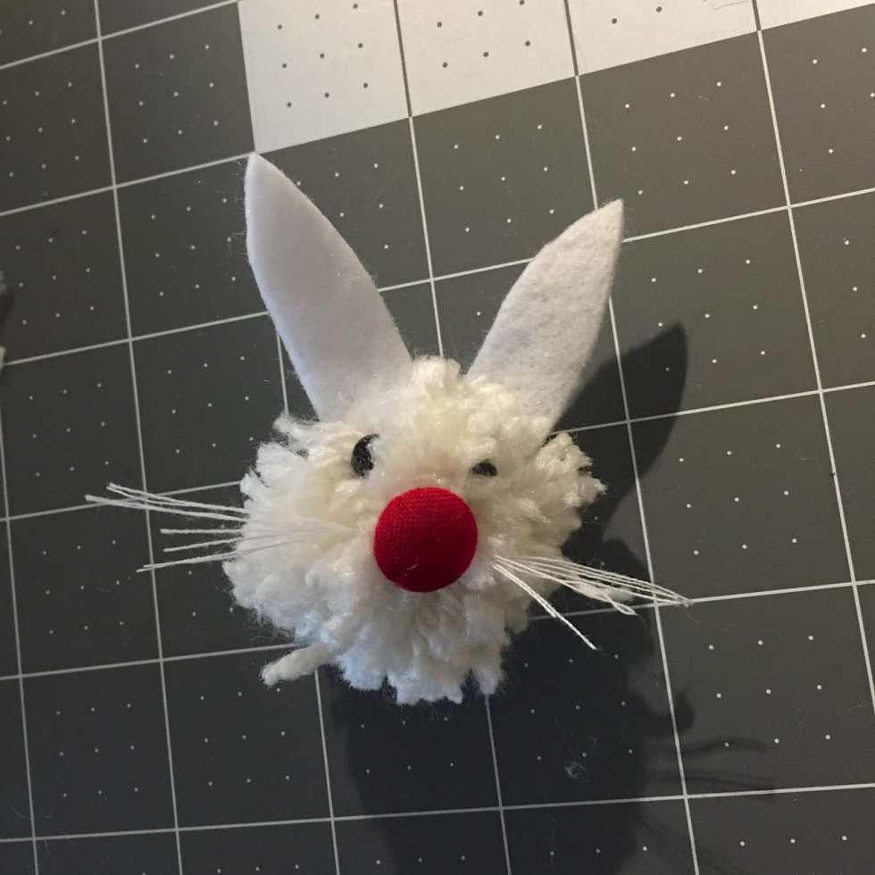
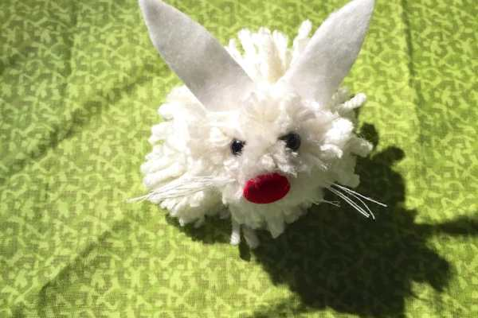

Project: DIY Pom Pom Easter Bunny

Easter kind of snuck up on me this year! It’s just over a week away and I haven’t really posted anything for it yet. Whoops! I knew I had to get at least one Easter themed DIY on the blog, and I knew it had to be something QUICK and EASY. This little Pom Pom Bun is the perfect solution!

> _Please Note: While totally adorable, this bun is best served as a decoration and NOT a children’s toy. The tiny eyes, whiskers and other bun parts can be pulled off by little hands, and you don’t want anyone to choke on anything!_

If you have a pom pom maker, you may absolutely use that instead of your hands to make a much prettier pom pom. For a 5 minute bunny, I thought my hands were a fine tool. 🙂

## Materials:

- White or ivory yarn

- White or ivory felt

- White or ivory thread

- Needle

- Black beads for eyes

- Covered button nose (red or pink)

- Scissors

## Instructions:

- First, make the small pom pom by wrapping yarn around two fingers until you think it’s a sufficient amount for a bunny head.

- Then slowly slide the yarn off your fingers, keeping it “looped.” Use the loose end to tie the yarn together at the middle.

- Once secured, use your scissors to cut through one whole looped side, then the other.

- Use fingers to fluff out pom pom and snip pieces that are longer to make it uniform.

Not yet snipped to perfection!

- Make your larger pom pom by wrapping yarn around four fingers, following the instructions above until you have a bunny body.

- Make sure you like the way both pom poms look!

* Fold over a small square of felt and cut out a bunny ear. This will give you two ears.

- Use your needle and thread to sew the button nose to your small pom pom.

- Next, sew on the eyes, and lastly the ears.

- Double up your thread and cut ten inches of it. Thread it through your needle, but don’t knot it, so that there are now five inches/four strands.

- These are your whiskers. Sew them right through the nose once, and back once. This will give you about an inch of whiskers on each side.

- Use your scissors to snip the loop and your fingers to separate them.

- Now it’s time to attach the head and body! Just use your needle, thread and novice sewing skills to sew the two together.

Enjoy your cute little pom pom Easter Bunny decoration! Isn’t he adorable!?

What fun DIYs do you plan on doing this Easter? Share them in the comments!
