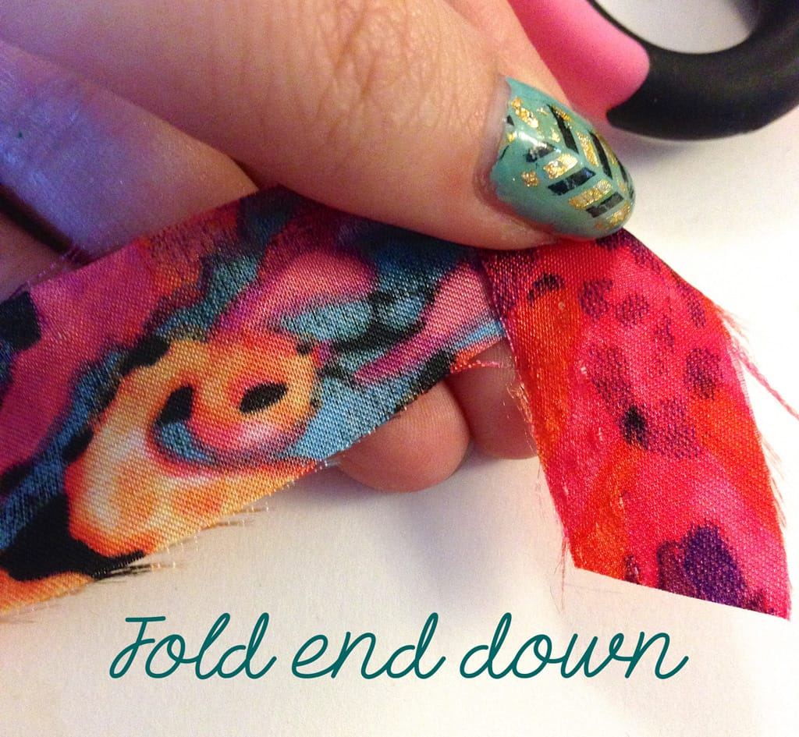
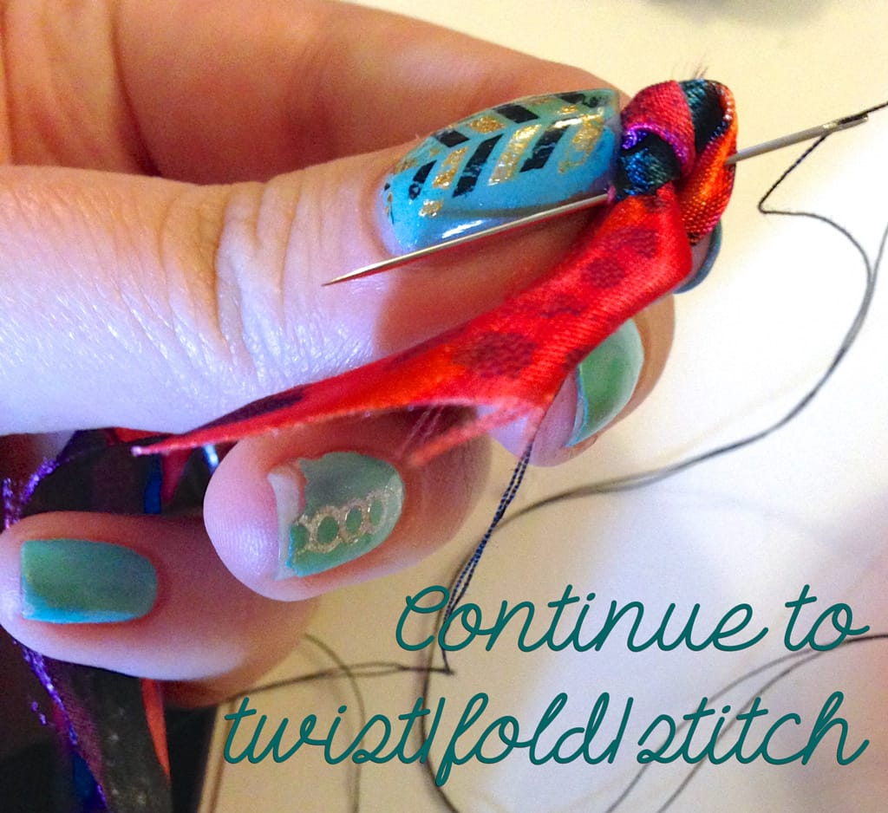
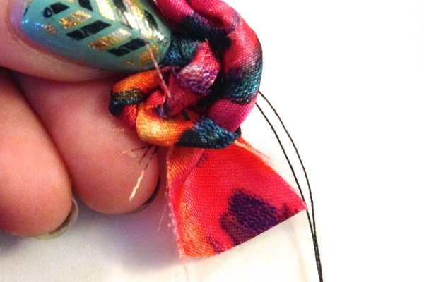
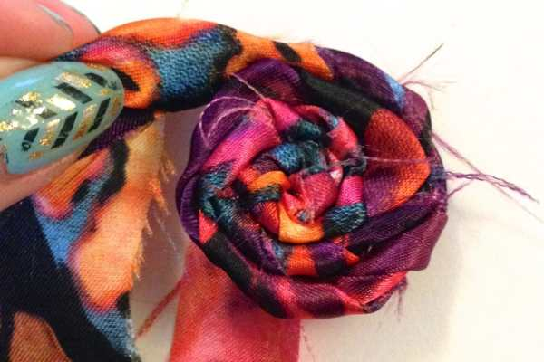
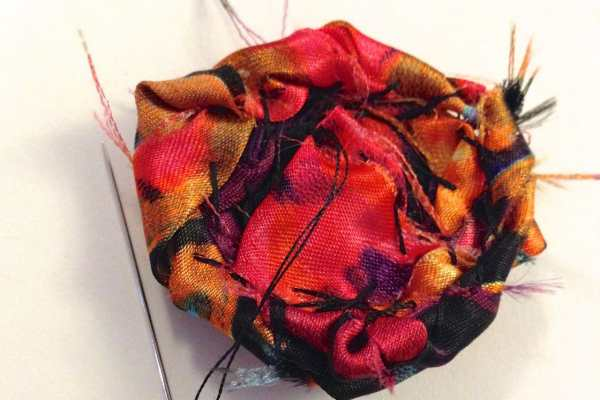
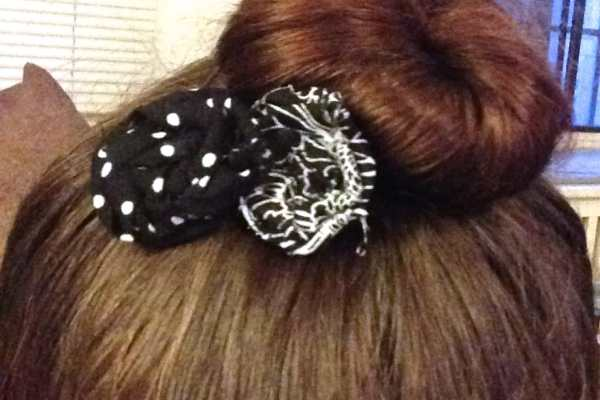

Project: DIY Shabby Chic Rosettes

I really like making these little fabric rosettes because they are simple, don’t require my sewing machine, and are great to use in a number of projects!

_(Bonus: they are this month’s fabric scrap basket project!)_

Today, I’m going to show you how to make the flowers themselves, and give you one idea for using them. Next week, I’ll show you another project I used them in that turned out great!

## Materials:

- Scraps of fabric in various sizes and lengths- as long as they are in strip form!

- Needle, matching thread

- Scissors

- Alligator Clip, glue (optional, if making a hair clip)

## Instructions:

I love projects that use up scraps of leftover fabric! The more worn and frayed the edges are, the better! For the shabby chic flower look, anyway. You can certainly use non-fraying material for a more polished look. I just happen to like them looking mega handmade!

> _Please ignore my horrible chipping nail polish!!_

- First step is to fold one end down about an inch. This is what you’ll hold on to as you wrap your fabric around. We’ll call it a “handle.”

- Put a quick stitch through that fold to keep it in place if you like.

- Next, you’re going to take your super long tail and fold it up and away from your little “handle,” so they are pointing in opposite directions. Repeat this folding/flipping/twisting motion.

- Twist the fabric around the “handle” to make what looks like a little knot, and stitch as you go to keep each new twist in place.

- Keep turning the fabric, twisting it the way you want it to be shown, and stitching it in place. Doing this all the way around in a circle will create your rosette.

See it taking shape below?

- When you get to the end of your strip, you have two options. You can leave the last bit of fabric (i.e. the “handle”) sticking out to mimic a leaf, or you can stitch it under the back to keep it hiding and flat. Play around with both ways to see which you like best.

- If you decide to stitch the back, simply flip the rosette over, fold the extra fabric over the back as flat as you can, and give it a few stitches to hold it in place. This is especially nice when you need a flat back for gluing.

That’s it! Just a few minutes later you have a really adorable shabby chic rosette, ready to use for your crafts! How cute is that!?

Here are a couple examples of different colors, fabrics, patterns, and with vs. without the extra “leaf” fabric.

Now that you have some rosettes, you are ready for a crazy quick project to use these flowers on! In addition to apparel, children’s crafts and scrapbooking, these little rosettes are really adorable when made in to hair clips!

- Simply take an alligator clip (I prefer these for their nice flat surface which is easy for gluing, but you can use something else if you like!) and arrange the flowers however you like them to look.

- Glue down in place. Let dry. Done!

## Tips:

- I’ll often sew a cute button bead, crystal or pearl to the center of the rosette to give it an extra little pop!

- I also will glue some colorful feathers underneath the rosettes peaking out to make for a really fun hair piece!

- If you absolutely don’t want to do any sewing at all (not even the very minimal hand stitching you do here), you can use a hot glue gun to keep the flower together as you turn! It just is a little bit trickier, and a bunch messier. 😉 Don’t burn yourself!

- Different fabrics yield different results! Have fun figuring out which you like best!

Hope you liked this easy DIY! If you give them a try, show me your results in the comments!
