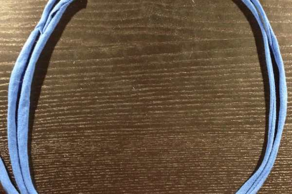
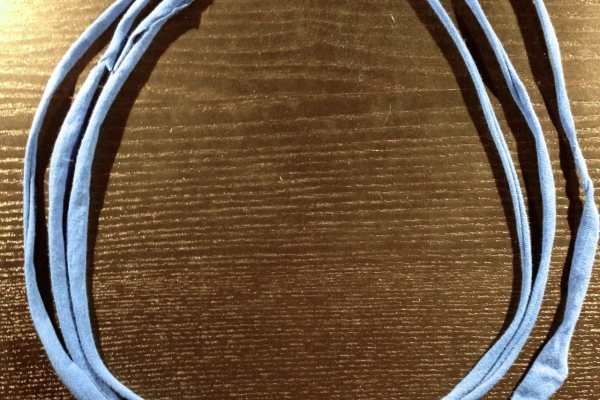
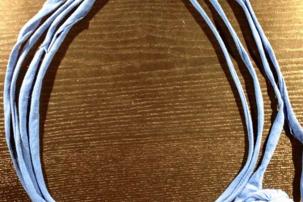
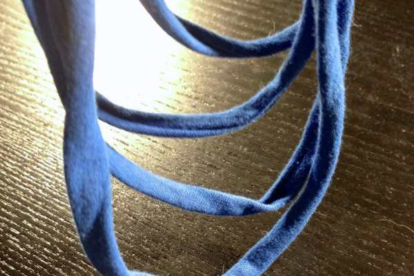
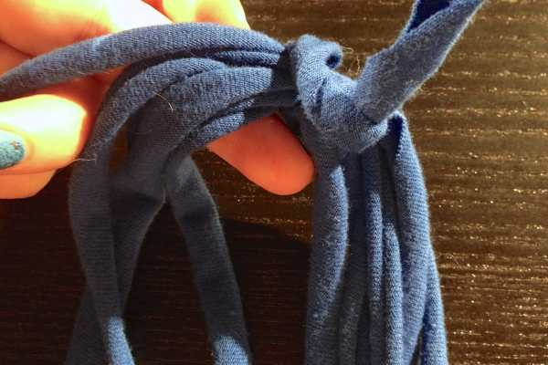
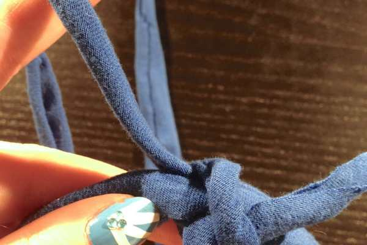
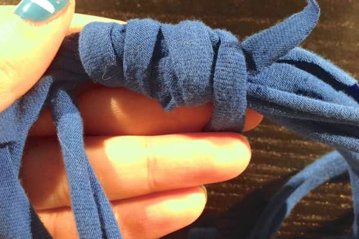
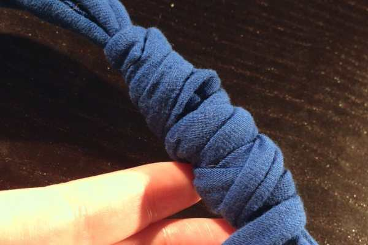
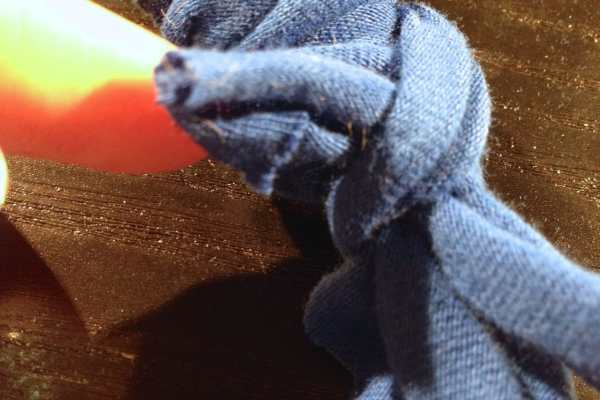

Project: DIY Yarn Necklace Tutorial

Yet another tutorial using t-shirt yarn (woo hoo for upcycling!), this necklace tutorial is incredibly simple to make, and will take you under 10 minutes from getting started to ready-to-wear! Big plus, you can make one to match every outfit you own, so your neck will never be empty or lonely!

I already made a rust orange one, and this blue one. I also used the same concept, only making all loops the same length instead of differing so that I could make matching bracelets. I’m searching our drawers for more t-shirts I can sacrifice in the name of crafting, as well! Hope you like making these as much as I do!

## Materials:

- T-shirt yarn

- Scissors

## Instructions:

- Loop the yarn around your neck once to see approximately how long you’d like the shortest loop.

- Next, mimic that loop with your yarn on a flat surface.

- Go around a second time, making the next loop slightly larger.

- Repeat for a third loop.

- Repeat for a fourth loop, leaving a long tail. Snip yarn.

- Pinch all layers together and hold up in the air to make sure all the loops hang just the way you want them to.

- Lay back on the flat surface.

- With the short tail, making a small knot around all the layers to keep loops together.

- With the long tail, tightly wrap around the knot so it isn’t visible, until you run out of yarn.

- When you come to the end of the tail, weave it under the wrapped portion to hold it in place.

- Voilá

  ! You have a cute summer necklace that’s ready to wear!

Every shot I took (and I took over a dozen!) looked like a cheap cleavage shot, so I inevitably nixed them all! Hopefully you still get the feel for what it looks like above! Happy crafting!
