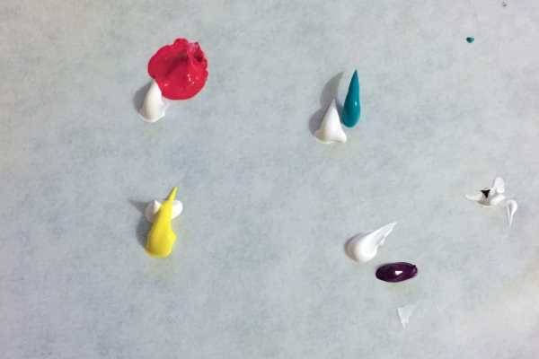
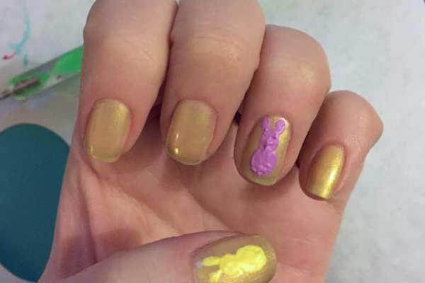
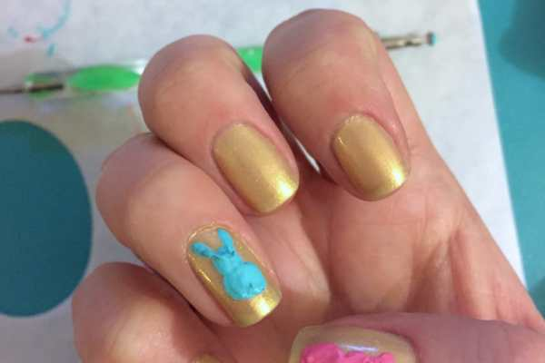

Last year, I had a very cute

[**nail art design for Easter**](/nail-art-easter-design/ "Nail Art: Easter Design 2014")

that was reminiscent of a little basket with flowers and decorated eggs. This year, I went for a different Easter staple:

[Peeps](/chocolate-covered-easter-peeps/ "Chocolate Covered Easter Peeps")

!

Besides my grandmother, no one in my family really likes Peeps all that much, but I still always put them in our Easter baskets. They are just so cute! I obviously had to use them in my holiday design.

I wasn’t planning on getting a manicure this week, but Husband and I had an hour to kill before a tour yesterday with nothing to do, so I decided to get a fun spring-y color on my nails as the base for a nail art I could do later. Plus, my cuticles were so dry and gross- they really needed the love.

I picked

[**OPI’s “Sit Under The Apple Tree” green**](http://amzn.to/1GFtCIY "OPI ")

, which came out lighter than I thought it would, but is still really fun. Plus it’s shimmery, which I love. You can use whatever color or brand of polish you like for this, though!

## Materials:

- Nail polish of your choice for base coat

- Acrylic paint in: white, black, teal, purple, pink and yellow

- Large and small dotting tools

- Clear top coat

## Instructions:

- With clean dry nails, do one to two coats of your preferred base coat shade and let dry.

- Put a dab of each color on your palette.

- Put a dab of white beside each color.

- Mix the white in to each to make it lighter and give it more “pop” on your nails!

- Use your largest dotting tool dipped in the first color to make a bunny body and adjoining body head on your ring finger.

- Next, use the opposite side/smaller dotting tool in the same color to make two bunny ears.

- Repeat using the other colors on your other ring finger and both thumbs. Let dry. Don’t worry about the paint looking stippled- your clear coat will smooth it out.

* Use your smallest dotting tool dipped in black paint to make little eyes and noses on the bunnies. Let dry.

- Seal in your PEEPS! look with a clear top coat and let dry. Done!

SO CUTE!!! I love this design so much and can’t wait to show it to the kids on Easter. How will you be decorating your nails for the holiday? Peep peep!

