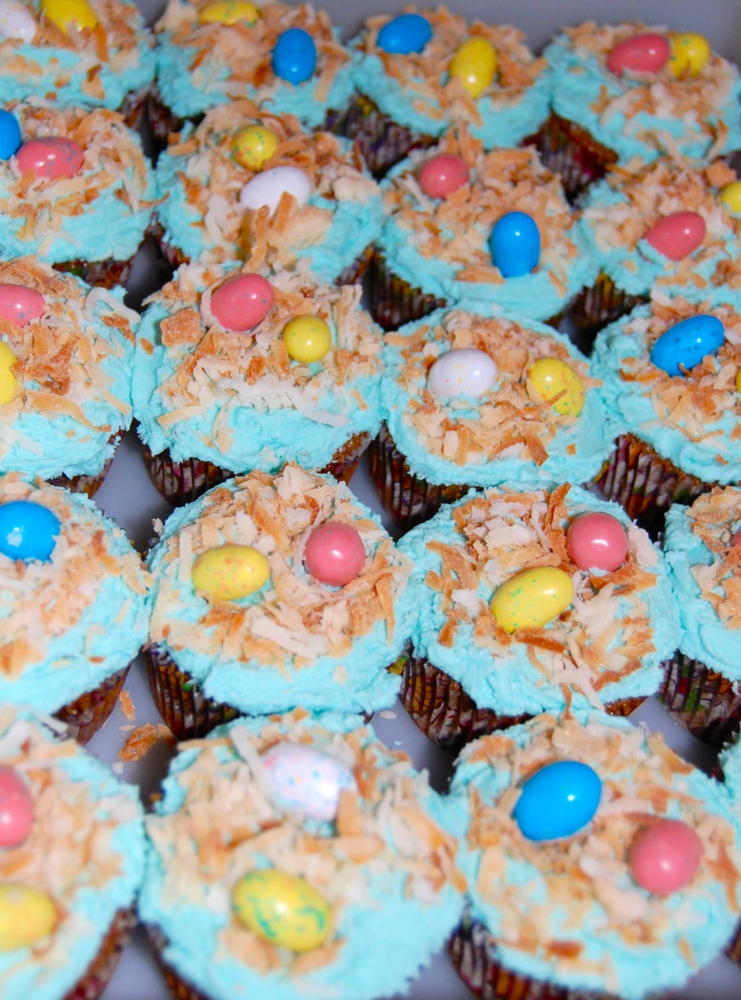
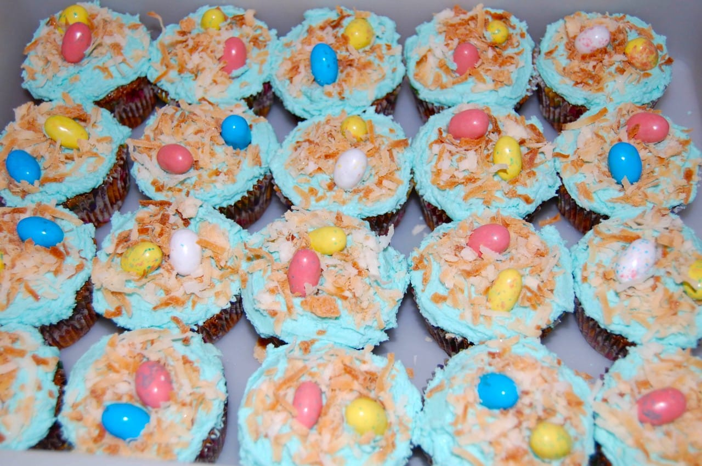

Easter Recipe: Bird’s Nest Cupcakes (+ cream cheese frosting recipe!)

I really enjoyed sharing the idea last week for

[chocolate dipped Peeps](/blog/chocolate-covered-easter-peeps/ "Chocolate Covered Easter Peeps")

, and wanted to keep the Easter recipes rolling! This is one I’ve been making for years and is a favorite of kids and adults alike! The cake recipe itself doesn’t matter (I do my aunt’s top secret carrot cake recipe, but you can do whatever you like!) but the cream cheese frosting and toppings are what make these little nests special!

As I said, the cake can be whatever you want it to be. That said, I’m not including a recipe or ingredients list for cake. I’ll continue on as if you have already baked (and cooled!) plain cupcakes ready to frost and decorate! First, I’ll share how to make my

_a-m-a-z-i-n-g_

cream cheese frosting, and then on to the nest itself!

## Frosting Ingredients:

- 1 stick (1/2 cup) of

  **softened**

  butter

- 1 package (8 oz.) of

  **softened**

  cream cheese

- Up to 1 box (16 oz.) confectioner’s sugar

- 2 tsp vanilla extract

- Blue (or green) food dye

## Frosting Instructions:

- Beat butter and cream cheese together in your stand mixer or with a hand mixer until it’s nice and smooth.

- Add confectioner’s sugar

  **ONE CUP**

  at a time and mix. You can use up to the entire box for this recipe, depending on how sweet you want it AND on the texture/thickness you want it. Always add just a bit at a time, mix, and test. Stop when YOU think it’s good. No need to add all the sugar just because you can!

- Mix in vanilla.

- Dye your icing blue to resemble the sky, or green for grass, or whatever you like! Just a couple drops at a time, mix, and see what color it turns. Keep going til you’re happy with the shade!

- Refrigerate until ready to use.

Now that you have your cooled cupcakes baked and your cream cheese frosting dyed, it’s time to frost and decorate! Here are what you’ll need for the decoration portion!

## Bird’s Nest Ingredients:

- Shredded coconut

- Candy or chocolate speckled eggs

## Bird’s Nest Instructions:

- Place a sheet of wax or parchment paper on a cookie sheet and bake your shredded coconut on 350 JUST until you see it STARTING to turn a LITTLE golden. You don’t want burnt coconut, so watch it like a hawk! Let it cool after you take it out of the oven.

- While waiting for coconut to cool, frost all your cupcakes for the next step!

- Place toasted coconut in a small heap in middle of frosted cupcake. Arrange it to look like a little nest!

- Pick out two or three of your favorite chocolate eggs, robins eggs, speckled bubble gum or even large jelly beans! Stick in the middle of the coconut ‘nest’ to make them look like little eggs.

- Step back and enjoy your hard work!

- Take a photo and share it with me!

## Tips:

- You’re going to end up with extra frosting. It’s inevitable. If you don’t want to make even MORE cake, try a teeny dollop with some blueberries and strawberries. It’s delicious!

- You can make the cupcakes even more professional looking by using a frosting tip instead of just smearing it on top. Much of it \*will\* get covered with the coconut, but the outside edges are still visible- make them prettier if you want!

- Get your shredded coconut toasted even quicker by using your toaster oven!

