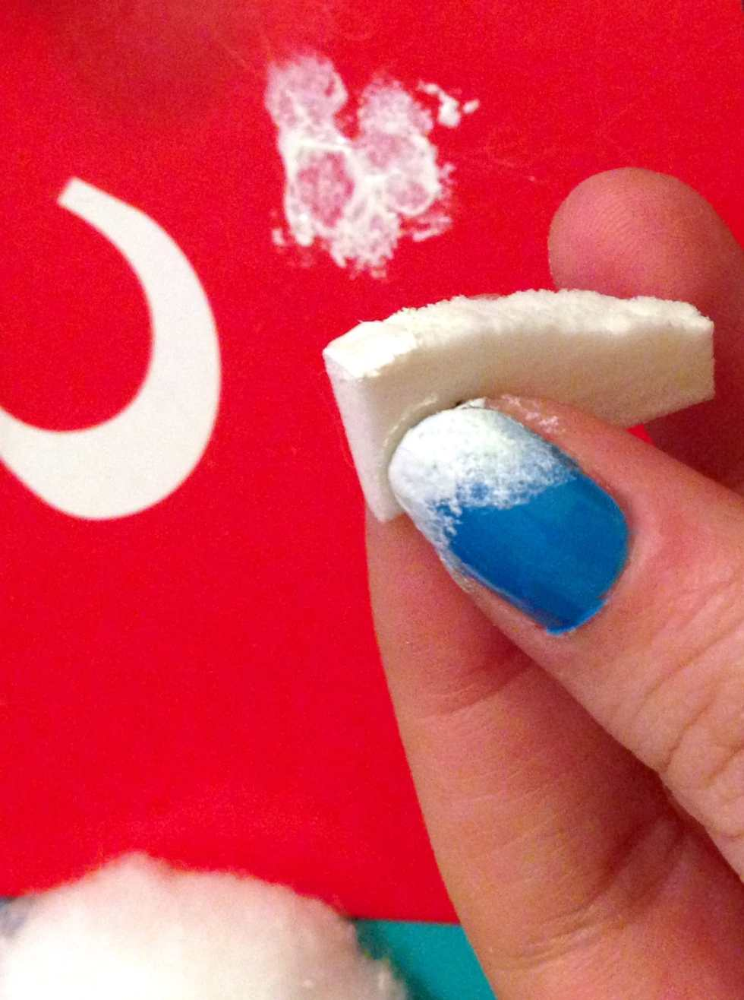
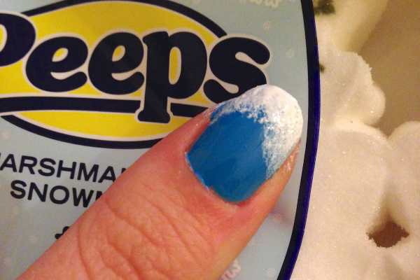
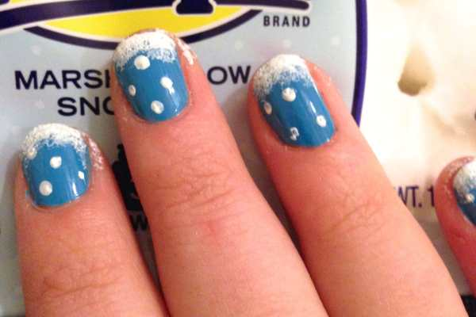
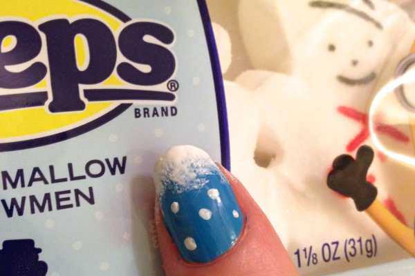
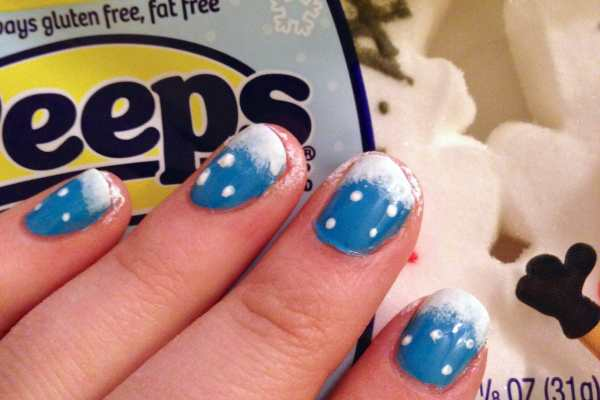
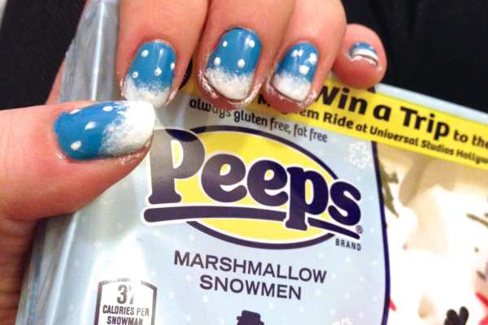
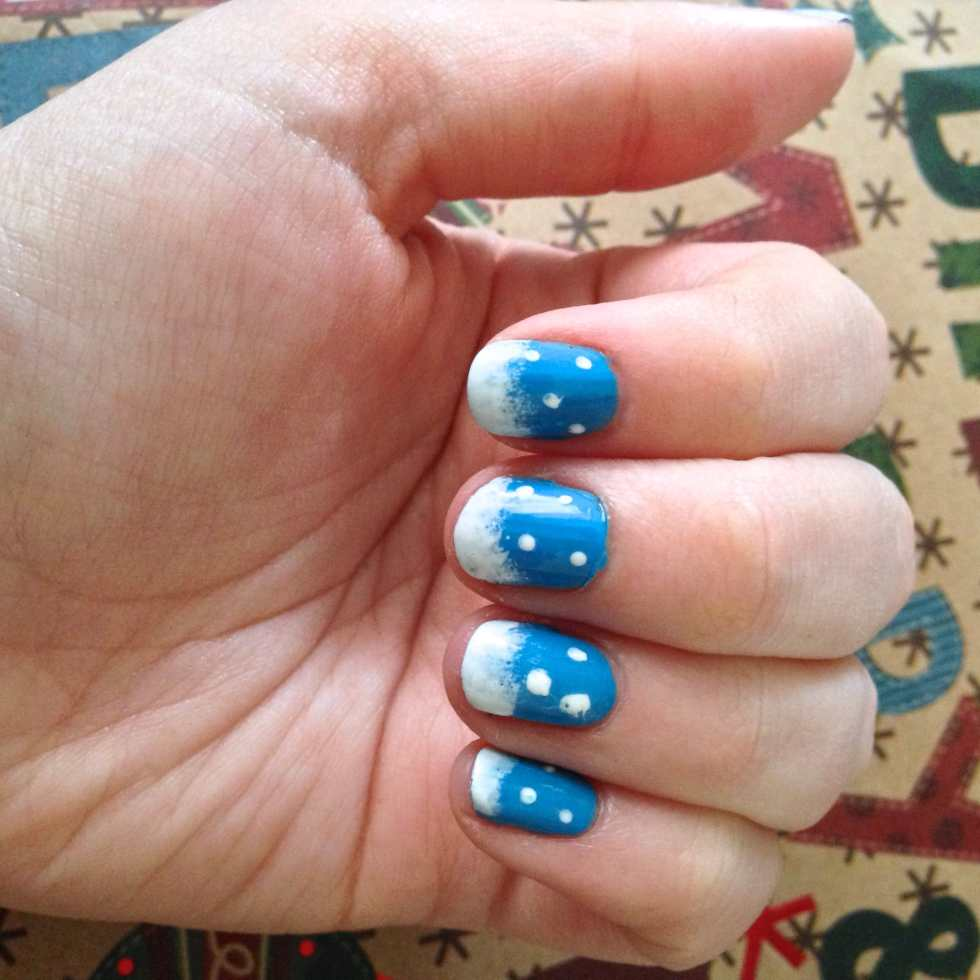
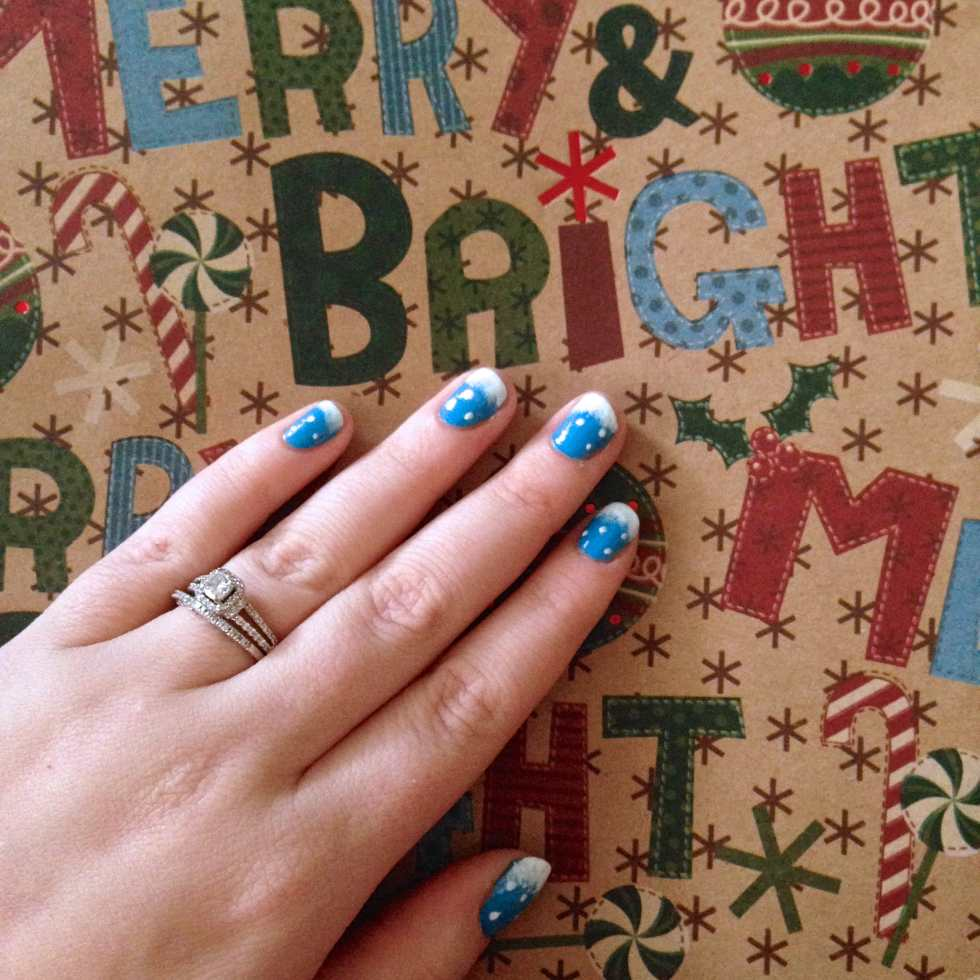

_♫ On the eighth day of Christmas, Katie Crafts gave to me- a Manicure Monday design that’s wintery! ♫_

Wow, a full week of our

**12 Days of Christmas**

has already gone by! So far we’ve enjoyed a

**[recipe](/blog/fourth-day-of-christmas-key-lime-frosted-cupcake-recipe/ "Fourth Day of Christmas: Key Lime Frosted Cupcake Recipe")**

, some festive

**[origami](/blog/fifth-day-of-christmas-easy-origami-christmas-tree-diy/ "Fifth Day of Christmas: Easy Origami Christmas Tree DIY")**

, an easy

**[sewing project](/blog/third-day-of-christmas-diy-mini-makeup-bag/ "Third Day of Christmas: DIY Mini Makeup Bag")**

, and not

**[one](/blog/first-day-of-christmas-gift-tag-giveaway/ "First Day of Christmas: Gift Tag Giveaway")**

, but

**[two](/blog/seventh-day-of-christmas-big-giveaway/ "Seventh Day of Christmas: Big Giveaway!")**

giveaways! All while listening to some

**[holiday tunes](/blog/sixth-day-of-christmas-holiday-playlist/ "Sixth Day of Christmas: Holiday Playlist")**

! Now it’s time to turn to a beauty post and do a fun little nail art design for Manicure Monday!

## Materials:

- Blue nail polish

- White nail polish or acrylic paint

- Dotting tool or toothpick

- Clear top coat

- Makeup sponge

- Nail polish remover & Q-tip (to clean up around your nails if you make a mess!)

## Instructions:

Notice the streaks?

- With clean, dry nails, do one coat of blue nail polish and let dry.

Ahh, much better with two coats!

- If streaky, do a second coat of blue nail polish and let dry.

- Pour a little of the white nail polish or acrylic paint on to a paper plate (or in my case, a piece of cardboard from a package!) Rip a corner of the makeup sponge off and dab it in the white.

- Gently sponge on some white on the tip of each nail to make it look like accumulated snow. Let dry.

- Go back and do the same thing on the lowest portion of the tip of your nail so that the bottom is more opaque. Let dry.

- Dip the dotting tool or toothpick in to the white and on to your nails to look like little dots of falling snow. Let dry.

- Use clear polish to lock in look. Let dry.

- Clean up your nails from any nail polish that was sponged on your skin.

- Share your nails with Mr. Christmas Owl and enjoy your wintery wonderland look!

## Tip:

- On my thumb nails, since they are bigger, I dabbed the sponge up the sides slightly to look like the snow was accumulating there too- as it would in a window sill. 🙂

That’s it! SUPER easy nail art to enjoy on a snowy day- or any Winter day, really! I love Manicure Monday. What nail design will you be donning this Christmas?
