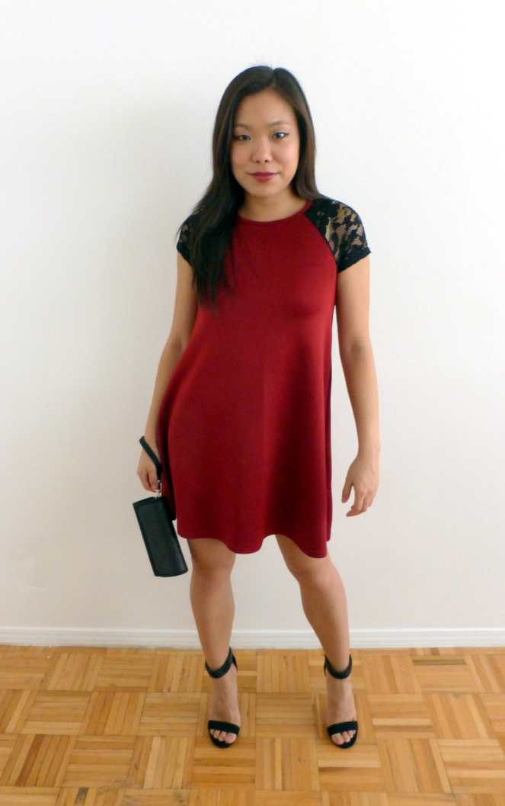
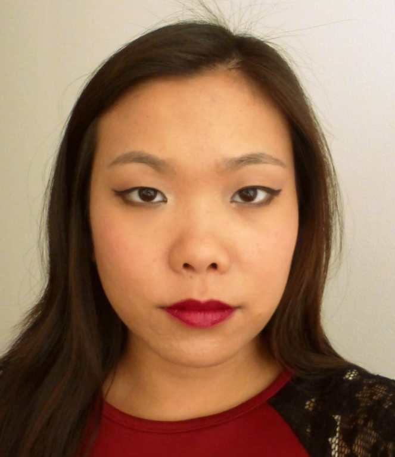
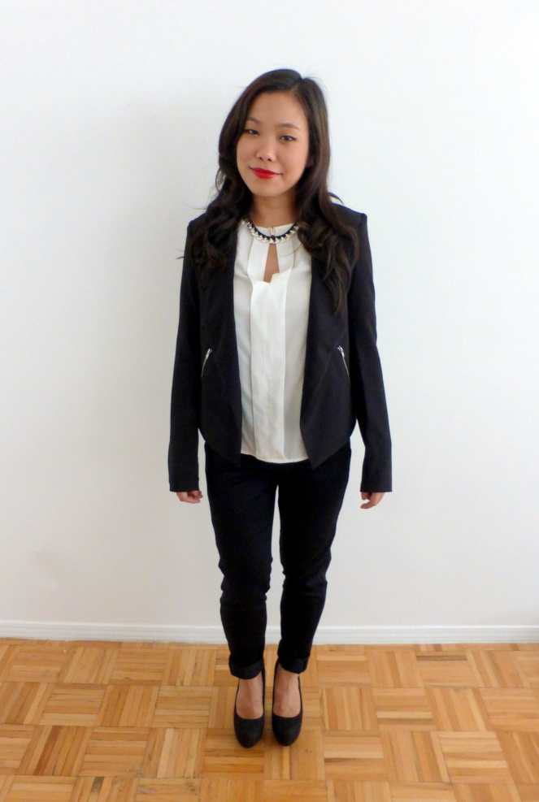
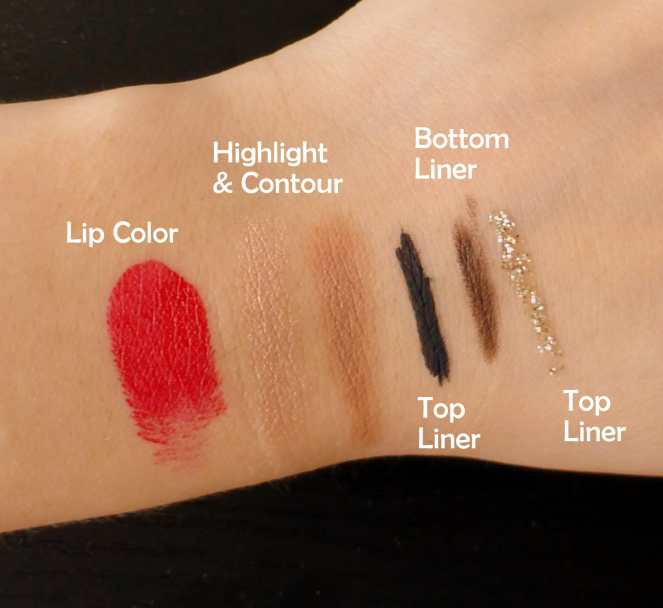
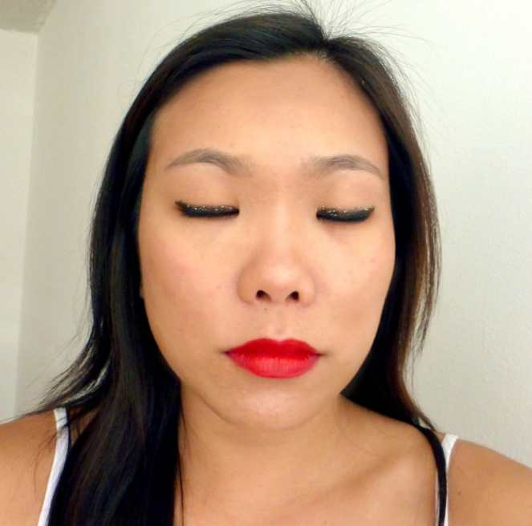
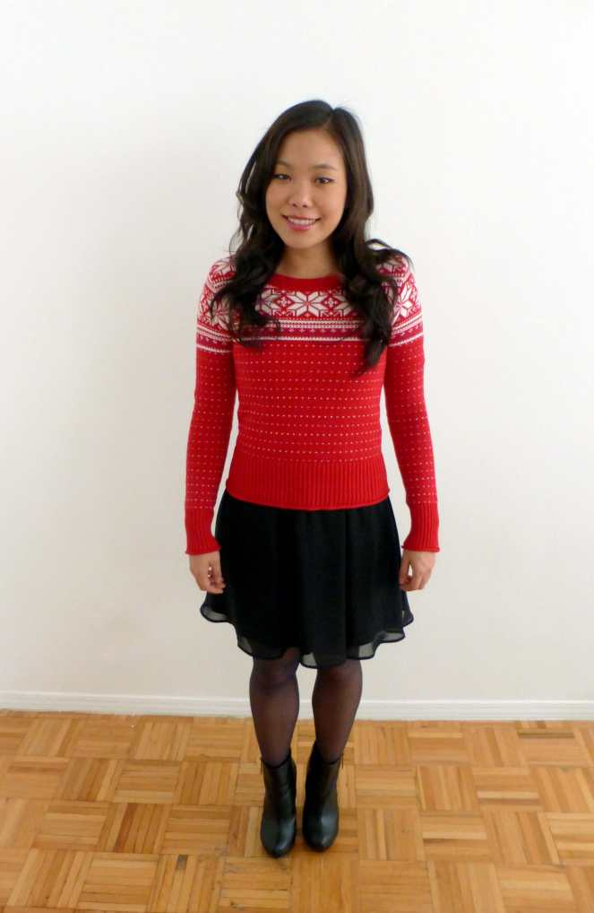
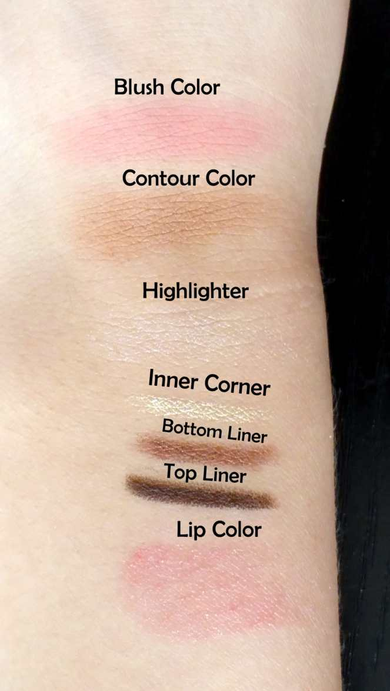
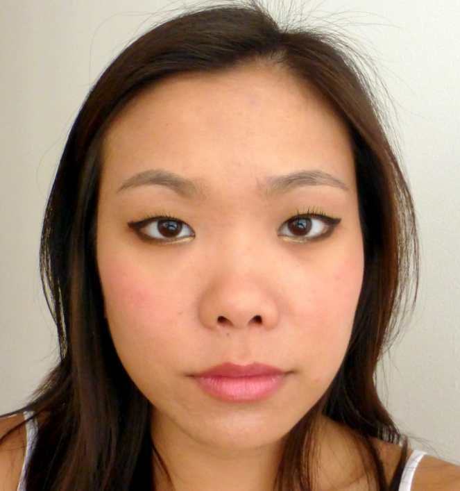

_♫ On the eleventh day of Christmas, Katie Crafts gave to me- holiday fashion & makeup inspiration by La Vie en May! ♫_

> Hi everyone! Today’s 12 Days of Christmas post is by guest fashion and beauty blogger, May of
>
> [La Vie en May](http://www.lavieenmay.com/ "La Vie en May")
>
> ! Check out her blog when you’re done reading her holiday picks below!

Holidays are coming up, do you know what you’re going to wear? Before you start scrambling and pulling your hair out, check out these 4 head-to-toe looks I curated for this holiday season! Whether you prefer pants or dresses, extravagant or simplistic, there’s something for everyone. Alright, let’s start…

## Look #1: Classic Black Dress

Black never goes out of style. It’s a timeless color that’s always chic and fashionable. Plus, its’ slimming qualities don’t hurt either! For this look, I suggest a bold pink lip and soft eyes. It’s all about the pinks this year. Don’t be afraid to make it pop!

Makeup Pairing:

Products used: em waterliner in ‘chocolate dream’ & ‘bronze kiss’, Elizabeth Mott Smooth Shadow in ‘pearl’, and Urban Decay Glide-On Lip Pencil in ‘Adrenaline.’

## Look #2: Red Dress

Red is an iconic color for the holidays and it looks fabulous on anyone. Stand out with a bright red or tone it down with a darker hue. A red dress goes well with neutral tones. To complement the dress, wear a muted, dark red lip.

Makeup Pairing:

The palette shown is the em cosmetics Day Life Palette.

## Look #3: Monochrome

Who says you always need to wear a dress to a holiday party? Pants can look just as sexy and stylish. Personally, I love a white & black combo. It’s best when combined with a bold red lip and gold glitter liner!

Makeup Pairing:

Products used: Urban Decay Revolution Lipstick in ‘F-Bomb’, em cosmetics Chiaroscuro stick in ‘Light’, em waterliner in ‘black night’ & ‘chocolate dream’, UD Glitter Liner in ‘Midnight Cowboy’.

## Look #4: Ugly Sweater

It’s not a holiday party without an ugly sweater! It’s a tradition in my family. Keep your makeup simple and muted. You want your sweater to do the talking!

Makeup Pairing:

Products used: em cosmetics shade play cheek palette in ‘blush a bye pink,’ C3 Warm White Highlighter, em waterliner in ‘bronze kiss’ & ‘chocolate dream’, Urban Decay Revolution Lipstick in ‘Lovelight.’

> Thanks so much for your awesome holiday picks, May! I don’t know which one I like better! How about you guys? Which is your favorite?
