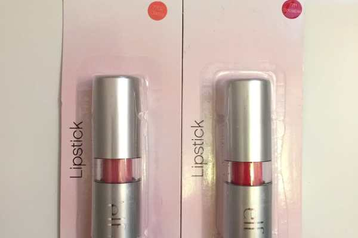
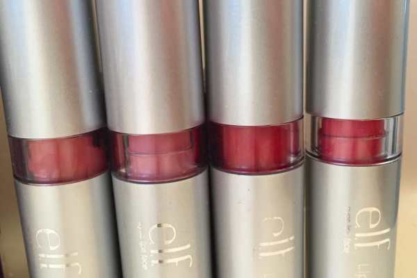
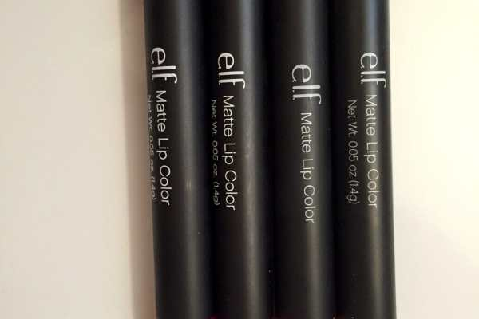
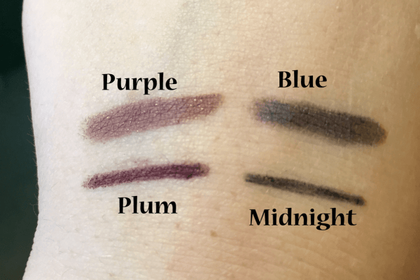
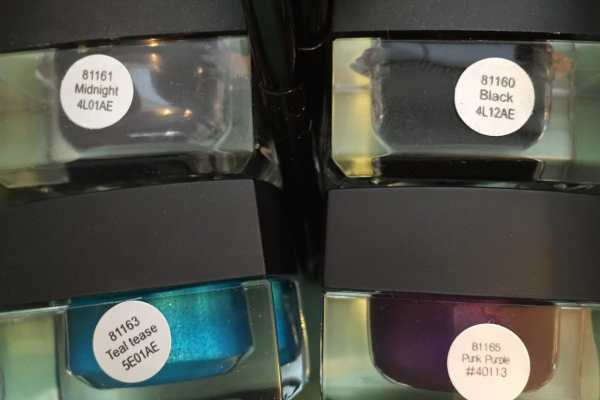

I’ve been slowly accumulating my stash of e.l.f. cosmetics for a few months now, and I thought I’d swatch out some of my collection! I have far too many eyeshadows from them to swatch, but here are a few of my new additions, and a few of my favorites!

I already had two e.l.f. lipsticks and just bought two more in pretty pinks! I’m loving the new shades I picked up: Classy and Sociable. They are just perfect for the Summer! I already have Charming in my collection and Fearless, one of my favorite reds ever!

I also added two new matte lip colors to my collection: Dash of Pink and Berry Sorbet. The matte lipsticks from e.l.f. are great because they last forever- through eating, drinking and hours of chatting! Berry Sorbet is a pretty fuschia type color while Dash of Pink is nice, light and great for the warm weather. I don’t like Nearly Nude very much, as it’s just TOO nude for me (and I feel like I look dead with it on!) I adore Rich Red, though! I usually line my lips with my regular red liner, fill the whole lip in with Rich Red and then do a quick coat of the above lipstick in Fearless for a long wearing bold look!

I have two e.l.f. Eyeliner & Shadow Sticks, that I’m on the fence about. The colors are great (Purple Shadow with Plum Liner, and Blue Shadow with Midnight Liner) and I like the liners. The shadows glide on smoothly and blend just fine, but since they are creamy they tend to settle in the creases of my eyelids and then it just does not look nice! Even after primer and powder, it still creases. I’ll give them a few more tries before I nix them, though.

Next up are some new e.l.f. Studio Cream Eyeliners that I picked up. I already have them in Black and Midnight Blue, and I didn’t swatch those because they are exactly the colors you would expect them to be. I DID swatch out the new colors I bought! I got Teal Tease to do some fun looks with, though I probably won’t wear it out all too often. It’s very pretty and sparkly, though! The Punk Purple is a color I may use more often, though it is a little harder to work with for some reason. It’s also less sparkly than the teal.

The last of my new additions are already my FAVORITE out of all my eyeshadows, after only a week of owning them. I bought the Smudge Pot in Wine Not and the Mineral Eyeshadow in Sassy. I cover my whole eye in the sparkly beautiful Sassy and then use the Wine Not to create a little smokey eye. The colors together are lovely. I wore them to a wedding this past weekend and they lasted all night, through lots of dancing (with primer underneath). I’ll definitely be trying more of these in the future.

I love when new makeup arrives! I can’t wait to get more!! (Okay, so I may have just ordered a few more e.l.f. things and some NYX as well… Stay tuned…!)

What product did you like best? What else should I get and swatch out?
