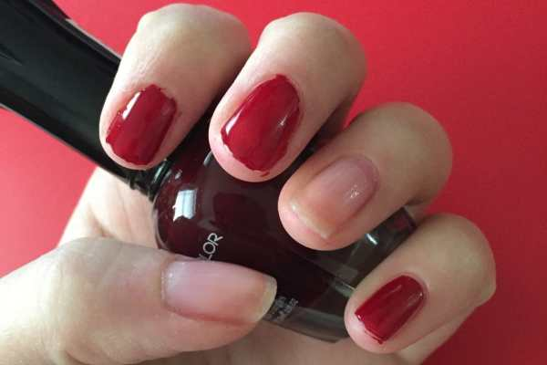
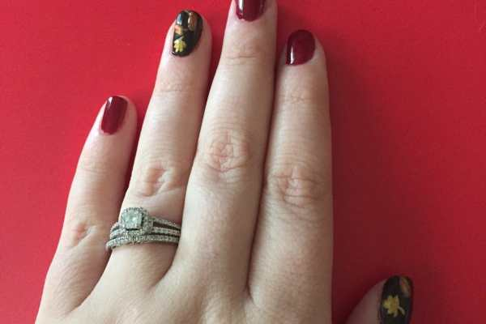
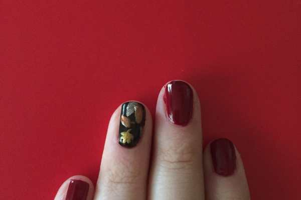
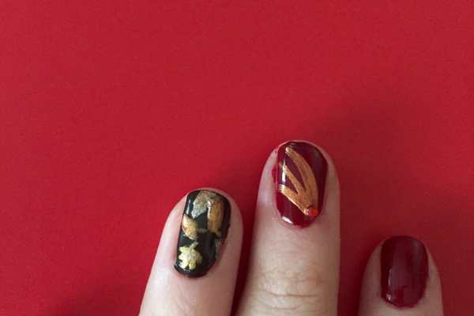

We went to a Fall festival over the weekend and it really got me in the spirit of the season! As if I really needed any more help… 😉 Husband just bought me a six pack of fun Fall colored nail polishes by Kleancolor Nail Lacquer so I decided to try them all out and design a little fall nail art!

The colors included in the pack from

_[Kleancolor Nail Lacquer](http://amzn.to/1Vzywv8)_

are garnet red, dark brown, americano, copper, gold bright and pearl silver. I used all but the silver in this tutorial.

## Materials:

- Clear base/top coat

- Nail polish from above set, or other polish in shades of dark red, dark brown, glitter copper, glitter gold and glitter light brown

- Red nail gems

- Nail art brush

## Instructions:

- Begin with clean, dry nails. Paint a coat of sheer base coat on nails and let dry.

- Paint all fingers that are NOT accent nails with the garnet red polish. Let dry.

- Paint all accent nails with dark brown. Let dry.

* Do a second coat of each if necessary, and let dry.

- Pick your first shade for leaves and dip your nail art brush in! Draw whatever shape leaf you like. Draw a few. Draw them on each of your accent nails. Let dry.

* Continue with the other shades, drawing different leaves all over the accent nails until you are happy with them.

- Use the other shades to add depth and don’t forget about the stems! Let dry.

- Next up, dip your nail art brush in whichever shade you liked best to draw three lines on your middle fingers. I picked the copper! Add a red nail art gem at the tip to make it look like a burst. Let dry.

- Seal in your look with a clear polish. Let dry. Clean up any rogue polish from your skin and enjoy your fall look!

Here are Husband and I at the Fall Festival! Aren’t we cute?

Later this week I’ll be heading to Manhattan for New York Comic Con! That means upcoming posts will involve whatever nail art I pick for the event and of course a fun recap of it as well. Be sure to follow

[my Instagram page](https://instagram.com/imkatiecrafts/)

for lots of pics from NYCC!

What kind of nail art do you like to wear in the Fall?
