A couple days after our long, exhausting and amazing NYCC trip, Husband and I joined his family for a beautiful day of pumpkin picking, apple cider donut eating, hayride riding and more at Linvilla Orchards in Media, PA! We had such a lovely day and we couldn’t have asked for nicer weather, especially considering the day before was quite cold and dreary. We were very busy enjoying ourselves, but managed to take a few pics while there!

This time of year, Linvilla is packed to the brim with people and gourds for Pumpkinland! When we first got there, it was a bit overwhelming. It took a million years to find a parking spot and just as long to navigate the INSANE crowd of people swarming all over the place. It thankfully thinned out a bit (or maybe we just got used to the mob) and we had a wonderful day!

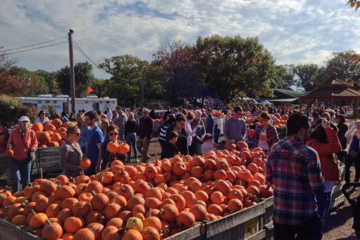

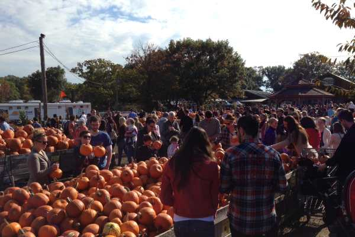

The pumpkins ranged from very teeny to small and then from large to gigantic! It seemed all the medium, regular sized pumpkins were already gone. We will have to find one for carving up around the city, but we came home with a collection of 9 gourds and pumpkins of different shapes and colors, a little hay bale, an adorable metal crow decoration, and half a dozen apple cider donuts to accompany our gallon of apple cider. Don’t they all look cute with our scarecrow in front of our house?

I should have watered the plants AFTER taking pics, in hindsight.

Also, how creepy does our home look here? Perfect for Halloween!

The orchards had a lot more to offer than just pumpkins. Depending on the season you can pick peaches, pears, strawberries, pine trees, apples (we wanted to do this too but didn’t have the time!) and more- and even go fishing! We saw the grounds for all these activities during our hayride.

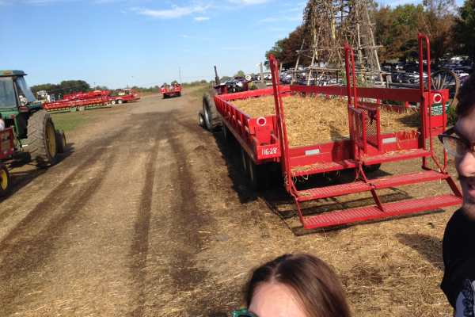

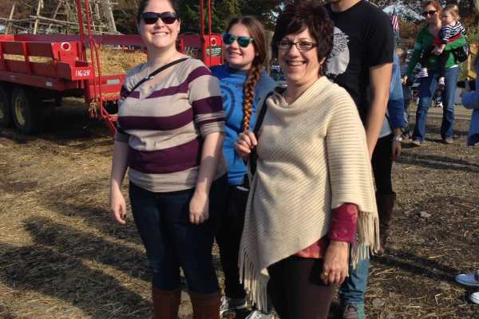

We squinted through most of it since it was super sunny, but it was a really fun time either way! Here are more photos from our trip!

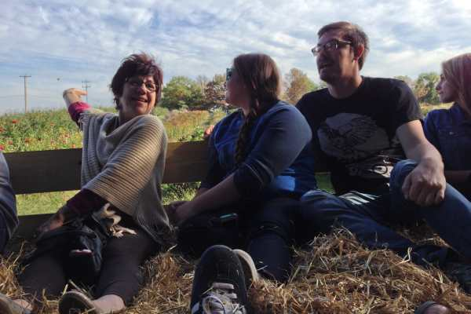

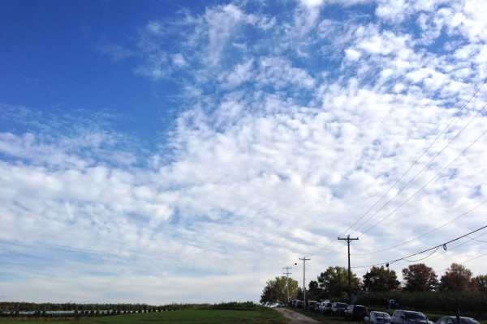

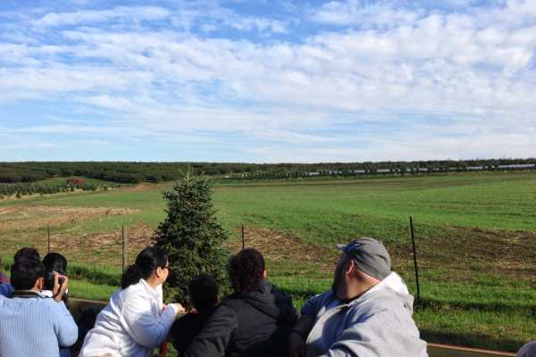

Hubs and me!

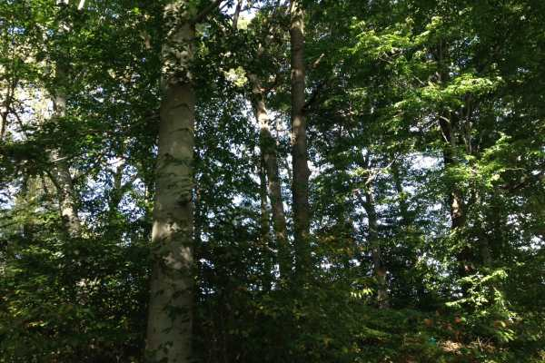

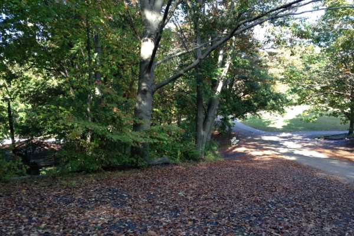

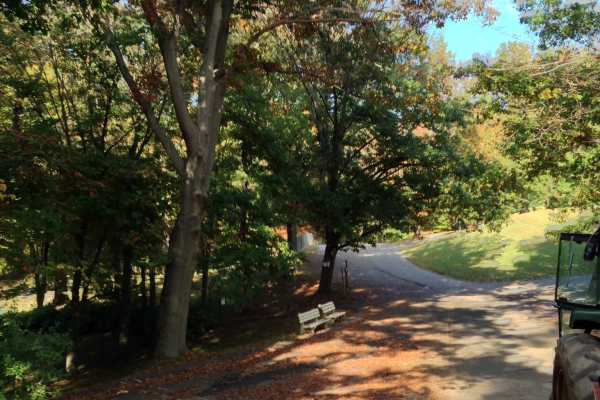

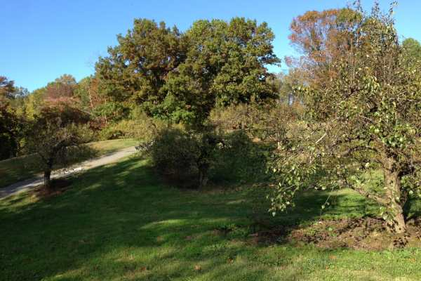

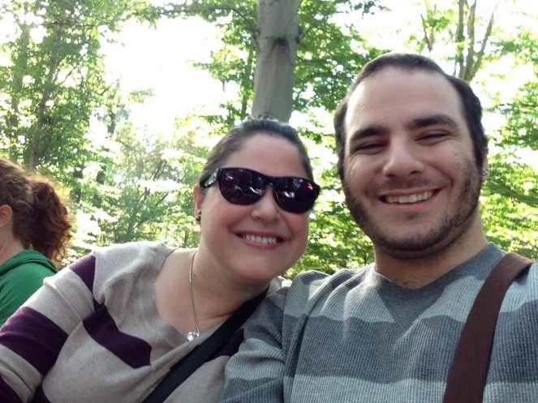

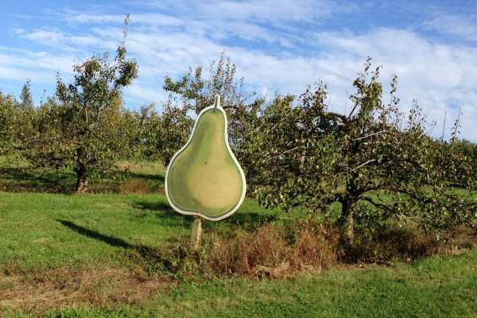

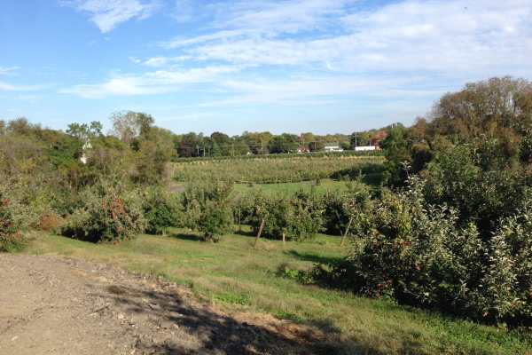

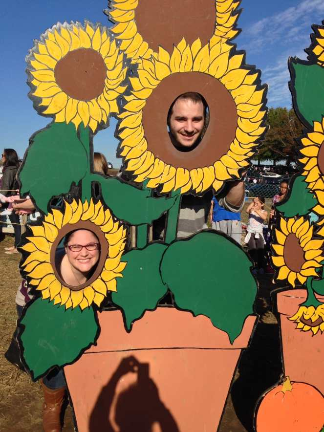

I’m so glad we got some picks in the giant sunflower cut outs, because they came out so cute! I LOVE this photo below of Husband making the worse face ever while trying to evade the sun, and he’ll probably kill me for posting it but I am taking that chance! It’s too funny not to share.

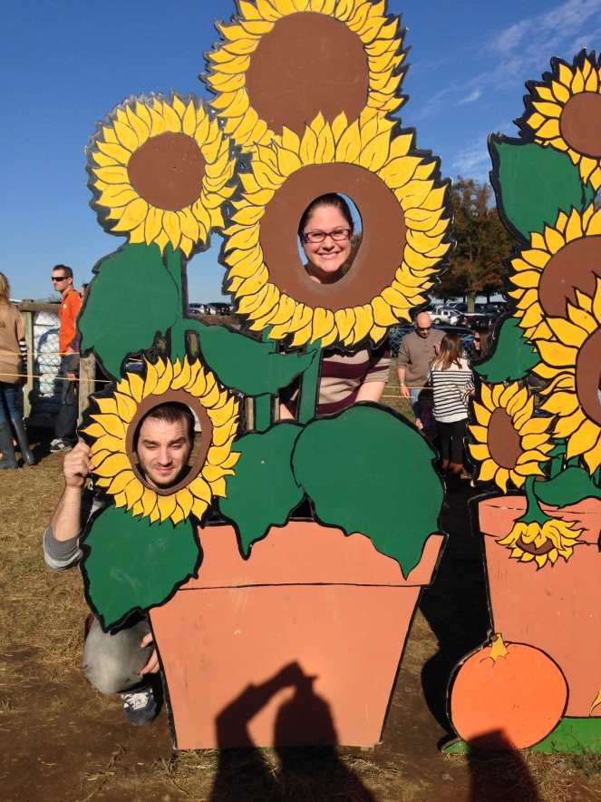

We are hoping to go back in a couple months to see their Christmas set up and maybe cut down a tree for the new house! We haven’t been allowed to have a real one in years so I am excited to get one this season – I just hope the cats don’t pull it down.

We decided we’ll have to go every year and start a new tradition! Next time we will go during the week though. The crowds were just a bit much!

Did you go pumpkin or apple picking this year?
