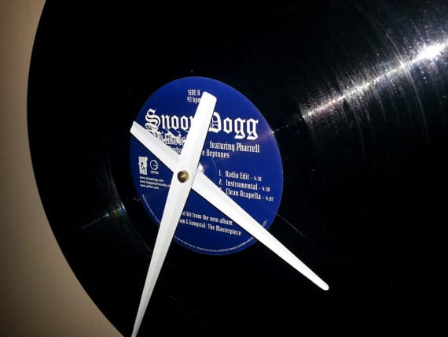
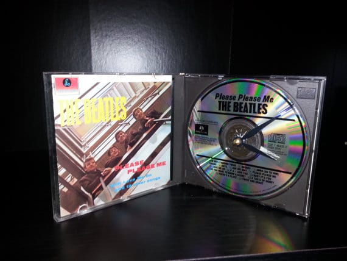
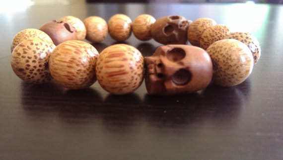
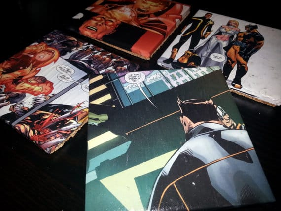

Hello, Wednesday! I’m finding Wednesdays to be my favorite day of the week lately, because it means I get to feature an awesome new Etsy shop on my blog! Today’s featured shop is a couple from my city, Philadelphia. They are Annemarie and Paul, and their shop

**[AM/PM Home Decor](https://www.etsy.com/shop/AMPMHomeDecor "AMPMHomeDecor on Etsy")**

is thrifty and fun. Check out their upcycled album clocks, bottle lamps, coasters (yay X-men!) and more!

##

## Tell us a little about yourself…

We are Paul & Annemarie (PM and AM respectively). We’ve been dating for over a year and a half, and a couple months ago moved into our place in Northeast Philly with two cats.

After being there for a couple months I (Paul) was trolling

[instructables.com](http://instructables.com)

, which is Pinterest for guys, and saw some stuff that I could make. I made them, and we started selling them.

Now we’ve got a great program down where I sit in my office and make stuff while Annemarie stares at me wondering why I’m not working harder and/or faster.

## 

## What do you love about your craft?

For me, its taking something that has maybe outlived its life, a CD, or an old comic book or whatever, and reusing it to serve a daily use purpose like a clock. In my life I’ve lived through three dead music formats, records, cassettes and now CDs. And I think the clocks we make are a great way to preserve the art that went into the physical medium of the album art work.

## What item was your favorite to make so far?

It was probably the Police Synchronicity clock. I saw a lot of CD clocks online, but none of them incorporated the jewel case. And I took a shot at drilling back through the tray as a way of fixing the clock mechanism, and it worked out pretty well. Doing it that way let me present the whole album. Plus, its self standing, and I think its just a cooler way of presenting the whole thing.

## Where do you find your creative inspiration?

I do one of two things, they both end up at

[instructables.com](http://instructables.com)

. It started with just clicking around and eventually landing on projects that look interesting. Now, I’ll start with a base material, like we have a suitcase that’s probably from the late 50’s, and I think I found a cool pet bed project for that.

## How did you decide to open your Etsy shop?

I forget how Etsy ended up on my radar, but as a seller you have two options, either open up your own website and shout at the highway begging people to stop in and shop, or you join a market place where you just have to pick off existing traffic. Its very much the difference between opening a brick and mortar stand alone store, or having a spot in a mall or a flea market.

For what we do, and where we are as new sellers with no name recognition, it makes way more sense to operate as part of a marketplace full of potential buyers who are already interested in purchasing products like what Annemarie and I have. If we just started a website and tried to sell our stuff, we’d probably still be waiting for our first sale, and would be way over our listing fees in marketing just trying to get traffic.

## Any advice for others who want to start their own Etsy shop, or who are looking to fulfill their passion for crafting?

Don’t be afraid of new ideas. If you can make one thing, you can make anything.

Don’t forget to stop by

[**AM/PM Home Decor**](https://www.etsy.com/shop/AMPMHomeDecor "AM/PM Home Decor on Etsy")

and take a gander at their wonderful homemade products! Be sure to fave their shop while you’re there!
